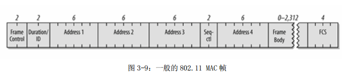

1. mac 地址：

    MAC地址就是在媒体接入层上使用的地址，也叫物理地址、硬件地址或链路地址，由网络设备制造商生产时写在硬件内部。MAC地址与网络无关，也即无论将带有这个地址的硬件（如网卡、集线器、路由器等）接入到网络的何处，都有相同的MAC地址，它由厂商写在网卡的BIOS里。MAC地址可采用6字节（48比特）或2字节（16比特）这两种中的任意一种。

    电脑 wlan 的 mac 地址：94-B8-6D-75-38-CA

2. CDMA/CD 协议

    CSMA /CD(Carrier Sense Multiple Access with Collision Detectio)即带碰撞检测的载波监听多路访问技术，是一种争用型的介质访问控制协议,采用半双工通信，最早应用于总线型局域网。

    - CS:载波侦听: 在发送数据之前进行监听,以确保线路空闲,减少冲突的机会
    - MA:多点接入: 每个站点发送的数据,可以同时被多个站点接收
    - CD:碰撞检测: 边发送边检测, 发现冲突就停止发送, 然后延迟一个随机时间之后继续发送。冲突的检测由于两个站点同时发送信号, 经过叠加后, 会使线路上电压的摆动值超过正常值一倍。据此可判断冲突的产生。

    原理：

    1. 终端设备不停的检测共享线路的状态, 只有在空闲的时候才发送数据, 如果线路不空闲则一直等待。
    2. 发送过程中, 若其他设备也同时发送数据, 则其发送的数据必然产生碰撞, 导致线路上的信号不稳定, 终端设备检测到这种不稳定之后, 马上停上发送自己的数据, 然后再发送一连串干扰脉冲, 然后等待一段时间之后再进行发送。
    
    缺点:带宽窄, 冲突检测机制, 传输时间必须大于延迟时间导致物理长度限制51.2μs的冲突检测窗口, 1位在2500m, 加上四个中继器的往返时间。帧长最小字节数64, 刚好512位。

3. CSMA/CA 协议

    CSMA/CA（Carrier Sense Multiple Access with Collision Avoid，即带有冲突避免的载波侦听多路访问）是一种数据传输是避免各站点之间数据传输冲突的算法，其特点是发送包的同时不能检测到信道上有无冲突，只能尽量“避免”。
    
    例如，如果计算机A和计算机C同时给计算机B发送一个控制消息，它们将同时到达计算机B，导致冲突的发生。当这种冲突发生时，发送者可以随机等待一段时间，然后重发控制消息。因为控制消息比数据敏要短得多，所以发生第二次冲突的可能性也要比传统以太网要小很多。最终将有一个控制消息正确到达，然后计算机B发送一个响应消息。通常CSMA/CA利用ACK信号来避免冲突的发生，也就是说，只有当客户端收到网络上返回的ACK信号后才确认送出的数据已经正确到达目的。

4.  802.11 的MAC 帧与802.3的MAC帧区别

    802.11 MAC 帧并未包含以太网帧的某些典型功能，其中最显著的是 type/length 位以及preamble（同步信号）。 Preamble 属于物理层， 而封装细节（如 type 与length）则出现在 802.11帧所携带的标头（header）中。

    

    

5. 参考教材第三章 题 3-03 、 04、 06 、 13、 20、 24、 30-33

    - 3-03 网络适配器的作用是什么？网络适配器工作在哪一层

        作用:
        1.   进行串行/并行转换
        2.   对数据进行缓存
        3.   在计算机的操作系统安装设备驱动程序
        4.   实现以太网协议
        
        网络适配器工作物理层
    
    - 3-04 数据链路层的三个基本问题为什么都必须加以解决?

        1. 封装成帧:必须封装成帧,不然不知道源地址、目的地址等信息
        2. 如果不进行透明传输的话,可能会少传一部份的数据,导致数据缺失
        3. 不进行差错检测的话接受到的数据可能都是数据缺失的,不可用

    - 3-06 PPP协议的主要特点是什么?为什么PPP不使用帧的编号?PPP适用于什么情况?为什么PPP协议不能使数据链路层实现可靠传输？

        - PPP协议的主要特点:
           1. 简单
           2. 封装成帧
           3. 透明性
           4. 多种网络协议
           5. 多种类型链路
           6. 差错检测
           7. 检测连接状态
           8. 最大传送单元
           9. 网络地址协商
           10. 数据压缩协商
        - PPP不可靠传输,所以不使用帧编号
        - PPP适用于线路质量不太差的情况下。
        - PPP没有编号和确认机制。

    - 3-13

        - 局域网LAN是指在较小的地理范围内，将有限的通信设备互联起来的计算机通信网络 
        - 从功能的角度来看，局域网具有以下几个特点： 
  
            （1） 共享传输信道，在局域网中，多个系统连接到一个共享的通信媒体上。 

            （2） 地理范围有限，用户个数有限。通常局域网仅为一个单位服务，只在一个相对独立的局部范围内连网，如一座楼或集中的建筑群内，一般来说，局域网的覆盖范围越位10m~10km内或更大一些。 

            从网络的体系结构和传输检测提醒来看，局域网也有自己的特点： 
            （1） 低层协议简单 

            （2） 不单独设立网络层，局域网的体系结构仅相当于相当与OSI/RM的最低两层 

            （3） 采用两种媒体访问控制技术，由于采用共享广播信道，而信道又可用不同的传输媒体，所以局域网面对的问题是多源，多目的的连连管理，由此引发出多种媒体访问控制技术 
            
            在局域网中各站通常共享通信媒体，采用广播通信方式是天然合适的，广域网通常采站点间直接构成格状网。
  
    - 3-20

        1/200000=5us
        帧长:5*2*1*109*10-6=10000bit=1250B

    - 3-24

        设在t=0时A开始发送，在t=（64+8）*8=576比特时间，A应当发送完毕。t=225比特时间，B就检测出A的信号。只要B在t=224比特时间之前发送数据，A在发送完毕之前就一定检测到碰撞，就能够肯定以后也不会再发送碰撞了如果A在发送完毕之前并没有检测到碰撞，那么就能够肯定A所发送的帧不会和B发送的帧发生碰撞（当然也不会和其他站点发生碰撞）。

    - 3-33

        ```
        动作        交换表的状态         向哪些接口转发帧
        A发送帧给D  A,1                 广播2,3,4,5,6
        D发送帧给A  D,4                 接口1
        E发送帧给A  E,5                 接口1
        A发送帧给E  不变                接口5
        ```

6. 参考教材第9章 题 9-7、15、16 

    - 9-7

        我们通常将介于广域网和局域网之间的网络成为城域网，简称MAN。广义的无线局域网包括无线城域网（WMAN）和无线个域网（PMAN）。

        CSMA/CD协议要求一个站点在发送数据的同时还必须不间断地检测信道，以便发现是否有其他的站也在回发答送数据，这样才能实现“碰撞检测”的功能。但在无线局域网的设备中要实现这种功能花费过大。当我们在发送数据时检测到信道是空闲得，在接收端仍然有可能发生碰撞。即碰撞检测对无线局域网没有什么用处。

    - 9-15

        地址4用于自组网络，前三个地址的内容取决于帧控制字段中的“到DS”（到分配系统）和“从DS”（从分配系统）这两个子字段的数值。

    - 9-16
        
        802.3和803.11都用于局域网，其中，802.3是有线的，802.11是无线的。
        
7. 谈谈你对无线局域网的应用、建设及安全方面的认识

    无线局域网具有网络配置灵活、适应性强、安装维护方便等优点,而且有较好的经济性,是实现Internet高速接入的一种方案。近几年来，随着计算机网络技术的逐渐成熟和飞速发展，无线局域网技术作为计算机网络的重要分支日益受到人们的广泛重视，其满足用户特别是企业移动用户的宽带无线接入需求,为部署公共无线局域网业务提供了巨大的需求和动力。无线局域网业务是一个较新的业务，它面临着机遇和挑战，包括信号干扰、安全性、易用性等。