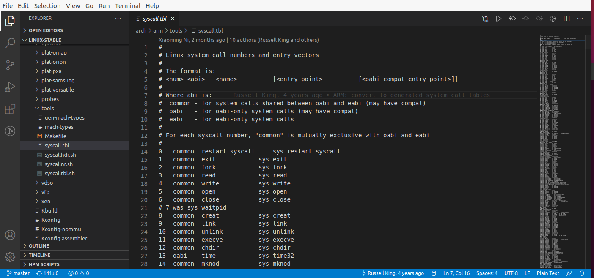
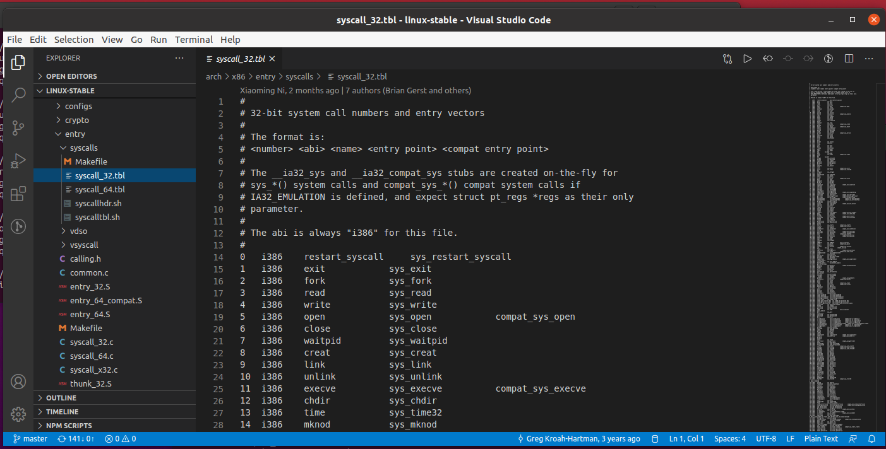
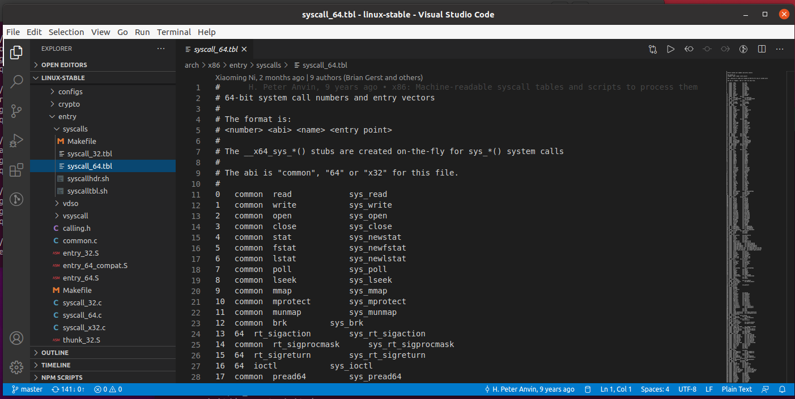
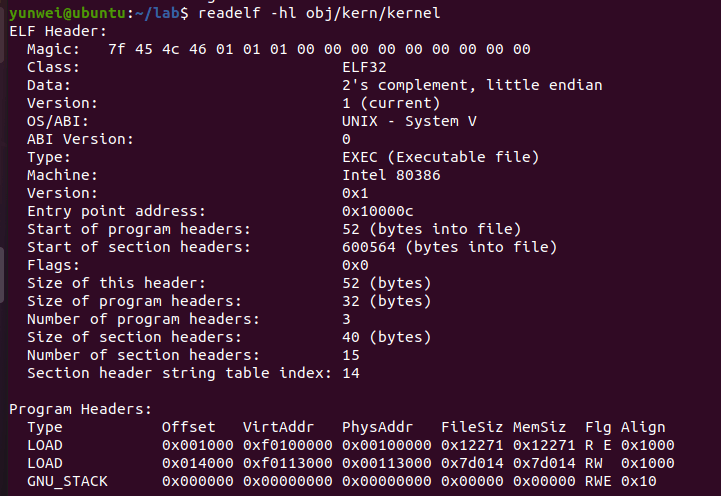
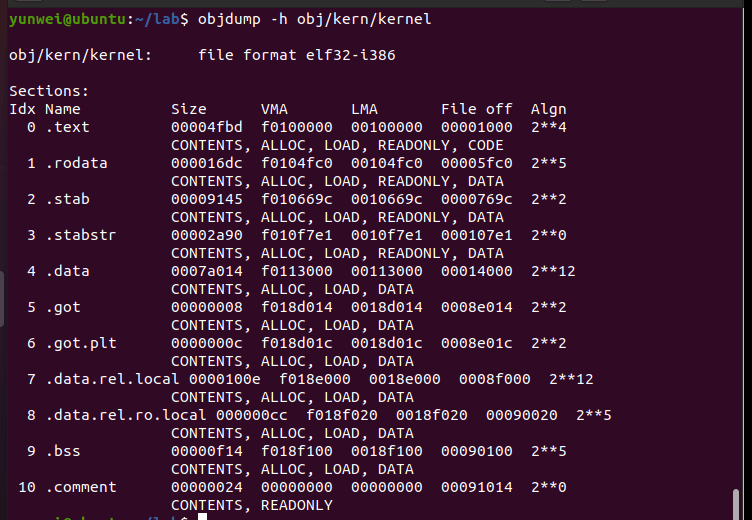
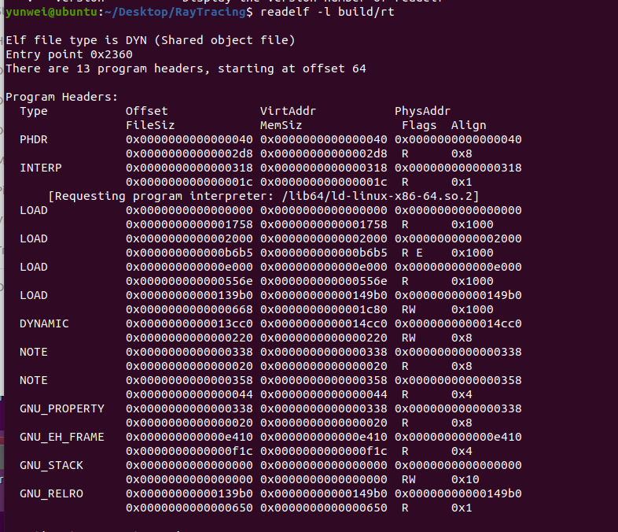
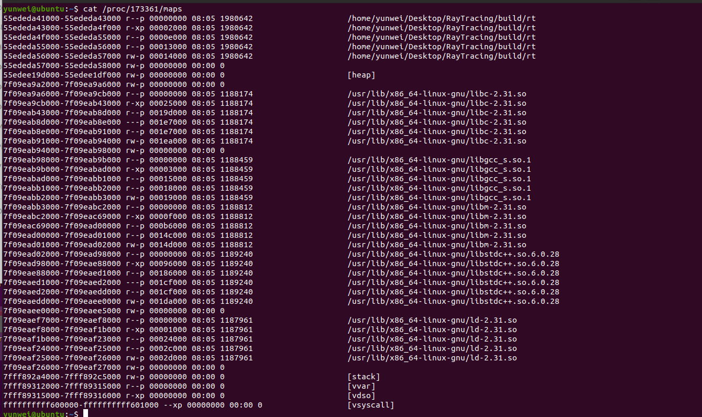

1. Operating System Concepts(10th) Chapter 1 Exercises: 1.14, 1.17, 1.19, 1.22 (20 points)

    - 1.14

        中断的目的一般是通过进行控制流的转换来响应外部硬件产生的某些行为，比如时钟、IO等等。trap一般是软件产生的。trap 可以被用户程序直接生成，比如系统调用或者 debug 什么的。
        
    
    - 1.17

        可以。本质上就是需要用软件模拟一个虚拟机出来，通过软件模拟出来那些和特权级相关的操作；只是这样会慢一点。

    - 1.19

        1. magnetic tapes
        2. optical disk
        3. hard-disk drives
        4. nonvolatile memory
        5. main memory
        6. cache
        7. registers

    - 1.22

       基本思路就是给每个程序分配一定数量的物理页面，让每个程序都只能访问自己被分配到的页面部分。实际上这一套现在是用页表和虚拟内存机制完成的，每个程序维护自己的一个页表，硬件根据这个页表把程序运行时的虚拟内存转化为对应的物理内存，如果要访问的地址不在这个页表里面或者对应项权限不够，就报错。

2. Detail your steps about how to get arch/arm64/kernel/sys.i (10 points)

get linux source code:

3. Find system call table for ARM32, RISC-V(32 bit), RISC-V(64 bit), X86(32 bit), X86_64 (50 points)

4. Explain what is ELF file? Try readelf and objdump command on an ELF file, give screenshot of the output. (20 points)

ELF 是一种用于二进制文件、可执行文件、目标代码、共享库和核心转储格式文件，是UNIX系统实验室（USL）作为应用程序二进制接口（Application Binary Interface，ABI）而开发和发布的，也是Linux的主要可执行文件格式。

Run an ELF file and cat /proc/PID /maps to give its memory layout.

