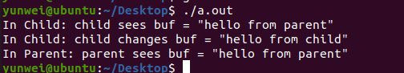
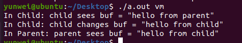

1. Operating System Concept Chapter 2 Exercises: 2.9, 2.10, 2.12. 2.17 (40 points)

    - 2.9
      - 加载程序并开始执行；用户程序来管理内存和分配优先级不够安全；
      - 进程间通信；用户程序可能恶意干扰到其他程序的运行；
      - 内部和外部错误的错误捕捉和恢复，这个如果是外部错误或者硬件错误的话程序很难去捕捉；
      - IO；一些东西如果让程序自己去 IO 的话可能破坏整个系统，比如说一些开关；
      - 文件和权限管理；这个部分如果搞得不好的话也会破坏安全性；
    - 2.10
      - 一般存在固件里面的都是嵌入式设备，没硬盘的
    - 2.12
      - 功能抽象：比如文件系统
      - 保护和隔离：比如进程，只允许操作和自身相关的内存和文件，用户等等；限制 IO 操作；
      - 可以说一个是增加用户能看到的功能，一个是减少和限制；
    - 2.17
      - 可以的，比如用 Linux 的内核模块机制；

2. Operating System Concept Chapter 3 Exercises: 3.1. (10 points)

    - 3.1
      - PARENT: value = 5
      - 进程隔离，值不会变

3. Operating System Concept Chapter 3 Exercises: 3.2. (20 points)

    - 3.2
      - There are 8 processes created.
      - 修改过的代码：

        ```c
        #include <stdio.h>
        #include <unistd.h>
        int main()
        {
        /* fork a child process */
        printf("root: %d\n",getpid());
        fork();
        printf("  first fork: %d\n",getpid());
        /* fork another child process */
        fork();
        printf("    second fork: %d\n",getpid());
        /* and fork another */
        fork();
        printf("      third fork: %d\n",getpid());
        return 0;
        }
        ```

        输出：

        ```
        yunwei@ubuntu:~/Desktop$ ./a.out 
        root: 31571
            first fork: 31571
            first fork: 31572
                second fork: 31572
                second fork: 31571
                second fork: 31574
                second fork: 31573
                    third fork: 31574
                    third fork: 31573
                    third fork: 31571
                    third fork: 31572
                    third fork: 31578
                    third fork: 31575

        ```

4. Operating System Concept Chapter 4 Exercises: 4.8 4.9. 4.10 4.17 4.19 (50 points, 10points each)

    - 4.8
      - bc
    - 4.9
      - 不能，操作系统看不到有多个线程也没法同时运行；
    - 4.10
      - 不行，这样没法子隔离，会被恶意网页干掉整个浏览器
    - 4.17
      - c:CHILD: value = 5
      - p:PARENT: value = 0
    - 4.19
      - 两个成对的操作，比如说需要对一个文件进行修改的 read 和 write

5. Compile and run the clone.c program twice, with ‘vm’ and without ‘vm’ as the argument, respectively. Take the screenshots of the running results (20 points) and explain why the output is different (30 points). Hint: Understand the meaning of the CLONE_VM flag of the clone system call.

    - without:

      

    - with

      

    - 如果未设置CLONE_VM,则子进程在clone()时在调用进程的内存空间的单独副本中运行。 其中一个进程执行的内存写入不会影响另一个进程,就像fork一样。

6. Operating System Concept Chapter 5 Exercises: 5.3 5.4 5.5 5.8 (40 points, 10 pointseach)

    - 5.3
      - 忙碌等待是一种以进程反复检查一个条件是否为真为根本的技术，条件可能为键盘输入或某个锁是否可用。
      - 可以主动让出CPU, 然后等要等的条件满足之后被外部唤醒 
      - 不能，其他方式的等待会有让出和唤醒的开销，不一定更少
    - 5.4
      - 自旋锁等待的条件需要由别的进程来完成，但又只有一个处理器，没办法跑别的进程；多处理器就不存在这样的问题了
    - 5.5
      - 如果对信号量执行了两次等待操作，则当它的值为1，如果两个操作不是原子执行的，则两个操作都可能会继续减少信号量的值，从而违反相互排斥。
    - 5.8
      - 满足三个互斥条件：
        - 互斥条件：如果两个进程同时设置 turn 标识符，只有一个进程能成功进行
        - 临界区外的进程不会阻塞其他进程进入临界区；
        - 在结束时转向另外一个进程，可以保证另外一个进程有机会进入临界区域；

7. According to the ppt we have learnt in the class, explain the reason why the MarsPathfinder had reset itself, and how to avoid that. (10 points)

    - 优先级反转
        探路者号使用了 VXWorks 作为底层的实时嵌入式系统内核，VXWorks 支持多线程编程，并且提供了线程的优先级抢占调度机制。探路者号内部的任务是以线程的形式运行的，并且各个任务根据重要程度被分配了不同的优先级。

        探路者号系统包含一个“信息总线”，可以把它看作是一个共享的内存区域，用于在系统内部不同组件之间传递信息。

        探路者号出现故障时，正在执行的气象数据采集任务则是一个不常运行的任务，所以它的线程优先级较低。不过，气象数据采集任务作为系统的一个组件，也是要使用“信息总线”的，它在需要传输数据时，会获取互斥体，并将数据写入总线，然后释放互斥体。

        如果信息总线持有互斥锁时被中断打断，进入操作系统重新调度，之后又尝试请求同一个互斥锁以取回气象数据采集任务的数据并发送时，那么C语言程序将被阻塞等到气象数据采集任务释放互斥体。探路者号系统还包含一个中等优先级的通信任务。

        大多数情况下，上述线程工作配合的很好。但是，中断随时可能发生，因此系统还是有可能会出现这种情况：（高优先级）信息总线管理线程被阻塞，等待（低优先级）气象数据线程释放互斥锁时，（中等优先级）通信任务在这一段时间间隙被调度。

        在这种情况下，长时间运行的中等优先级的通信任务将阻断比其优先级低的气象数据采集任务，导致气象数据采集任务无法运行，也就可能导致其无法释放互斥锁，进而导致高优先级的信息总线管理线程永远阻塞下去。

        过一段时间后，探路者号的看门狗程序注意到信息总线任务有一段时间没有运行，就断定系统发生了严重错误，因此会重启整个系统。

    - 解决方案

        当在 VXWorks 中创建一个互斥体时，互斥对象接收一个布尔类型参数，该参数用于指定互斥对象是否应该执行优先级继承。

        探路者号系统传递给互斥体对象的参数是 off，也即不继承优先级。事实上，如果将该参数改为 on，则低优先级的气象数据采集线程将继承阻塞的信息总线管理线程的高优先级，从而使其优先于中等优先级的通信任务，就能阻止系统重启。