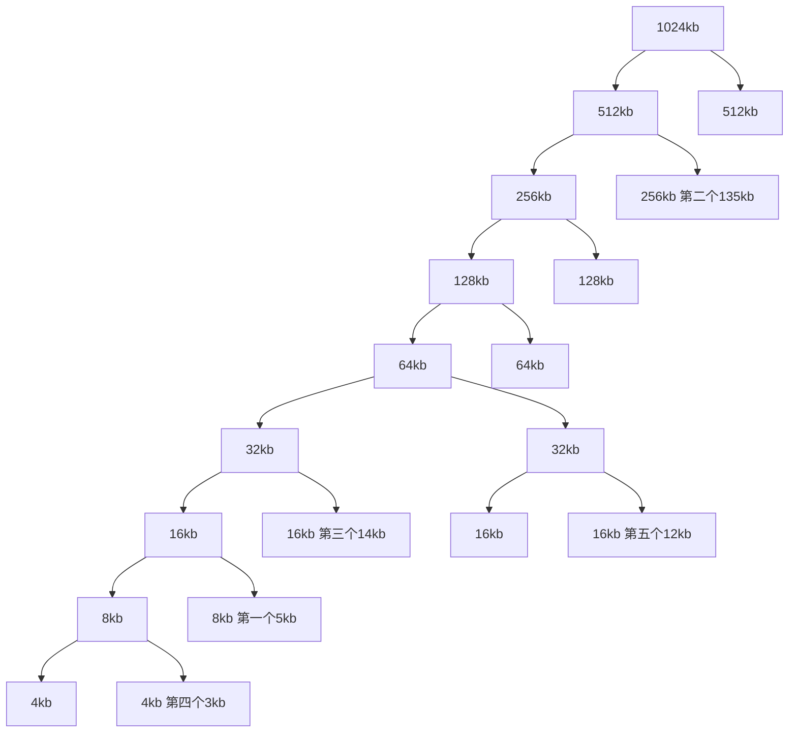
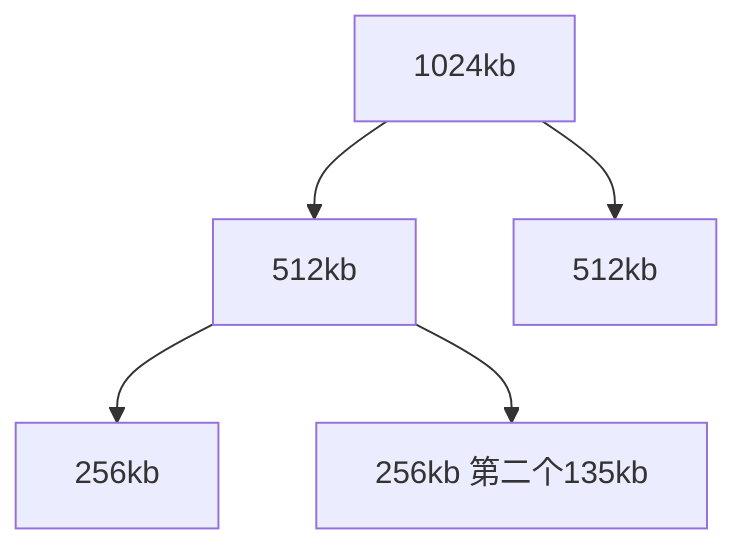

9.2 Why are page sizes always powers of 2?

    计算机用二进制编码，这样可以让 page number 和 offset 直接用某些位的范围表示，比较方便

9.4 Consider a logical address space of 64 pages of 1,024 words each, mapped onto a physical memory of 32 frames.

    a. How many bits are there in the logical address?

        6 + 10 = 16

    b. How many bits are there in the physical address?

        5 + 10 = 15

9.5 What is the effect of allowing two entries in a page table to point to the same page frame in memory? Explain how this effect could be used to decrease the amount of time needed to copy a large amount of memory from one place to another. What effect would updating some byte on one page have on the other page?

    effect: 多个虚拟页可以在不占有多个物理页的情况下有同样的内容；
    比如在一些多个程序共享的库，cpoy on write 等机制实现的时候，把不一样的虚拟页指向同一个物理页就可以避免复制物理页。但其中一个虚拟页作出更改的时候，另外一个虚拟页的内容也会变，也没有同步机制保证。

9.6 Given six memory partitions of 300 KB, 600 KB, 350 KB, 200 KB, 750 KB, and 125 KB (in order), how would the frst-ft, best-ft, and worst-ft algorithms place processes of size 115 KB, 500 KB, 358 KB, 200 KB, and 375 KB (in order)

    a. first-fit:

        P1 -> M1
        P2 -> M2
        P3 -> M5
        P4 -> M3
        P5 -> M5
    
    b. best-fit

        P1 -> M6
        P2 -> M2
        P3 -> M5
        P4 -> M4
        P5 -> M5

    b. worst-fit

        P1 -> M5
        P2 -> M5
        P3 -> M2
        P4 -> M3
        P5 -> wait

9.15 Compare the memory organization schemes of contiguous memory allocation and paging with respect to the following issues:

    a. External fragmentation
    b. Internal fragmentation
    c. Ability to share code across processes

    连续内存分配的话会导致大量的外部碎片而不是内部碎片，代码共享也别想；采用分页的方法的话，如果没有分段的话还是会有不少的内部碎片，程序的各个部分不清晰，代码共享也很困难；有分段的话就能比较好地解决碎片问题，也能实现代码共享。

9.19 Explain why address-space identifers (ASIDs) are used in TLBs

    TLB 用这玩意来判断虚拟页是属于哪一个 process 的，不同 process 的不能混用。

9.20 Program binaries in many systems are typically structured as follows. Code is stored starting with a small, fxed virtual address, such as 0. The code segment is followed by the data segment, which is used for storing the program variables. When the program starts executing, the stack is allocated at the other end of the virtual address space and is allowed to grow toward lower virtual addresses. What is the signifcance of this structure for the following schemes?

    a. Contiguous memory allocation

        一般情况下栈在高位，代码在低位，这样会导致中间有大量的空白页在分配的时候被浪费掉

    b. Paging

        不用预先分配大量空白内存，只要分配需要的部分就好，比如栈一页，代码段和 bss 段各自分配到需要的物理页上，堆和栈的内存等需要的时候再分配多的物理页；结合分段机制，不同段的地址范围还可以有重叠；

9.25 Consider a paging system with the page table stored in memory.

a. If a memory reference takes 50 nanoseconds, how long does a paged memory reference take?

    50 + 50 = 100ns

b. If we add TLBs, and if 75 percent of all page-table references are found in the TLBs, what is the effective memory reference time? (Assume that fnding a page-table entry in the TLBs takes 2 nanoseconds, if the entry is present.)

    50 + 0.75 * 2 +0.25 * (50 + 2) = 64.5ns

10.16 A simplifed view of thread states is ready, running, and blocked, where a thread is either ready and waiting to be scheduled, is running on the processor, or is blocked (for example, waiting for I/O).

Assuming a thread is in the running state, answer the following questions, and explain your answers:

a. Will the thread change state if it incurs a page fault? If so, to what state will it change?

    会的，因为要等待把这个 page load 进来，所以会到 block 状态；

b. Will the thread change state if it generates a TLB miss that is resolved in the page table? If so, to what state will it change?

    不会，这个很快，不会产生什么错误或者中断，只是会导致内存访问稍微慢一点；

c. Will the thread change state if an address reference is resolved in the page table? If so, to what state will it change?

    不会，这个就是正常的内存访问；

10.24 Apply the (1) FIFO, (2) LRU, and (3) optimal (OPT) replacement algorithms for the following page-reference strings:

- 2, 6, 9, 2, 4, 2, 1, 7, 3, 0, 5, 2, 1, 2, 9, 5, 7, 3, 8, 5
- 0, 6, 3, 0, 2, 6, 3, 5, 2, 4, 1, 3, 0, 6, 1, 4, 2, 3, 5, 7
- 3, 1, 4, 2, 5, 4, 1, 3, 5, 2, 0, 1, 1, 0, 2, 3, 4, 5, 0, 1
- 4, 2, 1, 7, 9, 8, 3, 5, 2, 6, 8, 1, 0, 7, 2, 4, 1, 3, 5, 8
- 0, 1, 2, 3, 4, 4, 3, 2, 1, 0, 0, 1, 2, 3, 4, 4, 3, 2, 1, 0

Indicate the number of page faults for each algorithm assuming demand paging with three frames.

    - FIFO：按数字顺序，显示每个页面访问时的在内存里面的页
        - 第一个序列：

            2 26 269 269 469 429 421 721 731 730 530 520 521 521 921 951 957 357 387 385

            18 次 page faults

        - 第二个序列：

            0 06 063 063 632 632 632 325 325 254 541 413 130 306 061 614 142 423 235 357

            16 次 page faults

        - 第三个序列：

            3 31 314 142 425 425 251 513 513 132 320 201 201 201 201 013 134 345 450 501

            15 次 page faults
        
        - 第四个序列：

            4 42 421 217 179 798 983 835 352 526 268 681 810 107 072 724 241 413 135 358

            20 次 page faults

        - 第五个序列：

            0 01 012 123 234 234 234 234 341 410 410 410 102 023 234 234 234 234 341 410

            12 次 page faults

    - LRU:
        - 第一个序列：

            17 次 page faults

        - 第二个序列：

            19 次 page faults

        - 第三个序列：

            16 次 page faults
        
        - 第四个序列：

            20 次 page faults

        - 第五个序列：

            11 次 page faults
    
    - OPT:
        - 第一个序列：

            13 次 page faults

        - 第二个序列：

            13 次 page faults

        - 第三个序列：

            11 次 page faults
        
        - 第四个序列：

            16 次 page faults

        - 第五个序列：

            11 次 page faults

10.35 A page-replacement algorithm should minimize the number of page faults. We can achieve this minimization by distributing heavily used pages evenly over all of memory, rather than having them compete for a small number of page frames. We can associate with each page frame a counter of the number of pages associated with that frame. Then, to replace a page, we can search for the page frame with the smallest counter.

a. Defne a page-replacement algorithm using this basic idea. Specifically address these problems:

- What is the initial value of the counters?

    0

- When are counters increased?

    当这个物理页被一个虚拟页引用的时候；

- When are counters decreased?

    当这个虚拟页不再需要，被回收的时候；

- How is the page to be replaced selected?

    引用计数最小的那个 page，之后可以用 FIFO；

b. How many page faults occur for your algorithm for the following reference string with four page frames? 1, 2, 3, 4, 5, 3, 4, 1, 6, 7, 8, 7, 8, 9, 7, 8, 9, 5, 4, 5, 4, 2.

    总共14个；

c. What is the minimum number of page faults for an optimal page-replacement strategy for the reference string in part b with four page frames?

    总共11个；

10.36 Consider a demand-paging system with a paging disk that has an average access and transfer time of 20 milliseconds. Addresses are translated through a page table in main memory, with an access time of 1 microsecond per memory access. Thus, each memory reference through the page table takes two accesses. To improve this time, we have added an associative memory that reduces access time to one memory reference if the page-table entry is in the associative memory. Assume that 80 percent of the accesses are in the associative memory and that, of those remaining, 10 percent (or 2 percent of the total) cause page faults. What is the effective memory access time?

    内存缓存直接中： 0.8 * 1
    内存中：0.18 * 2
    硬盘 page fault：0.02 * (20000 + 2)

    total + 401.2 microsecond 

10.40 In a 1,024-KB segment, memory is allocated using the buddy system. Using Figure 10.26 as a guide, draw a tree illustrating how the following memory requests are allocated:

- Request 5-KB
- Request 135 KB.
- Request 14 KB.
- Request 3 KB.
- Request 12 KB.

Next, modify the tree for the following releases of memory. Perform coalescing whenever possible:

- Release 3 KB.
- Release 5 KB.
- Release 14 KB.
- Release 12 KB

request:

回收之后：留下一个 135 KB

