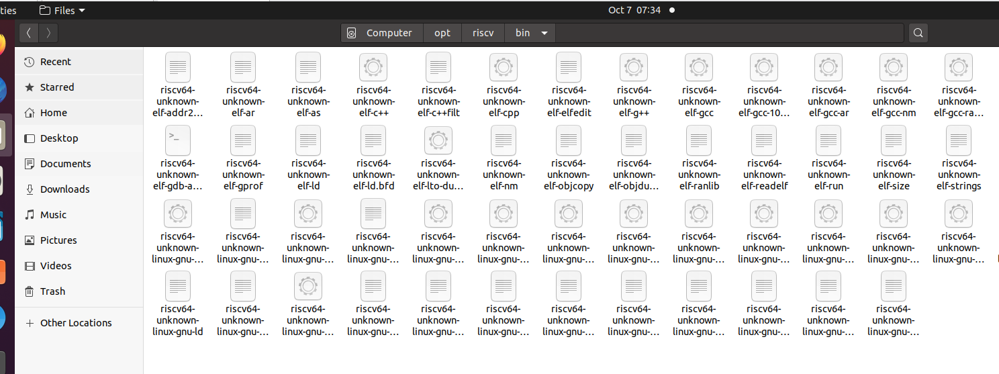
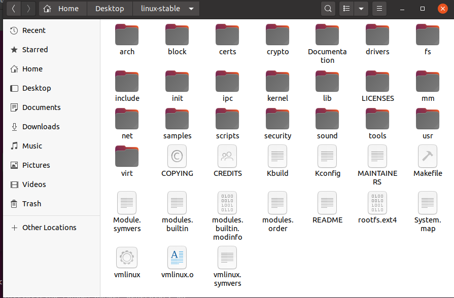
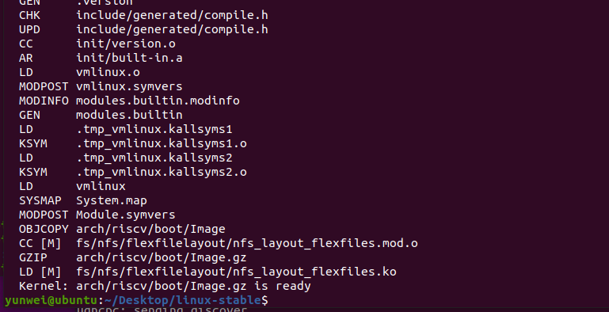
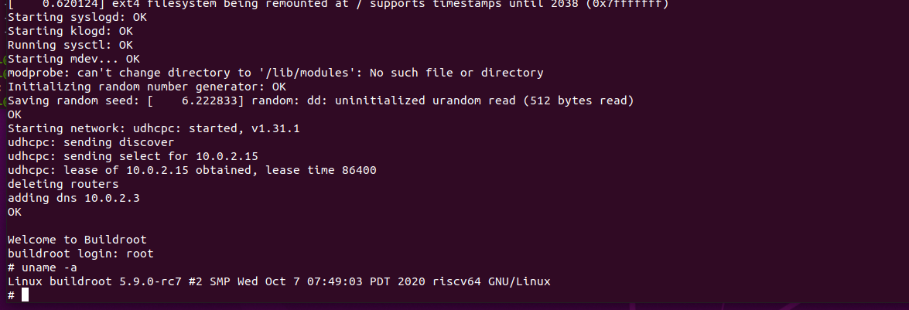
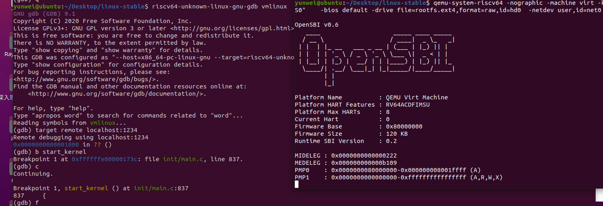
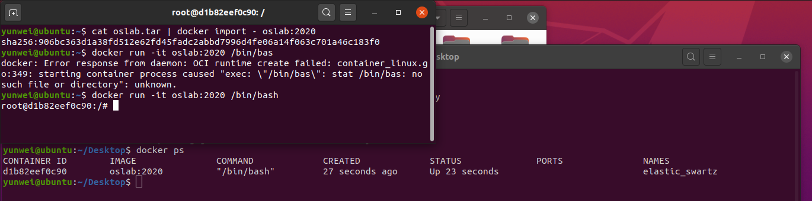

# lab0 report: 环境配置运行 RISC-V Linux 

3180102760 郑昱笙

## 不使用 docker 镜像的处理方法：

本地环境：Ubuntu 20.04

### 安装 riscv 工具链

下载源代码：

```
git clone --recursive https://github.com/riscv/riscv-gnu-toolchain
```

安装依赖：

```
sudo apt-get install autoconf automake autotools-dev curl python3 libmpc-dev libmpfr-dev libgmp-dev gawk build-essential bison flex texinfo gperf libtool patchutils bc zlib1g-dev libexpat-dev
```

安装编译 Linux 所需的 64 位工具链：

```
./configure --prefix=/opt/riscv
make linux
```

编译完成以后的可执行文件在 `/opt/riscv/bin` 里面（由于不小心多编译了一下 newlib 所以多了不少）：



最后还需要把 `/opt/riscv/bin` 添加到环境变量，才能正常使用命令。

### 下载编译 Linux 源代码：

这里选用的是清华源，linux-stable 分支，运行：

```
git clone https://mirrors.tuna.tsinghua.edu.cn/git/linux-stable.git
```

目录大概是这样子的：



打开，编译：

- 指定使用的交叉编译工具链前缀为 `riscv64-unknown-linux-gnu-`
- 指定架构为 RISC-V
- 使用默认配置

```
make CROSS_COMPILE=riscv64-unknown-linux-gnu- ARCH=riscv CONFIG_DEBUG_INFO=y defconfig all -j2
```

编译好会是这样：



### 使用 QEMU 运行内核

把打包好的文件系统放到linux-stable 目录下；

在编译好的 linux-stable 目录下执行：

- -nographic: 不使用图形窗口，使用命令行
- 内核镜像目录：`arch/riscv/boot/Image`
- 打包好的文件系统用的是助教给的那个docker压缩包里面的 `rootfs.ext4`
- 指定user mode的虚拟网卡ID为 `net0`
- 指定要模拟的设备为 `virtio-net-device`
- bios 使用默认的 `OpenSBI` 

```
qemu-system-riscv64 -nographic -machine virt -kernel arch/riscv/boot/Image   -device virtio-blk-device,drive=hd0 -append "root=/dev/vda ro console=ttyS0"    -bios default -drive file=rootfs.ext4,format=raw,id=hd0  -netdev user,id=net0 -device virtio-net-device,netdev=net0
```

运行之后，首先会进入 OpenSBI 的欢迎界面，然后输出一串调试信息，初始化各个模块，最后进入 shell：



### 使用 gdb 对内核进行调试

运行 qemu 的命令和上面类似，就是在结尾处加上 `-S -s`:

```
qemu-system-riscv64 -nographic -machine virt -kernel arch/riscv/boot/Image   -device virtio-blk-device,drive=hd0 -append "root=/dev/vda ro console=ttyS0"    -bios default -drive file=rootfs.ext4,format=raw,id=hd0  -netdev user,id=net0 -device virtio-net-device,netdev=net0 -S -s
```

然后在同个目录另外一个窗口启动 GDB：

设置断点，继续运行：

```
riscv64-unknown-linux-gnu-gdb vmlinux
target remote localhost:1234

b start_kernel
c
```

结果如图所示：



按 q 即可退出 gdb，此时 qemu 会继续运行。

## 使用 docker 镜像：

使用 aliyun 源安装：

```
curl -fsSL https://get.docker.com | bash -s docker --mirror Aliyun
```

加入 docker 组：

```
 sudo usermod -aG docker $USER
 sudo chmod a+rw /home/$USER/.docker/config.json
```

导入镜像：

```
cat oslab.tar | docker import - oslab:2020
```

从镜像创建一个容器:

```
docker run -it oslab:2020 /bin/bash
```



## 获取 rust 编译工具链：

参考：[https://rcore-os.github.io/rCore-Tutorial-deploy/docs/pre-lab/env.html](https://rcore-os.github.io/rCore-Tutorial-deploy/docs/pre-lab/env.html)