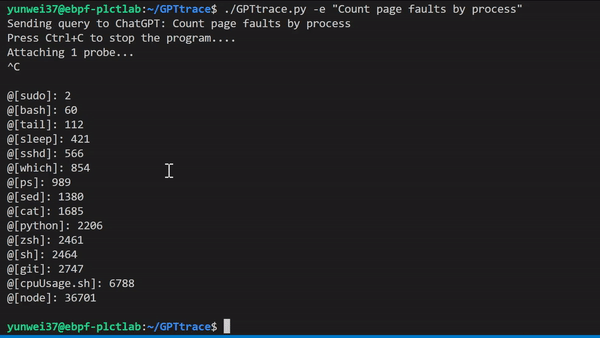

# 使用 ChatGPT ，通过自然语言编写 eBPF 程序和追踪 Linux 系统

eBPF 是一项革命性的技术，起源于 Linux 内核，可以在操作系统的内核中运行沙盒程序。它被用来安全和有效地扩展内核的功能，而不需要改变内核的源代码或加载内核模块。今天，eBPF被广泛用于各类场景：在现代数据中心和云原生环境中，可以提供高性能的网络包处理和负载均衡；以非常低的资源开销，做到对多种细粒度指标的可观测性，帮助应用程序开发人员跟踪应用程序，为性能故障排除提供洞察力；保障应用程序和容器运行时的安全执行，等等。eBPF 已经成为了一个越来越受欢迎的技术，它可以帮助我们更加高效地对内核和用户态的几乎所有应用进行追踪和分析。

但是，eBPF 的开发，或者追踪内核产生的各类事件，需要一定的专业知识，对于一些不熟悉该技术的开发人员来说，可能会有一定的困难。这时，我们的 demo 工具 GPTtrace 所带来的一些新的思路，也许就可以帮助你解决这个问题。它使用 ChatGPT ，通过自然语言编写 eBPF 程序和追踪 Linux 内核：<https://github.com/eunomia-bpf/GPTtrace>

如果你是一名开发人员，想要更加高效地进行追踪和分析，那么类似的方案绝对值得尝试：这种 ChatGPT 和 eBPF 技术的结合将在未来的软件开发、调试、以及可观测性场景中发挥更加重要的作用，同时它可能也会带来一种全新的、交互式地学习范式。

## 我们做了哪些尝试？

GPTtrace 使用 ChatGPT 技术，允许开发人员通过自然语言编写 eBPF 程序和追踪 Linux 内核，无需事先了解该技术的专业知识。它使得开发人员可以更快、更准确地定位和解决软件中的问题。例如，根据进程名称统计 Page Faults 次数：

我们还有一个视频演示与讲解，可以在这里观看：[<https://www.bilibili.com/video/BV1oM411J7gp/>](https://www.bilibili.com/video/BV1oM411J7gp/)

## 我们是怎样做到的？

我们目前的思路是通过预训练 eBPF 程序，让 ChatGPT 学会如何编写各种 eBPF 程序或 bpftrace 的 DSL。大概分为这几步：

1. 预训练 ebpf 程序，利用一些 ebpf 的开发资料，先和 ChatGPT 对话多次，让 ChatGPT 通过对话上下文如何写各种 eBPF 程序或者 bpftrace 的 DSL（其实我们在十二月份就做过一些类似的实践，产出了一份教程文档，但没有把它变成一份工具：<https://github.com/eunomia-bpf/bpf-developer-tutorial>）；
2. 调用 ChatGPT api，并把返回的结果解析之后作为命令输入 shell 执行，或者将 eBPF 程序写到文件里面编译运行
3. 如果编译和加载报错，把对应的报错信息返回给 ChatGPT，让它再生成一个新的 eBPF 程序或者命令

我们使用了 ChatGPT 的 Python API，花了一个下午简单实现了这个小玩具，它可以使用中文或者英文等多种语言输入任意自然语言的描述，例如 “追踪进程打开的文件” "Show per-second syscall rates" 等等，正确率不是 100%，不过十次里面大概已经可以有七八次可以正确进行追踪了，遇到报错还会自行进行修正和调整。

## 进一步的优化？

这个玩具项目本身只是想展示一下可能性，很快应该会有更好的类似 ChatGPT 这样的的 api，和更通用的训练/执行框架出来的，希望它能起到抛砖引玉的效果。目前看起来还有很多可以优化的空间:

1. 能联网搜索之后，让这个工具去获取 bcc/bpftrace 仓库里面的示例程序学习，效果应该还会好很多;
2. 或者让这个应用自己能联网搜索 Stack Overflow 之类的结果，查询如何编写 eBPF 程序，类似新 Bing 的搜索方式；
3. 提供更多高质量的文档和教程，看起来输出的准确度和教程、代码示例的质量密切相关；
4. 其实还可以多次调用其他工具执行命令返回结果，比如说 ChatGPT 输出命令，用 bpftrace 查询一下当前内核版本和支持的 tracepoint，然后返回输出（这也是一次对话），再给出程序，效果应该还要好不少

短期来看，我们希望尝试基于这个工具构建一个交互式的、带有提示的内核追踪工具和学习 eBPF 程序的教程，帮助用户在编写 eBPF 程序时更快地了解语法和调试错误，并且可以根据用户的反馈调整提示和建议的质量；以及提供一个结构化的学习 eBPF 程序的教程，从基础的语法和 API 开始，结合通过用户最终想编写的 eBPF 程序的需求，逐步向用户介绍常用的 eBPF 应用场景和编写技巧。

某种意义上来说，它甚至可以不仅仅是一种语言模型，借助简单的对话的交互模式，以及能操控各类工具、访问网络的手段，它也许可以起到一个巨大的、前无古人的知识库的作用：连接各行各业，根据自然语言输入而非关键词，给出综合概括的、无法被搜索引擎简单获取到的思考和答案。

在当今信息爆炸的时代，我们可以轻易地获得各种海量的信息，但这也带来了另一个问题，就是信息的分散和碎片化，很难将这些信息整合起来，形成有价值的知识。而 ChatGPT 可以通过自然语言交互的方式，将各种信息和知识整合起来，乃至主动去获取知识和接收反馈（就像我们在 GPTtrace 中做的一样），形成一个巨大的知识库，为人们提供综合的思考和答案。

这种方式可以连接各行各业，不受特定领域或行业的限制，根据自然语言输入而非关键词，给出更加准确、综合的概括。此外，由于 ChatGPT 可以操控各类工具和访问网络，它可以更加深入地了解各种知识和信息，并为用户提供更加全面和深入的解答。

这种革命性的变化可能已经站在人类文明变革的前夜，我们获取知识和思考的方式将被颠覆，类似的大模型的出现将成为这个变革的重要推手。

## 未来在何方？

其实这个模型本身的效果，并不算惊艳，甚至可以说还有非常多的成长空间。对于我这样的非 AI 专业研究人员（AI工具和模型的消费者）来说，和传统的训练深度学习模型的方式比起来：

- 训练模型不需要整理数据集和清洗数据集，仅仅需要几篇高质量的文档和教程，数量非常少，使用自然语言描述即可；极大地减少了非专业人士的准备工作；
- 只需要对话上下文即可直观和方便地进行训练，任何人都可以轻松理解（或者尝试类比）AI 是怎么进行学习的；
- 可以适应非常多种不同领域的任务，只要任何任务能被转换成一段文本或指令；

正如哈尔滨工业大学车万翔先生在青源Workshop中提及的，ChatGPT 时代，NLPer 的危与机中所说的那样：

> ChatGPT时代，为了应对当前的挑战，自然语言领域的研究者可以借鉴信息检索研究者的经验。首先，学术界可能不再进行系统级别的研究，主要集中在相对边缘的研究方向上；其次，使用工业界巨头提供的数据进行实验，并不一定能得出可靠的结论，由于存在隐私问题，数据的真实性存疑；通过调用公司提供的 API 进行研究，一旦模型被调整，其结论有可能也会改变。

当使用 AI 解决特定问题的门槛变得足够的低廉，反而是 AI 更进一步普及、更进一步解决更多细分场景下的问题的巨大机会。另一方面可能是支撑 AI 的基础设施：当生成的内容（例如代码，文本，算法，音频视频）的成本变得更廉价，也许可编程、低代码的平台也会变得相对原先巨大的单体应用来说，变得更加具有可扩展性和可复用性。例如，从一段描述或交互式地对话中直接生成一个 FaaS 的接口发布，直接生成一个网页前端并部署，或使用 ChatGPT 生成的代码直接作为可观测的采集和数据处理程序，部署到大型的可观测性平台中。

我们现在也在探索一些 eBPF 和 Wasm 结合的编译工具链和运行时，希望实现从内核态到用户态的可编程扩展效果：<https://github.com/eunomia-bpf/wasm-bpf>

## 一些参考链接

- ChatGPT：<https://chat.openai.com/chat>
- GPTtrace：<https://github.com/eunomia-bpf/GPTtrace>
- ChatGPT Python API: <https://github.com/mmabrouk/chatgpt-wrapper>
- 基于 CO-RE (一次编写，到处运行） libbpf 的 eBPF 开发者教程：通过 20 个小工具一步步学习 eBPF（尝试教会 ChatGPT 编写 eBPF 程序）：<https://github.com/eunomia-bpf/bpf-developer-tutorial>
- ChatGPT类工具如何实现「降维打击」| 聊天机器人闭门研讨观点总结：<https://mp.weixin.qq.com/s/fB9rguy26ej-alm7l_i8iQ>
- eunomia-bpf 开源社区：<https://github.com/eunomia-bpf>

> 注：本文使用 ChatGPT 进行辅助写作完成。
