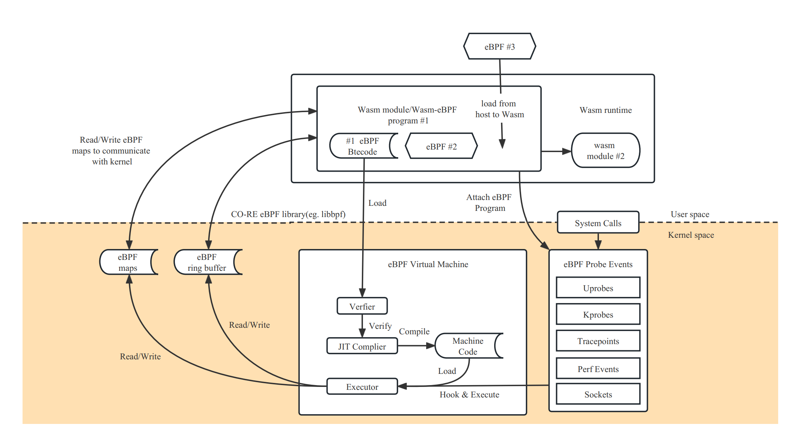

# Wasm-bpf: 为云原生 Webassembly 提供通用的 eBPF 内核可编程能力

> 作者：郑昱笙，陈茂林

Wasm 最初是以浏览器安全沙盒为目的开发的，发展到目前为止，WebAssembly 已经成为一个用于云原生软件组件的高性能、跨平台和多语言软件沙箱环境，Wasm 轻量级容器也非常适合作为下一代无服务器平台运行时。另一个令人兴奋的趋势是 eBPF 的兴起，它使云原生开发人员能够构建安全的网络、服务网格和多种可观测性组件，并且它也在逐步渗透和深入到内核的各个组件，提供更强大的内核态可编程交互能力。

Wasm-bpf 是一个全新的开源项目[1]，它定义了一套 eBPF 相关系统接口的抽象，并提供了一套对应的开发工具链、库以及通用的 Wasm + eBPF 运行时平台实例，让任意 Wasm 虚拟机或者 Wasm 轻量级容器中的应用，有能力将使用场景下沉和拓展到内核态，获取内核态和用户态的几乎所有数据，在网络、安全等多个方面实现对整个操作系统层面的可编程控制，从而极大的拓展 WebAssembly 生态在非浏览器端的应用场景。

## 基于 eBPF 的系统接口，为 Wasm 带来更多可能

也许你也已经看过 Solomon Hykes (Docker的创始人之一)这句话：

> 如果在2008年已经有了 Wasm + WASI，我们根本不需要创建 Docker。 Wasm 就有这么重要。 服务端的 WebAssembly 是计算的未来。

因为无法依赖浏览器中现有可用的 JavaScript 引擎接口，所以目前大多数在浏览器外运行的 Wasm 轻量级容器需要使用 WASI（WebAssembly 系统接口）。这些运行时允许 Wasm 应用程序以与 POSIX 类似（但不完全相同）的方式与其 host 操作系统交互。

但是，相对于传统的容器中可以使用几乎所有的系统调用，目前 WASI 所能提供的系统资源非常有限，目前仅仅在文件系统、socket 网络连接等方面提供了一些基本的支持，对于操作系统底层资源的访问、控制和管理能力仍然存在大量空白，例如对 Wasm 模块或者外部其他进程的执行资源限制与行为观测，对网络包的快速转发和处理，甚至和 wasm 沙箱外的其他进程进行通信，访问外设等，都没有一个比较成熟的解决方案。这也使得大多数的 Wasm 轻量级容器在实际应用中还是主要集中于纯粹的计算密集型应用，而在网络、安全等方面，还是需要依赖于传统的容器技术。

这也是我们希望建立 Wasm-bpf 项目的初衷：借助当前内核态 eBPF 提供的系统接口以及和用户态交互的能力，拓展整个 WASI 的生态蓝图，为 Wasm 应用带来更多可能的使用场景，同时也能在用户态增强 eBPF 程序的能力。

或者换句话说，类似于浏览器中运行的 Wasm 程序，通过 JavaScript 引擎接口访问浏览器提供的各种系统资源，Wasm-bpf 的方案就是借助 eBPF 虚拟机访问操作系统的各类资源；得益于 eBPF 目前在 Linux 内核甚至 Windows 等其他操作系统中的广泛支持，以及不同内核版本和架构之间的可移植性，和内核 BPF 验证引擎的可靠性，我们仍然可以在一定程度上保证应用的可移植性和安全边界。

Wasm-bpf 项目已经实现了内核态 eBPF 虚拟机和用户态之间系统接口完整的抽象机制，并提供了对应的工具链以将 eBPF 应用编译为 Wasm 模块，帮助进行内核态 eBPF 和用户态 Wasm 之间无序列化，共享内存的高效双向通信，并通过代码生成技术，提供和其他用户态 eBPF 开发框架几乎一致的、简单便捷的开发体验。借助 Wasm 组件模型不断完善的生态支持，我们也可以为 eBPF 社区带来更多用户态开发语言，不同语言实现的可观测性、网络等 eBPF 应用和数据处理插件也可以被轻松集成、复用、统一管理。

在几乎已经成为 eBPF 用户态事实上的 API 标准的 libbpf 库，和 WAMR(wasm-micro-runtime) 之上，只需要 300+ 行代码即可构建完整的通用 Wasm-eBPF 运行组件，并支持大多数的 eBPF 使用场景 -- 任何人用任何主流 Wasm 运行时，或者任何 eBPF 用户态库，以及任何编程语言，都可以轻松添加对应的虚拟机支持，并复用我们的工具链轻松实现 Wasm-eBPF 程序的编写和开发。

之前在 eunomia-bpf 项目中，已经有一些将 eBPF 和 Wasm 结合的探索，但它并不是为了 Wasm 原生应用的场景设计的，不符合 Wasm-eBPF 的通用编程模型，性能也较为低下，因此我们创建了一个新的开源仓库，让 Wasm-bpf 项目专注于利用 eBPF 增强和扩展 WebAssembly 使用场景，并进一步完善对应的工具链和开发库支持：<https://github.com/eunomia-bpf/wasm-bpf>

## eBPF：安全和有效地扩展内核

eBPF 是一项革命性的技术，起源于 Linux 内核，可以在操作系统的内核中运行沙盒程序。它被用来安全和有效地扩展内核的功能，而不需要改变内核的源代码或加载内核模块。

从历史上看，由于内核具有监督和控制整个系统的特权能力，所以操作系统一直是实现可观察性、安全性和网络功能等多种能力的理想场所。同时，由于操作系统内核对稳定性和安全性的高要求，内核的新功能迭代通常非常谨慎，也很难接受自定义的、较少通用性的功能改进。因此，与用户态的更多功能相比，内核态操作系统层面的创新率历来都比较低[2]。

eBPF 从根本上改变了这个公式。通过允许在操作系统内运行沙盒程序，应用程序开发人员可以在运行时，可编程地向操作系统动态添加额外的功能。然后，操作系统保证安全和执行效率，就像在即时编译（JIT）编译器和验证引擎的帮助下进行本地编译一样。eBPF 程序在内核版本之间是可移植的，并且可以自动更新，从而避免了工作负载中断和节点重启。

今天，eBPF被广泛用于各类场景：在现代数据中心和云原生环境中，可以提供高性能的网络包处理和负载均衡；以非常低的资源开销，做到对多种细粒度指标的可观测性，帮助应用程序开发人员跟踪应用程序，为性能故障排除提供洞察力；保障应用程序和容器运行时的安全执行，等等。可能性是无穷的，而 eBPF 在操作系统内核中所释放的创新才刚刚开始[3]。

### eBPF 的未来：内核的 JavaScript 可编程接口

对于浏览器而言，JavaScript 的引入带来的可编程性开启了一场巨大的革命，使浏览器发展成为几乎独立的操作系统。现在让我们回到 eBPF：为了理解 eBPF 对 Linux 内核的可编程性影响，对 Linux 内核的结构以及它如何与应用程序和硬件进行交互有一个高层次的理解是有帮助的[4]。

Linux 内核的主要目的是抽象出硬件或虚拟硬件，并提供一个一致的API（系统调用），允许应用程序运行和共享资源。为了实现这个目的，我们维护了一系列子系统和层，以分配这些责任。每个子系统通常允许某种程度的配置，以考虑到用户的不同需求。如果不能配置所需的行为，就需要改变内核，从历史上看，改变内核的行为，或者让用户编写的程序能够在内核中运行，就有两种选择:

| 本地支持内核模块                                                                                | 写一个内核模块                                                                          |
| ----------------------------------------------------------------------------------------------- | --------------------------------------------------------------------------------------- |
| 改变内核源代码，并说服Linux内核社区相信这种改变是必要的。等待几年，让新的内核版本成为一种商品。 | 定期修复它，因为每个内核版本都可能破坏它。由于缺乏安全边界，冒着破坏你的Linux内核的风险 |

实际上，两种方案都不常用，前者成本太高，后者则几乎没有可移植性。

有了 eBPF，就有了一个新的选择，可以重新编程 Linux 内核的行为，而不需要改变内核的源代码或加载内核模块，同时保证在不同内核版本之间一定程度上的行为一致性和兼容性、以及安全性。为了实现这个目的，eBPF 程序也需要有一套对应的 API，允许用户定义的应用程序运行和共享资源 --- 换句话说，某种意义上讲 eBPF 虚拟机也提供了一套类似于系统调用的机制，借助 eBPF 和用户态通信的机制，Wasm 虚拟机和用户态应用也可以获得这套“系统调用”的完整使用权，一方面能可编程地扩展传统的系统调用的能力，另一方面实现更高效的可编程 IO 处理。

正如上图所示，当今的 Linux 内核正在向一个新的内核模型演化：用户定义的应用程序可以在内核态和用户态同时执行，用户态通过传统的系统调用访问系统资源，内核态则通过 BPF Helper Calls 和系统的各个部分完成交互。截止 2023 年初，内核中的 eBPF 虚拟机中已经有 220 多个Helper 系统接口，涵盖了非常多的应用场景。

值得注意的是，BPF Helper Call 和系统调用二者并不是竞争关系，它们的编程模型和有性能优势的场景完全不同，也不会完全替代对方。对 Wasm 和 Wasi 相关生态来说，情况也类似，专门设计的 wasi 接口需要经历一个漫长的标准化过程，但可能在特定场景能为用户态应用获取更佳的性能和可移植性保证，而 eBPF 在保证沙箱本质和可移植性的前提下，可以提供一个快速灵活的扩展系统接口的方案。

目前的 eBPF 仍然处于早期阶段，但是借助当前 eBPF 提供的内核接口和用户态交互的能力，经由 Wasm-bpf 的系统接口转换，Wasm 虚拟机中的应用已经几乎有能力获取内核以及用户态任意一个函数调用的数据和返回值（kprobe，uprobe...）；以很低的代价收集和理解所有系统调用，并获取所有网络操作的数据包和套接字级别的数据（tracepoint，socket...）；在网络包处理解决方案中添加额外的协议分析器，并轻松地编程任何转发逻辑（XDP，TC...），以满足不断变化的需求，而无需离开Linux内核的数据包处理环境。

不仅如此，eBPF 还有能力往用户空间任意进程的任意地址写入数据（bpf_probe_write_user[5]），有限度地修改内核函数的返回值（bpf_override_return[6]），甚至在内核态直接执行某些系统调用[7]；所幸的是，eBPF 在加载进内核之前对字节码会进行严格的安全检查，确保没有内存越界等操作，同时，许多可能会扩大攻击面、带来安全风险的功能都是需要在编译内核时明确选择启用才能使用的；在 Wasm 虚拟机将字节码加载进内核之前，也可以明确选择启用或者禁用某些 eBPF 功能，以确保沙箱的安全性。

所有的这些场景都不需要离开 Wasm 轻量级容器：不像传统的使用 Wasm 作为数据处理或者控制插件的应用中，这些步骤由 Wasm 虚拟机外的逻辑实现，现在可以在 Wasm 轻量级容器中实现对 eBPF 以及 eBPF 能访问的几乎所有系统资源，完整的控制和交互，甚至实时生成 eBPF 代码改变内核的行为逻辑，实现整个系统从用户态扩展到内核态的可编程性。

## 用户空间和 eBPF 程序的交互流程

eBPF 程序是以函数为单位的、事件驱动的，当内核或用户空间应用程序通过某个 hook 点时就会运行特定的 eBPF 程序。要使用一个 eBPF 程序，首先我们需要使用 clang/LLVM 工具链将对应的源代码编译为 bpf 字节码，其中包含对应的数据结构定义、maps 和 progs 定义，progs 即程序段，maps 可以用来存储数据或者和用户空间实现双向通信。之后，我们可以借助用户态的开发框架和加载框架，实现完整的 eBPF 应用。

### 通常的用户态 eBPF 开发框架

对于一个完整的 eBPF 应用，通常需要包含用户态和内核态两部分：

- 用户态程序需要通过一系列系统调用跟内核进行交互（主要是 bpf 系统调用），创建对应的 map 以在内核态保存数据或和用户态通信，根据配置动态选择加载不同的程序段，动态修改字节码或配置 eBPF 程序的参数，将对应的字节码信息加载进内核，通过验证器确保安全性，并通过 maps 和内核之间实现双向通信，通过 ring buffer / perf buffer 之类的机制从内核态向用户态传递数据（或者反之）。
- 内核态主要负责具体的计算逻辑与数据收集。

### 在用户态 Wasm-eBPF 系统接口之上定义的全新 eBPF 开发框架

这个项目本质上可以说是希望把 Wasm 沙箱当做在操作系统之上建立的另一个用户态运行空间，让 Wasm 应用在沙箱中实现和通常用户态中运行的 eBPF 应用一样的编程模型和执行逻辑。Wasm-bpf 会需要一个在 host（沙箱外部）构建的运行时模块，以及一些在沙箱内部被编译为 Wasm 字节码的运行时库来提供完整的支持。

要实现完备的开发模型，我们需要：

- 一个 Wasm 模块可以对应多个 eBPF 程序；
- 一个 eBPF 程序实例也可以被多个 Wasm 模块所共用；
- 可以将 eBPF 程序从 Wasm 沙箱中动态加载进内核、选择所需的挂载点挂载、卸载，控制多个 eBPF 字节码对象的完整生命周期，并支持大多数的 eBPF 程序类型；
- 可以通过多种类型的 Maps 和内核双向通信，支持大多数的 Maps 类型；
- 通过 ring buffer 和 perf event polling 从内核态向用户态高效发送信息（对于 ring buffer 来说，也可以反之）；
- 几乎可以适配于所有的使用 eBPF 程序的应用场景，并可以随着内核功能的添加不断演化和扩展，同时不需要变动 Wasm 虚拟机的系统接口。

这就是目前 Wasm-bpf 项目所做的工作。我们也提出了一个新的 WASI 的 Proposal: WASI-eBPF[7].

在 Wasm-bpf 项目中，所有 Wasm 和 eBPF 虚拟机之间的通信都无需经过序列化、反序列化机制，通过工具链中代码生成技术和 BTF（BPF 类型格式[12]）信息的支持，我们可以实现在 eBPF 和 Wasm 之间可能不同的结构体内存布局、不同的大小端机制、不同的指针宽度之间的正确通信，在运行时几乎不会引入任何额外的开销；通过 eBPF Maps 通信的时候数据可以直接由内核态复制到 Wasm 虚拟机的内存中，避免多次拷贝带来的额外损耗。同时，通过自动生成 skeleton （bpf 代码框架）和类型定义的方式，用户态程序的 eBPF-Wasm 开发体验也得到了非常大的改善。

得益于 libbpf 提供的 CO-RE（Compile-Once, Run Everywhere）技术，在不同内核版本之间移植 eBPF 字节码对象，也不需要引入额外的重新编译流程，运行时也没有任何的 LLVM/Clang 依赖[12]。

通常一个编译好的 eBPF-Wasm 模块只有大约 90Kb，在不到 100ms 内即可以完成动态加载进内核并执行的过程。我们也在仓库中提供了几个例子，分别对应于可观测、网络、安全等多种场景。

感谢华南理工大学赖晓铮副教授、西安邮电大学陈莉君教授团队和达坦科技王璞、施继成老师对 Wasm 和 eBPF 相结合的指导与帮助，在接下来的工作中，我们会和参加 2023 开源毕设之旅的同学们一同针对一些 Wasm-bpf 具体的应用场景，进行更深入的研究与探讨，并在下一篇 blog 中给出更详细的原理解析与性能分析，以及对应的一些代码示例。

Wasm-bpf 编译工具链与运行时模块等目前由 eunomia-bpf 开源社区开发与维护，感谢中科院软件所 PLCT 实验室对社区的大力支持和资助，感谢社区同伴们的贡献。接下来，我们也会在对应的 eBPF 和 Wasm 相关的工具链和运行时方面，进行更多的完善和探索，并积极向上游社区反馈和贡献。

## 参考资料

- [1] wasm-bpf Github 开源地址：<https://github.com/eunomia-bpf/wasm-bpf>
- [2] 当 Wasm 遇见 eBPF ：使用 WebAssembly 编写、分发、加载运行 eBPF 程序：<https://zhuanlan.zhihu.com/p/573941739>
- [3] <https://ebpf.io/>
- [4] 什么是 eBPF：<https://ebpf.io/what-is-ebpf>
- [5] Offensive BPF: Understanding and using bpf_probe_write_user <https://embracethered.com/blog/posts/2021/offensive-bpf-libbpf-bpf_probe_write_user/>
- [6] 云原生安全攻防｜使用eBPF逃逸容器技术分析与实践：<https://security.tencent.com/index.php/blog/msg/206>
- [7] kernel-versions.md: <https://github.com/iovisor/bcc/blob/master/docs/kernel-versions.md>
- [8] WebAssembly：无需容器的 Docker：<https://zhuanlan.zhihu.com/p/595257541>
- [9] 云原生项目可扩展性的利器 WebAssembly 简介 <https://mp.weixin.qq.com/s/fap0bl6GFGi8zN5BFLpkCw>
- [10] WASI-eBPF: <https://github.com/WebAssembly/WASI/issues/513>
- [11] BPF BTF 详解：<https://www.ebpf.top/post/kernel_btf/>
- [12] BPF 可移植性和 CO-RE（一次编译，到处运行）：<https://cloud.tencent.com/developer/article/1802154>
