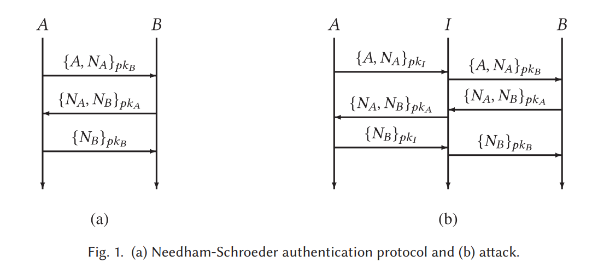
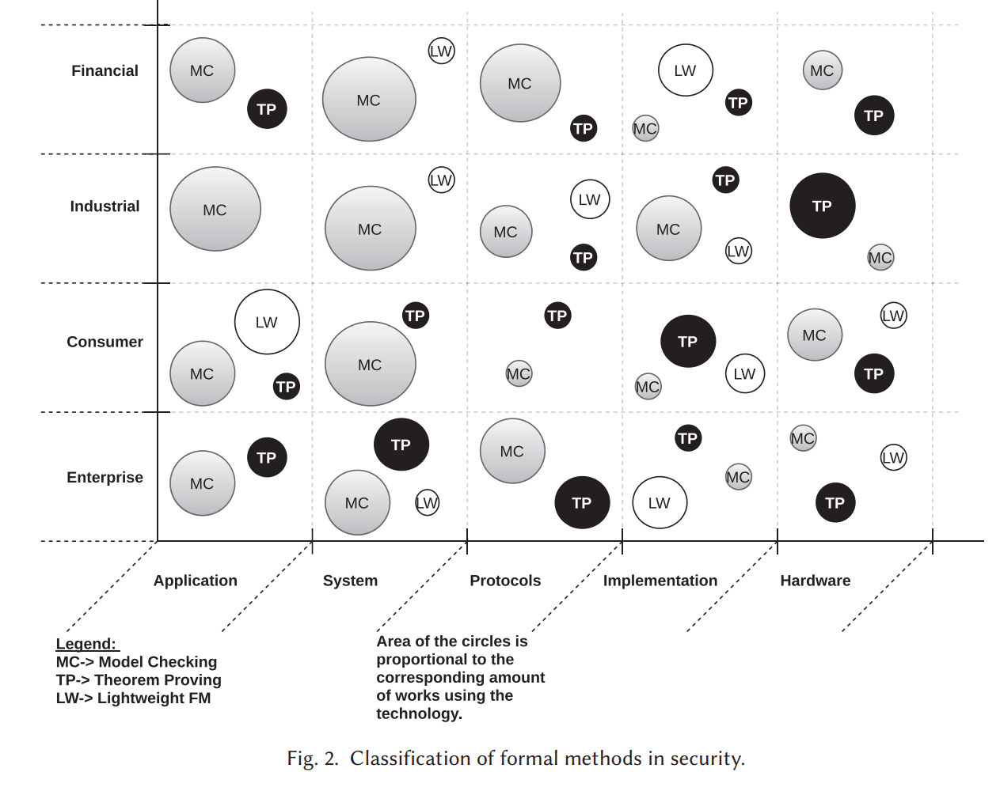
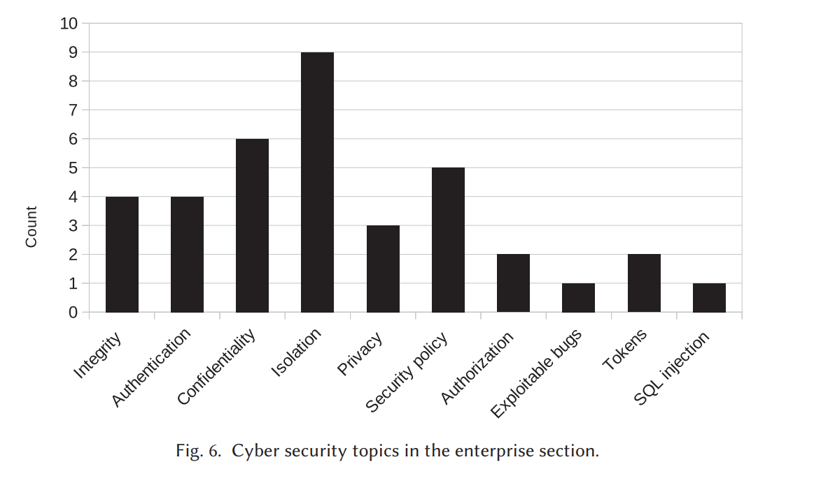

# 综述阅读：安全实践中的形式化方法

[A Survey of Practical Formal Methods for Security (acm.org)](https://dl.acm.org/doi/pdf/10.1145/3522582)

在今天的世界中，关键基础设施通常由计算机系统控制。这引入了新的网络攻击风险，可能会破坏这些系统的安全性并破坏其功能。因此，有必要建立具有强大的网络攻击抵御保证的系统。实现这种保证的一种方法是使用形式化验证，它提供了系统符合所需网络安全属性的证明。本文回顾了在网络安全和安全关键系统方面使用形式化方法（FM）的情况。我们将FM分为三个主要类别：定理证明、模型检查和轻量级FM。为了比较FM的不同用途，我们定义了一组共同的术语。我们进一步根据应用FM的计算机系统类型来开发类别。介绍、讨论、比较和总结了每个类别中的解决方案。我们描述了历史亮点和发展，并从FM从业者和研究人员的角度介绍了FM在网络安全领域的最新研究现状。通过考虑所有类型的FM、几种类型的安全关键系统以及相应的分类结构，实现了全面的FM概述。因此，本文为安全关键系统的系统设计人员提供了FM和可用技术的综合概述，简化了选择正确工具的过程。本文总结了检讨的讨论，重点关注最佳实践、挑战、一般未来趋势和研究方向。

> 本文来自 eunomia-bpf 社区，我们正在探索 eBPF 和 WebAssembly 相互结合的工具链和运行时: <https://github.com/eunomia-bpf/wasm-bpf> 社区关注于简化 eBPF 程序的编写、分发和动态加载流程，以及探索 eBPF 和 Wasm 相结合的工具链、运行时和运用场景等技术。

1 INTRODUCTION

数字服务目前正向社会各个方面扩展[207]。这反过来导致社会对支持这些服务所需的网络基础设施的依赖性。对网络基础设施的沉重依赖带来了新的挑战，形式是网络攻击和潜在的网络恐怖主义[142]，威胁行为者涵盖了从个人犯罪分子、网络犯罪分子和“黑客活动分子”到资源充沛的国家行为者[208]的整个范围。金融、工业或日常消费服务的干扰可能导致显著的财务和社会成本。随着数字化的进一步传播，潜在的攻击面只会变得更大，增加了保护数字服务的挑战[250, 260]。随着系统越来越大、越来越复杂，必须投入大量资源来保护这些系统免受已知网络攻击的攻击。通常，保护机制被纳入以关闭成功网络攻击后发现的漏洞，因此具有反应性质。这种方法将网络安全从系统内要解决的主要挑战降低到了一个事后的考虑[236]。

由于网络攻击的广泛性质，很难直接量化它们对社会的影响[101]，然而，它们往往涉及显著的财务成本以及可能的生活质量受损。一个例子是潜在的针对电力基础设施的网络攻击，包括电力市场，这可能导致发电机的损坏和机密数据的泄露[191]。另一个例子是针对制造设施的攻击，导致生产延迟或质量降低[47, 204]。这些例子表明，网络威胁应被视为对社会基础设施的物理威胁一样重要。

越早发现新系统中潜在的网络安全威胁，这些威胁的缓解成本就越低[257]。形式方法（FM）提供了在系统生命周期的所有阶段发现和缓解网络威胁的机会。使用FM为网络安全保证领域带来了数学严谨性。这是可能的，因为FM是使用基于模型的方法的技术，其中的模型被严格指定[261]，允许开发关于所研究的系统应该做什么的精确语句，而不会对如何做出任何约束[264]。这些模型代表所讨论系统的软件、硬件或二者的组合。使用FM的主要好处来自系统设计内部一致性的数学证明[115]。这种证明提供了强大的保证，因为它考虑了整个系统的行为，一旦证明为真，它就保持为真，而在传统的测试中，只能覆盖特定的场景。FM可以被视为提供数字社会网络安全保证的工具[262]。除了保证系统行为的正确性之外，采用全面的正式方法还可以减少实现错误的数量，这些错误是攻击的基本组成部分。

需要注意的是，存在各种各样的形式方法。我们考虑的主要类别是：

- 定理证明，基于计算机证明分析形式描述的重要属性。
- 模型检查，以详尽的方式检查系统的有限状态模型是否满足给定的规范。
- 轻量级形式方法，使用形式化技术对系统进行静态或动态分析（这个概念是在参考文献[132]中提出的，但我们从其描述中提取了模型检查并将其归为了另一类）。

有关形式方法在安全领域的技术基础的详细介绍，请参阅参考文献[32]。该章节重点介绍该领域的技术基础，而我们的调查则集中于特定的应用领域。
在所有情况下，这些方法都被用来确定系统是否以正确的方式运行，许多方法都已经获得了重要的工具支持以自动化验证和验证过程[10]。在本次调查中，我们考虑所有方法及其在数字社会特定领域的应用。我们进一步将形式方法应用于系统行为的特定抽象级别，从应用级别到硬件级别。通过考虑形式验证在这些维度上的最新研究，我们提供了一个非详尽的概述，以特定学科的形式方法应用为例。本次调查的目的是允许从业者识别适用于其领域系统的经过验证的方法，从而希望增加形式方法在网络安全领域的应用。我们认为，在不同的形式方法应用领域进行类似的调查可能会成为增加应用的催化剂，因为已经确定，教育和经验以及找到形式方法的正面应用示例可能会导致专业人员将形式方法应用于他们的专业领域[104]。

1.1 Methodology

在应用形式化方法（FM）解决网络安全挑战的领域内，研究出版物的数量是相当可观的。因此，我们对于本次调查中所考虑的研究出版物做出了几项限制。首先是研究的新颖性，考虑到过去十年的情况，我们将出版日期限制在2012年之后。此外，所有的研究工作都需要在科学场合，如期刊、会议或研讨会上发表。下一个限制是专注于计算机工具支持的FM，即只有能够提供计算机分析并经常引导用户进行此分析的工具支持FM才被考虑。这一限制是为了更专注于FM的应用，将形式化安全分析的好处带给工业界。这与我们专注于应用形式化方法有关，在寻找研究出版物时，我们只考虑了使用工具支持FM来处理具体网络安全问题的研究出版物。因此，本次调查不专注于FM在安全领域的理论进展或仅简要提到FM使用的提议流程，如模型检查算法的理论方法、超属性规范等。此外，本次调查不涉及通常被称为可证明安全的安全方法。这是一种数学方法，用于分析加密机制或系统的安全性。该方法考虑攻击者模型下的系统，并将安全要求表达为一个对攻击者应该能够实现的限制。证明是通过建立攻击者需要解决一个已知的困难问题（例如二次残余问题[105]）才能破坏系统安全的事实来完成的。因此，系统的安全性降至基础难题的难度。该方法通常用于密码学领域而非安全系统，因此不在我们调查的范围内。我们指向参考文献[28]，提供了关于密码学中FM的报告。最后，我们将我们的搜索限制在明确考虑安全方面，而不是作为安全或正确性的副产品的研究。我们使用Google学术进行跨库搜索，重点关注研究论文，排除研究摘要或扩展摘要。

由于本调查为读者提供了研究的快速概述，我们进一步决定将不同的研究出版物按其关注的行业（领域）以及FM使用的抽象级别进行分类。通过这种方式，研究人员和潜在的工业用户可以快速找到他们感兴趣的领域。此外，我们根据发现的研究论文和现有文献的启示，将研究分类为基于网络安全问题分类。[208]。

1.2 History

本章介绍了过去40年中，在安全领域中使用形式化方法进行研究的重要案例历史。我们选择了四个案例研究，其中使用了形式化方法来保护系统的安全性：

(1) Needham-Schroeder公钥协议。Lowe使用了一个细化模型检查器来发现该协议的三角攻击。这是对先前由Burrows等人[52]证明正确的协议的新攻击。

(2) Mondex智能卡。这是第一个获得ITSEC E6级认证的商业产品。当时有很多讨论，关于是否可能实现这一点。

(3) Tokeneer ID站。人们对使用FM实现更高保证级别所需的严格性的可行性提出了类似的问题。Tokeneer解决了这个问题。

(4) seL4微内核。该系统被认为是世界上最可靠的微内核。显然，它证明了安全和使用形式化方法不会导致性能下降。

Needham-Schroeder公钥协议。Needham-Schroeder公钥协议是一种在网络设备之间进行通信的传输层协议[190]，为网络中的两个方提供相互认证。该协议在图1(a)中进行了可视化。它简单而广为人知，已成为测试安全协议验证技术的流行基准。我们在这里讨论它，因为它是一个重要的安全协议，但其中包含了一个重大错误。这个错误是通过形式化建模和分析发现的。

Lowe [165]表明，与其意图相反，该协议无法确保认证。特别是，他证明了入侵者可以在协议运行期间冒充代理A。冒充者欺骗另一个代理B，使其认为他们正在与A交谈。该协议使用公钥密码学。每个代理A都拥有一个公钥，任何其他代理都可以从服务器获取该公钥。A还拥有一个密钥，它是其公钥的逆。

任何代理人都可以使用A的公钥加密消息，但只有A可以解密它，确保保密性。
该协议还使用随机数：为协议的单次运行造币的随机数字。
Lowe使用CSP [123]对协议进行编码，并通过CSP的模型检查器FDR [103]进行分析。Lowe没有直接指示FDR在协议中寻找漏洞-他只是对入侵者的能力进行了建模，但是模型检查器进行的详尽搜索发现了攻击，尽管如此。
假设我（入侵者）是一个可以参与网络会话的网络用户。我还可以拦截消息并注入新消息，但无法在没有密钥的情况下解密消息。如果我发明随机数或已经理解消息的内容，则可以产生新消息。即使不理解内容，此入侵者也可以重播完整的加密消息[213]。这种方法通常称为Dolev-Yao模型[85]。
攻击涉及协议的两次同时运行，如图1（b）所示。A与I建立有效会话。同时，我冒充A与B建立虚假会话。协议的错误运行可以解释如下：A向I发送一个带有随机数NA的消息，I使用I的秘密密钥解密该消息。 I向B中继消息，假装B正在通信。 B以A加密的方式回复NB，因此I将此加密的随机数中继给A。 A解密NB并向I确认它，I得知它。 I重新加密NB并将其返回给B，这使B相信A是另一方。攻击结束时，B错误地认为A是通信伙伴，只有A和B知道NA和NB。这表明协议是不安全的。协议分析师称这是中间人攻击。在这里，它已被自动发现。

Mondex。Mondex应用程序包括具有电子钱包（钱包）的智能卡，用于电子商务[235]。客户使用Mondex智能卡进行低价值、类似现金的交易，不需要第三方参与。英格兰银行（在这种情况下是金融监管机构）认为Mondex的要求是安全关键的：Mondex必须没有任何实现或设计漏洞，可以允许电子伪造。因此，开发人员将Mondex证明为当时最高标准的ITSEC E6级[129]，相当于通用标准评估保证级别7[57]。Mondex是第一个实现ITSEC E6（EAL7）的商业产品。
参考文献[235]进一步描述了Mondex应用程序的开发，以及其抽象和具体模型。抽象模型描述了电子钱包的世界：原子交易交换价值，抽象模型表达了它们所需的安全性质。具体模型是钱包设计和价值交换的消息协议。
设计团队使用Z符号[233, 263]指定了这两个模型。他们证明了具体模型在形式上是抽象模型的细化。这意味着具体模型遵守所有抽象安全要求。抽象模型及其安全性质通常比具体模型更容易理解。开发人员编写了手动证明，认为没有有效的自动化工具可以完成这样的大任务。相反，证明步骤使用fuzz2和Formaliser工具[97]进行类型检查。证明还得到了独立的外部评估人员的检查。

有四个主要的安全属性：
• 系统及其用户不得创造价值。
• 系统必须记账所有价值。
• 钱包必须具有其预期交易所需的足够价值。
• 所有转移必须在真实的钱包之间进行。
设计团队在证明发现漏洞后更改了辅助协议。 该项目的详细说明在参考文献[265]中给出。 Mondex已被证明是一个可靠的安全系统，由其正式开发保证。

Tokeneer。Tokeneer系统是由美国国家安全局（NSA）[30]设计和开发的。它提供安全访问一个工作站的区域，并控制物理进入。访问控制需要生物识别检查和安全令牌。这些令牌描述了用户在访问该区域时的允许操作。
开发人员需要确保安全性质。他们通过符合通用标准评估保障等级5 [57]来实现这一点。他们还需要展示他们可以以一种具有成本效益的方式来做到这一点。NSA邀请使用FM来开发Tokeneer系统的一个组件，并监控这个实验以测量执行开发所需的工作量和技能。
Praxis（一家英国公司）赢得了合同，并用Z [233, 263]编写了一个正式的规范，正式细化规范到一个SPARK程序。SPARK是带有附加工具集的Ada的子集[29]。他们证明了关键系统属性和运行时错误的缺失，使用传统方法开发额外的软件。这些额外的Ada程序提供了与外围设备的接口。
该项目需要260人天，三人兼职，以及九个月的经过时间。它产生了约10K行SPARK代码，约有16.5K个合同。在实施阶段平均每天写作约200行代码，整个项目大约40行代码。另外还产生了3.5K行标准Ada代码，实施阶段平均每天约200行代码，整个项目约90行代码。系统测试耗时约占项目工作量的4％，远小于通常的测试。
在Tokeneer中发现了两个缺陷。一个是通过形式分析发现的，另一个是通过代码检查发现的。测试团队发现了两个范围内的故障：用户手册中缺少的项目。
NSA设置的任务是符合通用标准评估保障等级5。Tokeneer开发实际上在几个方面超过了EAL5的要求：配置控制，故障管理和测试。尽管核心开发工作的主体是以EAL5为基础进行的，但涵盖规范，设计，实施和通信的开发领域是以EAL6和EAL7完成的。为什么？因为这样更便宜！

seL4微内核。第三代微内核seL4提供虚拟地址空间、线程和进程间通信的抽象。它提供明确的内存管理模型和授权能力。保证ARM版本的seL4微内核的二进制代码是正确的实现。seL4符合其抽象规范，不做其他事情。特别是，seL4 ARM二进制符合完整性和机密性的经典安全属性。
seL4微内核的C代码已经通过其抽象规范进行了正式证明。此证明在Isabelle/HOL中进行了机器检查。这假定启动代码、缓存管理、硬件和手写的汇编代码的正确性。
开发人员声称seL4是唯一经过验证的通用操作系统（OS）内核。系统的操作模型形成一个抽象规范。Haskell程序原型化内核。这个原型提供了自动转换到Isabelle/HOL。Isabelle代码然后是内核的可执行的、设计级别的规范。这是手工编写的C代码，形成了高性能的C实现seL4。细化证明链接规范和C代码。开发者证明攻击者不能破坏内核，即使他们使用错误的编码、虚假的调用或缓冲区溢出攻击。

1.3 Definitions/background

在本文中，我们提供了一组通用术语和定义。这非常重要，因为形式验证和安全领域在很多年内独立发展，因此一些术语被过载并且具有稍微不同的含义，取决于它们在何种上下文中使用。例如，在安全领域（特别是密码学中），证书是指用于将实体绑定到加密密钥的文档。然而，在FM中，证书被用作系统或协议正确性的证明。

在本调查中，对于安全方面，我们使用身份验证一词来指识别和验证访问系统的用户（实体或个人）是否是用户声称的人。这与授权相反，后者是基于用户身份允许用户访问系统的过程。此外，我们经常发现安全协议旨在提供特定的属性，例如隔离，这是一种设计原则，其中进程被分离并被赋予对共享资源（例如共享内存）的特权访问（通常使用容器化或虚拟化等技术）。或者不可否认性，确保无法否认语句或消息的有效性，特别是其作者。我们还想指出匿名性和保密性之间的区别，匿名性指用户或进程的身份不得透露，而保密性指编码为数据块的内容不得透露。

在形式方法方面，可以说所考虑的系统通常包括一组协调的进程，这些进程是定义一组指令的程序实例，由一个或多个线程执行。我们认为进程是系统中的主动实体，而程序是被动实体。描述进程行为的形式框架包括CSP，CCS，ACP，π演算等。进程通常实现协议，即一组数据传输规则，并且可以在共享内存上进行同步或通过通道进行通信，通道是物理通信网络的抽象。由于使用了中间处理器缓存，共享内存实现变得越来越复杂，可能实现许多不同的一致性模型[6]。同样，可以对通道进行许多不同的假设，例如消息的FIFO排序；通道是否保证完整性、可用性和保密性；通道是否无误；是否可以区分消息类型等等。

一般来说，验证是针对规范的，规范是实体（例如硬件、系统、计算机程序、数据结构等）允许行为的抽象（形式或非形式）描述。正式验证通常是针对系统模型进行的，该模型提供了实体的精确正式描述，捕捉被建模实体的关键特性。必须确保模型描述的每个特征都是实体的实际特征。可能会开发相同实体的不同模型，这取决于所关心的属性；例如，计算机程序可以通过前/后状态之间的关系、状态轨迹、输入和输出之间的函数等进行建模。模型可能描述行为功能、协议等。在形式方法中，通常在多个抽象级别上开发模型，并精确定义这些级别之间的关系。安全性的形式方法还需要攻击者的模型，例如在通信系统环境中使用的 Dolev-Yao 模型。

在硬件验证中，术语“协同验证”用于证明系统软件在底层硬件设计的表示上正确执行。这使得软件与硬件集成，而不需要任何物理设备（例如芯片或板）可用。验证的目的是确保它符合其实现（规范）的要求，即实体的物理表现形式。在某些情况下，可以将实现称为模型，该模型提供有关实体的足够细节，以便可以轻松地获得相应的物理实体。

为了最终确定FM的定义，重温我们对FM的分类很重要。我们分类的第一类是定理证明，其中提供了系统正确性的证明，采用符号逻辑。本调查重点关注自动定理证明，其中利用证明助手生成证明。该方法利用一个逻辑系统，试图确定语句ϕ是否从一组语句Γ = {ψ1，...，ψn}中得出。我们考虑的第二类是模型检查，其中利用一个系统的有限状态模型系统地搜索此模型中包含的所有可能系统状态（即模型中的所有可能系统状态）以便检测有关系统的语句是否存在反例，例如在线性时间逻辑中表示为p的属性，表示属性p在无限多个状态中成立。与定理证明一样，我们重点关注自动模型检查。最后，我们定义了一类轻量级形式方法，其中放置了不提供详尽分析的方法。一个简单的例子可能是静态代码分析，其中分析代码时不运行以确定是否违反预定义的规则。另一个例子可能是VDM [38]，其中使用形式建模语言对系统进行建模，并将属性表示为合同，例如inv t == t.issueTime < t.expirationTime，表示通常必须在t到期之前发出t。为了执行检查，模型被动画化，仅设置特定场景（通常是被认为是关键的场景），但是，VDM也可以利用组合测试结合输入路径生成大量测试，从而显着增加测试覆盖率。

2 SURVEY

2.1 分类和概述

由于安全领域中的形式化方法应用于许多领域，我们根据领域和抽象级别进行分类，以提供广泛的安全领域FM的系统概述。我们选择的四个领域的标签如下：

金融（第2.2节）：聚合了在金融/货币领域应用FM的工作，例如支付系统、家庭银行、金融市场、加密货币等。例如移动银行应用程序，ATM基础设施，FIX股票交易协议，智能卡/硬件钱包等。

工业（第2.3节）：该标签聚集了处理应用于生产商品或服务、制造和工业控制的计算系统的工作。例如水处理管理面板，PLC控制网络，Modbus/TCP，电机控制器等。

消费者（第2.4节）：这个标签分类了关注终端用户/个人个人计算设备和应用程序（如命令行shell、家庭操作系统、VoIP协议和运动智能家电）的安全性的作品。

企业（第2.5节）：这是消费者类别的对应，用于分组关注提供计算服务以满足组织需求而不是个人的企业系统的安全性的作品。例如电子邮件服务，电子政务系统，sn2协议，数据服务器仓库等。

由于仅展示四个领域只会将FM在安全领域的研究按应用领域分开，我们进一步介绍了五个抽象级别，这些级别是进行形式化验证的级别：

应用：用于将FM应用于计算应用程序或计算目的的作品的级别。

系统：用于将FM应用于架构级别的作品，通常涵盖多个子系统。

协议：用于应用FM以断言属性或分析系统组件之间的通信协议的级别。

实现：这是一个横向类别，包括所有专注于直接在结果系统上应用/使用FM（例如运行时监控）而不是强调设计和规范的作品。

硬件：用于对在硬件开发过程中应用FM的作品进行分类。

这种分类使我们能够系统地审查最新的研究成果，并基于此提供概述。为了清晰地概述安全领域中的FM，我们进一步应用了第三个维度，定义所使用的FM类型，即模型检查、定理证明和轻量级FM。这提供了不同研究工作的数量概述，如图2所示。

此调查中的各个部分按照逻辑顺序组织，其中研究工作根据应用程序、系统、协议、实现或硬件类型进行分组。在此分组中，研究工作进一步按照逻辑分类组织成段落。例如，第一个段落可能会考虑与制造相关的工作，而下一个段落则会考虑与工业控制相关的工作。在这两种情况下，研究旨在工业领域，但具有不同的范围。调查中的每个部分都代表一个单独的领域，我们在不同抽象级别上提供了研究工作的系统总结。由于此调查试图对大量的研究工作进行分类，因此每个研究工作仅简要介绍，重点关注分析的问题和使用的FM技术。有关单个研究工作的更多详细信息，请参阅本调查基础的技术报告[149]。

消费者物联网系统，例如智能家居设备存在安全漏洞，并已经通过FM得到广泛验证。参考文献[153]的作者使用AVISPA中的模型检查工具和BAN逻辑来验证一个框架，确保智能家居环境中的匿名、身份验证和完整性。在参考文献[182]中，作者开发了IoTRiskAnalyzer工具，用于帮助工程师应用最适合的安全策略。这是通过使用马尔可夫决策过程[202]、将风险属性形式化为概率CTL公式，并使用PRISM模型检查器[156]进行验证实现的。汽车制造商也利用连接设备，特别是智能手机。例如，参考文献[53]的作者开发了基于智能手机的防盗装置，使用ProVerif针对Dolev-Yao攻击模型进行正式验证，以确保安全要求的强大保证。

2.5 Enterprise

企业和大型公司计算是大型国际企业的支柱。近年来，在企业计算中利用云解决方案的趋势仍然存在，同时仍然经常在本地数据中心运行。这些数据中心和云集群被用于众多企业任务，例如协作平台的虚拟化、公司管理和企业门户网站的托管。本节概述了利用FM解决企业计算安全挑战的情况，包括安全数据存储、虚拟化和软件定义网络安全、使用硬件令牌的强身份验证。由于企业是更大的实体，变化通常较慢，需要进行良好的管理。为此，FM已被用作企业云采用的助推器，因为已经提出了几种基于FM的解决方案，可以使企业从本地数据中心安全切换到联合云解决方案。
与之前的章节类似，模型检查是企业计算中形式化安全分析中最常用的工具。定理证明也不落后，尤其是在分析企业服务器中的可信平台模块芯片方面。由于轻量级FM通常作为软件开发环境的插件提供，使它们易于访问，因此在实现层面上广泛使用。企业部分中涉及的网络安全主题如图6所示。

Application. 

企业应用程序通常处理和存储对组织至关重要的数据。如今，这些数据通过软件定义网络（SDN）传输。参考文献[226]的作者创建了一个验证平台，用于利用SDN的应用程序，该平台包括一个建模语言，可以自动翻译并分派到PRISM、SPIN和Alloy模型检查器。任何反例都将显示在工具中。与SDN类似，面向服务的体系结构（SOAs）经常在企业应用程序中使用，增加了这些应用程序的互连性。在参考文献[20]中，作者提出了一个安全平台

利用正式的规范语言和几个模型检查器（CL-Atse和OFMC）对SOA进行评估。作者发现了Google Apps中SAML-SSO集成的问题。企业数据通常存储在大型关系数据库中。在这种情况下，参考文献[61]的作者提出了一种安全外包数据库到不受信任的服务器的方法，建立在可验证数据库[36]的概念上，并利用定理证明来证明他们的方法是安全的。虚拟化是云中经常使用的另一种技术。参考文献[222]的作者介绍了一种针对Xen hypervisor安全的正式分析方案，包括模型检查和静态分析，成功地重新发现了已知的漏洞。最后，我们想指出参考文献[72]中的工作，描述了一家领先的云提供商如何利用FM保障其服务的安全性，指出FM的好处对于他们的客户至关重要。

System. 

现今，大型企业可以自行托管基础架构，充分利用云服务，或部分地将其基础架构与云服务结合，导致联合云系统[183]的出现。参考文献[270]的作者们提出了一种利用CPN和CPN工具[137]分析联合云行为的方法，并创建了几个模型用于安全分析。同样，参考文献[256]的作者们使用Z与Z/EVES定理证明器对数据交换系统进行了机密性和完整性属性的形式化分析，同时利用域理论[39]生成了测试。在参考文献[135]中，作者们提出了一种基于移动环境[55]和不干扰的带盒环境演算[51]的防火墙规则和云拓扑分析的形式化方法。由于云计算通常是利用共享资源构建的，因此参考文献[169]的作者们建立了一个离线框架，用于形式化分析网络隔离属性，确保共享资源之间的隔离。这是通过使用一阶逻辑和约束满足求解器Sugar [240]来完成的。同样，参考文献[173]的作者们提出了一个云复杂性管理（代理）系统[113]的安全框架，利用Z/EVES定理证明器在NIST [43]云参考架构中分析了几个云安全属性。

此外，在参考文献[232]中，作者们提出了一个代理解决方案，用于自动将云服务与客户进行配对，同时管理云复杂性。代理的一个重要部分是找到一个满足客户安全要求的服务，使用基于一阶关系逻辑[130]定义的KODKOD有限模型查找器[244]。此外，还有一些研究考虑了云系统内的虚拟化。例如，参考文献[117]的作者们提出了一种在虚拟化系统中分析安全性和信任的形式化框架，将硬件和软件模型结合在一起，用CSP#[238]表达，并分派给PAT模型检查器，发现了一个现实世界云系统中微妙的错误。同样，参考文献[42]的作者们提出了一个安全子系统，用于在与安全策略相关的虚拟化基础架构中进行变更分析，利用图形和图形转换分派给GROOVE模型检查器[102]。

协议。

企业计算正向云平台转型，需要安全通信协议，并受益于FM分析。Amazon云服务[13]使用s2n[14]，TLS协议的开源实现，利用FM证明其正确性。例如，在参考文献[64]中，作者们证明协议使用的基于哈希的消息认证码（HMAC）是不可区分于随机生成器的，使用Cryptol规范语言[89]描述HMAC，然后将其分派给Coq定理证明器，并通过软件分析工作台[100]将结果与实现相连接。在微软云中，参考文献[136]的作者开发了一种网络协议分析工具，利用Z3 SMT求解器来协助数据中心内的网络策略维护任务，为Azure云服务提供了重要的安全工具。由于云服务通常是远程访问的，参考文献[151]的作者利用Alloy分析器来查找SAML协议[125]中的漏洞。如今，云平台从小型IoT设备[185]收集数据，促使参考文献[141]的作者提出了一种轻量级双向认证协议，并使用OFMC和CL-AtSe验证其对多种攻击的抵抗能力。类似地，参考文献[212]的作者提出了一个移动设备认证方案，并使用ProVerif进行验证。IoT设备可以利用5G网络，参考文献[33]的作者使用Tamarin查找认证子协议问题，参考文献[8]的作者通过用CSP表达认证框架协议[269]和移动以太网协议[128]的方式进行分析，并将其分派给FDR模型检查器以评估相互认证属性。

实现。

企业计算通常由使用不同技术实现的许多应用程序组成。例如，参考文献[195]的作者创建了一个用于PHP插件的静态代码分析工具phpSafe，然后利用它发现了多个PHP插件中的580多个漏洞。类似地，参考文献[267]的作者创建了一个利用不变式分析[116]进行恶意行为检测的工具，指出在多个Web应用程序中逻辑漏洞的高效性。

虚拟化是企业计算的重要组成部分。为了实现虚拟化的安全性，参考文献[252]的作者创建了一个基于行为契约的安全验证虚拟化框架，并使用FRAMA-C[225]对行为契约进行静态分析。类似地，参考文献[251]的作者创建了一个虚拟化框架，用于在单个客户虚拟化程序中验证内存完整性，利用CBMC模型检查器[67]自动分析大部分代码库。

硬件。企业计算需要大量的云硬件基础设施和数据保密性、计算安全性等保障。客户通常将云提供商视为不受信任的实体，因为管理员本身可能构成威胁。

3 FUTURE OUTLOOK

此次调查概述了FM在多个领域中的安全应用情况。根据这些领域内的研究，可以预见在某些情况下FM的使用将加速，而在其他情况下，FM的使用将以较缓慢的速度增加。然而，一般来说，采用FM的趋势是增加的。在金融领域的情况中，FM的使用显然伴随着新的金融技术，如加密货币和智能合约。这种采用可以在专门针对智能合约领域的调查中看到[119]。金融领域中移动应用程序的使用也促使对通过使用FM可以提供高安全性保证的需求。最后，随着加密货币的兴起，金融领域内的硬件正在专门用于促进交易。预计在未来，这种硬件的安全性将继续得到形式化的审查，并且涵盖范围和复杂性将不断增加。

工业领域在网络安全领域面临着自己独特的一组挑战。随着自动化复杂性和数字技术在关键工业设施中的使用增加，预计FM将发挥至关重要的作用。这种趋势已经在2015年由[148]提出，他们调查了工业控制系统安全性和安全性的方法，包括非正式方法。到目前为止，该领域内的大多数工作都是反应性的，即现有系统和协议的分析。然而，在调查中，有几项工作显示了一种趋势，即在新的工业设施和协议的设计过程中早期利用FM。工业领域内另一个新兴趋势是将形式验证工具与软件开发流程集成，这主要表现在机器人应用和PLC代码方面。随着机器人应用和底层硬件的复杂性不断增加，预计FM在未来将发挥重要作用。

消费计算领域是一个快速发展的领域。消费者的趋势变化很快，然而，已经提出了相当多的工作来利用FM 恶意软件保护[37]，甚至创造了经过正式验证的互联网浏览器。此外，从计算机到智能手机的计算转移带来了新的安全挑战。在这个领域，已经将很多关注点放在了Android操作系统权限系统的分析上。这个领域显示出研究量的增加，并且只要移动操作系统被数百万用户使用，形式验证就会加速，可能导致流行的移动操作系统的完全形式安全验证。消费类硬件，如智能手机正在使用TPM，保护移动计算。此外，在这个领域，FM的使用正在增加，特别是为了确保安全TPM区域的属性。
最后，企业计算领域揭示了几个有趣的趋势。其中之一是使用FM来针对虚拟化超级管理程序，分析现有虚拟环境的安全属性以及利用该知识构建完全形式验证的超级管理程序。另一个重要的趋势是主要云计算提供商对其产品的安全性进行形式验证的重大投资。为此，不仅应用了现有的工具，而且云提供商已经转向开发自己的FM工具。这两个趋势都预计不仅会继续，而且由于云计算和虚拟化的日益普及而加速。

安全威胁[217]。在这方面，[219]的作者创建了一个云隔离系统，将用户数据与管理员分开，并限制管理员对用户虚拟机的操作，利用硬件模块，作者命名为Trusted Cloud Module（TCM），为云管理员提供有限的接口，管理加密密钥，并为用户提供安全存储。该模块由现成的硬件组件构建，使用Scyther验证工具。同样，任何可信计算的基础是提供安全存储和计算环境的可信平台模块（TPM）协处理器。不幸的是，使用TPM的平台的安全性经常没有正式验证，导致漏洞[50]。为了缓解这一问题，[27]的作者提出了TRUSTFOUND，这是一个形式建模框架，用于利用Trusted CSP#，CSP#的扩展和LS2[77]进行模型检查，其中使用PAT模型检查器进行验证，并检测到六个隐含的假设和两个严重的逻辑缺陷。

有时，企业使用小型一次性密码（OTP）生成硬件来为用户提供强认证以访问云服务[45]。其中一种设备是Yubikey，一种USB OTP生成器。在[154]中，作者已正式分析了Yubikey OTP的安全性以及硬件安全模块（HSM）的安全性。在这个领域的另一个挑战是解决CPU侧信道攻击。其中一个攻击是时间信道攻击，在共享环境中，攻击者（可能是虚拟机）可以确定另一个虚拟机执行的算法。为了解决这个问题，[92]的作者提出了Timing Compartments，这是一种在硬件中实现的隔离方案，可隔离共享资源的各方之间的时间信息。该方案通过使用SecVerilog进行信息流分析进行了检查。

4 CONCLUSIONS

超过30年前，Burrows等人发表了他们关于安全协议分析的BAN逻辑的开创性工作[52]。他们的工作并不是完全正式的，被证明可以批准危险的协议。尽管如此，他们表明他们的逻辑在揭示各种微妙的安全缺陷和缺陷方面表现良好，特别是在认证协议中。他们着手回答五个问题：
（1）这个协议是否有效？
（2）它能够工作吗？
（3）这个协议到底实现了什么？
（4）这个协议是否比另一个协议需要更多的假设？
（5）这个协议是否做了任何不必要的事情？

他们的重要论文启发了一代安全研究人员使用FM来设计和分析安全协议以及回答类似的问题。此外，在描述形式验证在软件工程中的好处时，Dijkstra曾经引用过著名的话：“测试只能证明漏洞存在，而不能证明漏洞不存在。” 50多年后，在计算机安全领域中，我们现在可能已经有足够的证据来声称“形式方法只能证明安全漏洞的存在，而不能证明不存在” [54]。也就是说，虽然FM提供了严格的工具和技术来证明安全漏洞的不存在，但这种严谨性是有条件的：只有在安全漏洞被记录和规定在一个正式的框架内时，才能进行证明。目前的局限性意味着，FM无法发现任何新的漏洞，因为我们可能并没有在寻找它们。

例如最近的Spectre和Meltdown攻击[145]。像许多漏洞一样，这两个攻击已被证明存在于使用推测执行的处理器范围内，并且缓解这些漏洞需要软件方面的干预。然而，尽管这些漏洞的普遍性，但攻击本身并没有通过形式验证发现，而是通过一系列关于微架构组件的训练和定时的实验。幸运的是，一旦发现了安全漏洞，即使是像Spectre和Meltdown这样复杂的攻击也可以得到正式的描述和隔离[59]。一旦这样做了，下一步就是一个形式的框架来推理这些问题，然后是更简化的工具来扩展验证到更大规模的系统。因此，对于在安全领域继续研究FM实际应用的重要性，同样重要的是通过研究该学科的理论方面来扩展我们在安全领域中FM的推理能力。如果没有这样做，就有可能出现一种新的安全漏洞，它超出了当今逻辑的范畴。例如，Spectre和Meltdown的变体可以通过子集闭合超属性[59]来捕获。因此，如果没有关于超属性[68]的现有作品和随后关于它们验证的作品[59、106、107]，FM的规范和使用来保护Spectre和Meltdown将会更加困难。

至于不同FM技术的利用，我们发现模型检查通常是分析更广泛系统的实践者的选择。从调查的作品中可以看出，一个趋势是，由于大量的工具支持、可以选择的建模语言的丰富性、能够进行详尽分析以及专门针对安全分析的模型检查器的存在[200]，模型检查通常被认为是一个好方法。我们可以确定，即使在模型检查会因问题规模而受到影响的问题上，作者也会将问题范围缩小，专门针对系统或应用程序的关键部分进行分析。在某些情况下，由于问题的规模过大或问题的适用性，FM实践者选择利用定理证明。虽然工具支持不及模型检查，学习曲线更陡峭，但定理证明提供了对会使模型检查器不堪重负的系统的详尽分析。然而，我们观察到，定理证明需要变得更加可访问，以增加其利用率。最后，轻量级FM的特殊类别提供了一个有趣的进入FM世界的入口。一方面，无法进行详尽分析可能被视为缺点，但另一方面，可以主张轻量级FM正在工程世界中变得普及。例如，静态代码分析器不仅在软件构建工具链中得到使用，而且经常直接集成到软件集成开发环境中[221]，成为世界各地大量软件开发人员的指尖工具。正如在第3节中思考的那样，这可能是将FM带入系统设计和开发前台的催化剂之一。

在本文中，我们展示了FM迄今对社会产生了什么影响，以及这种影响将来会增加。过去，安全曾经是工业在开发过程中不想投资的可选附加项。但是现在情况正在改变。例如，安全已成为必须的关键要素，行业不得不在开发过程中投资安全,Amazon Web Services的一个核心卖点是弹性计算云（见第2.4节）。FM已经成功地应用于金融、工业、消费和企业领域的安全分析中（见第2节）。

规范语言和相关工具

我们的调查涵盖了超过十年的FM在安全领域的应用。它揭示了正式规范语言及其工具、定理证明器、模型检查器和验证框架的丰富多样性。我们记录了超过40种不同的规范语言和超过40种不同的验证工具。其中包括以下内容：

Specification languages. AADL (Architecture Analysis & Design Language) [18, 70], ASF
(Anonymous Secure Framework) [153], ASLan++ (AVANTSSAR Specification Language)
[20], BAN logic [52, 228], Boogie [31], Boxed Ambients [135], CASM (ASM-based SL for compilers)[252], CCS (Calculus of Communicating Systems)[152], COVERT (compositional analysis of Android apps) [26], CSP (Communicating Sequential Systems) [120], CSP# (shared
variables CSP) [237], CTL (Computation tree temporal logic) [229], Cloud Calculus [135],
Cryptol [89], Dynamic State Machine [187], ERC20 token contracts [199], Event-B [83], HLPSL
(High Level Protocol Specification Language) [44], Hoare logic [108], LS2 (Logic of Secure
Systems) [27], LTL (linear-time temporal logic) [266], Markov Decision Process [182], Petri
nets [15], π-calculus [40], PlusCal [9], Promela [172], RTL (real-time logic) [110], SPDL (Security Protocol Description Language) [168], SysML-Sec [18], TLA+ (Temporal Logic of Actions) [72], Trusted CSP# [27], überSpark [252], VDM [98], Verilog [164], VHDL [111], VML [226],
vTRUST [117], XMHF (eXtensible and Modular Hypervisor Framework) [251], Z [265].

Model checkers. AVISPA (Automated Validation of Internet Security Protocols and Applications) [21], Alloy [83], CBMC (Bounded Model Checker for C and C++) [58], CWB-NC
(Concurrency Workbench of New Century) [152], Cadence IFV (RTL block-level verifier)
[111], FDR [103], GROOVE [102], jKind [99], NuSMV [65], OFMC (on-the-fly model checker)
[34], PAT (Process Analysis Toolkit for CSP#) [237], PRISM (probabilistic model checker)
[182], SATMC (SAT-based model checker for security protocols) [44], SPIN [247], TRUSTFOUND [27], UPPAAL [177], UVHM (formal analysis scheme for hypervisors) [251].

Theorem provers. Coq [72], Isabelle/HOL [144], K-framework [199], TAMARIN [154], Why [95].

Verification tools and frameworks. AndroBugs (Framework For Android Vulnerability
Scanning) [241], Cl-Atse (protocol analyser) [141], FUDGE (Fuzz driver generator) [24],
Frama-C [252], Krakatau [152], Maude (rewrite engine) [193], MobSF (mobile security framework) [127], phpSAFE [195], ProVerif [40], Quark [134], SAW (Software Analysis Workbench)
[72], SMACK [72], SecGuru [136], SecVeriLog [92], Sugar (SAT-based) [169], TTool (translator
from SysML-Sec to π-calculus) [18], Z3 [22].

这表明自Burrows等人的开创性论文[52]以来，FM在安全方面的研究和应用已经发展。我们的调查特别关注这些技术的实际应用，尤其是在工业规模上的应用。如今，一家公司如果不将其商业安全系统提交形式化分析，似乎是不可想象的。我们还怀疑黑客使用形式化技术来破解所谓的安全系统。作为最后的声明，我们需要承认调查提供了一个发展中领域的时间快照。因此，每十年需要回顾一次调查工作，我们正在计划这样做。尽管存在这个缺点，但作者认为，调查工作是研究的重要组成部分，因为它为寻找形式化方法在安全领域下的新作品和经验丰富的从业人员提供了一个起点和方向指示。

> 本文来自 eunomia-bpf 社区，我们正在探索 eBPF 和 WebAssembly 相互结合的工具链和运行时: <https://github.com/eunomia-bpf/wasm-bpf> 社区关注于简化 eBPF 程序的编写、分发和动态加载流程，以及探索 eBPF 和 Wasm 相结合的工具链、运行时和运用场景等技术。
