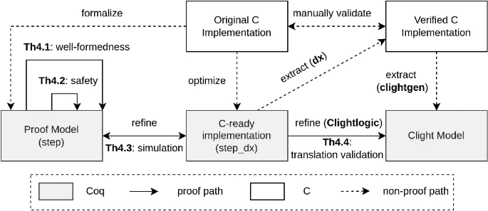
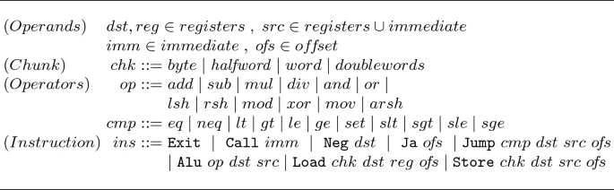
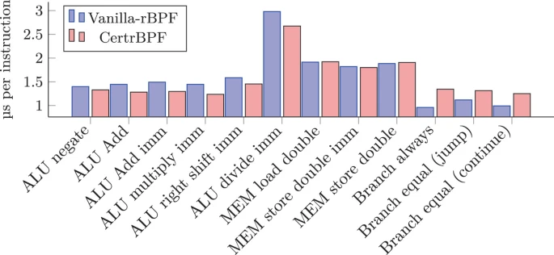
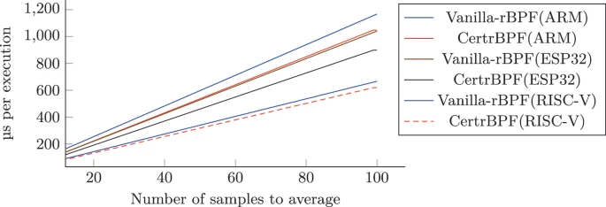

#! https://zhuanlan.zhihu.com/p/615631676
# 论文阅读：eBPF虚拟机的端到端形式化证明

[End-to-end Mechanized Proof of an eBPF Virtual Machine for Micro-controllers](https://link.springer.com/chapter/10.1007/978-3-031-13188-2_15)

## Abstract

RIOT是一个专注于物联网应用的微内核，采用扩展伯克利数据包过滤器（eBPF）来实现所谓的femto容器。由于微控制器很少具有硬件内存保护，因此对eBPF虚拟机（VM）的隔离对于确保系统完整性，防止潜在恶意程序非常重要。本文展示了如何在Coq证明助手中直接从Gallina规范中派生已验证的C实现的eBPF虚拟机。利用CompCert C编译器的形式化语义，我们得到了一个端到端的定理，说明我们的VM的C代码继承了Gallina规范的安全和安全属性。我们的细化方法确保规范的隔离属性在经过验证的C实现中得以保持。初步实验表明具有令人满意的性能。

> 本文来自 eunomia-bpf 社区，我们正在探索 eBPF 和 WebAssembly 相互结合的工具链和运行时: <https://github.com/eunomia-bpf/wasm-bpf> 社区关注于简化 eBPF 程序的编写、分发和动态加载流程，以及探索 eBPF 和 Wasm 相结合的工具链、运行时和运用场景等技术。

**1 Introduction**

硬件强制内存隔离（例如，Trustzone，Sanctum，Sancus）通常在微控制器单元（MCU）上不可用，这些单元通常会通过价格和性能来交换粗粒度隔离。为了减轻开发的变化和成本，MCU操作系统设计的常见做法（RIOT，FreeRTOS，TinyOS，Fushia等）建议在共享内存空间中运行设备的所有代码堆栈，只有当可以信任该代码时，这样才能合理安全。虽然在安全关键系统设计中很常见，但这种信任要求往往不适用于网络MCU，其中运行时OS内核的可扩展性是必不可少的功能。当系统重配置不影响整个网络（例如，通过领导选举）时，可以很容易地提供可离线的可扩展性，通过使用库OS或unikernels来独立重新配置网络端点（例如，云应用程序）。否则，最佳解决方案是将系统扩展（配置，协议，防火墙等）作为汇编级Wasm或Berkeley Packet Filters脚本加载和执行，使用目标设备上的解释器或即时编译器。

Femto-Containers。RIOT采用了扩展的Berkeley Packet Filters（eBPF）并将其定制为资源受限的MCU，通过实现所谓的femto-containers：解释eBPF脚本的微型虚拟机实例。与更具表现力的语言（例如Wasm）相比，实验表明RIOT的eBPF实现rBPF需要较少的内存。Linux内核具有一个eBPF JIT编译器，其安全性取决于复杂的在线验证器。由于MCU架构无法托管如此大的验证器，执行JIT代码将意味着将信任委托给第三方离线验证器。另一种选择是依赖于防御性VM。虽然VM可能比JIT慢，但它可以在开放且可能敌对的环境中运行不受信任的、错误的对手代码，仍然可以隔离故障以保护其主机的完整性。

方法。为了机械地证明解释器的正确性，传统的方法是在证明助手中定义参考语义，并显示可执行的优化解释器产生相同的输出。在本文中，我们的目标是验证使用系统编程语言C实现的虚拟rBPF指令集的解释器。为此，我们引入了一种直接的、端到端的验证工作流程。源指令集的语义是由我们的证明助手中的单调函数术语直接定义的。我们证明了这种语义强制执行关于内存隔离和控制流完整性的安全性和安全性要求。然后，C代码从这些单调函数术语自动派生出来以实现预期的虚拟机。我们证明提取的C代码具有与单调规范相同的有状态行为。我们的方法使用足够表达rBPF语义的Gallina单调子集，支持等价Clight代码的验证提取，同时可证明实现所有必需的防御运行时检查。

计划。本文的其余部分如下所述。第2节陈述了我们的贡献。第3节提供了有关BPF及其变体、CompCert和∂x∂代码提取工具的背景。第4节介绍了我们的工作流程，将单调Gallina程序正式细化为C程序。第5节定义了我们的虚拟机的证明模型：其语义、一致性和隔离定理。第6节将我们的femto-container的证明模型细化为可用于使用CompCert生成代码的合成模型。第7节证明了合成和实现模型之间的细化。第8节介绍了我们的验证验证器，该验证器建立了VM所需的不变量。第9节研究了我们生成的VM实现与现成的RIOT femto-containers之间的性能。第10节介绍了相关工作，第11节进行了总结。

**2 Contributions**

实现面向MCUs的故障隔离虚拟机面临两个主要挑战。一是将VM嵌入MCU的微内核中，因此需要最小化其代码大小和执行环境。第二个挑战是最小化其证明模型和运行代码之间的验证差距。我们解决了这些挑战，并呈现了第一个端到端的验证和合成全尺寸、真实世界的BPF指令集家族虚拟机：CertrBPF，一种专为MCU架构和RIOT操作系统资源限制设计的解释器。CertrBPF采用基于证明的编程工作流，使用嵌入在证明助手Coq中的函数式语言Gallina。从其证明模型直接执行可执行的C程序的验证细化和提取。我们报告了CertrBPF成功集成到开源IoT操作系统RIOT中，并针对微型基准测试评估了其性能。

*一个经过认证的rBPF解释器。* CertrBPF是Coq中rBPF的验证模型和实现。我们形式化了所有rBPF指令的语法和语义，实现了其解释器的正式模型（femto-container），完成了我们模型的关键属性的证明，并从这个形式化中提取和验证了CompCert C代码。这种方法使我们可以获得完全验证的虚拟机。不仅Gallina VM的规范证明了内核和内存的隔离，而且其预期语义的直接解释作为CompCert C代码本身被验证正确。这产生了一个完全验证的二进制程序，具有最大的安全性和最小的内存占用，并减少了可信计算基础（TCB）：CertrBPF是一个内存高效的内核级虚拟机，使用防御性代码隔离运行时软件故障，并不需要离线验证。

- 端到端证明工作流程。*一个显而易见的选择是使用现有的Coq提取机制将Gallina模型编译成OCaml。这种方法的缺点是必须信任Coq提取。此外，OCaml运行时需要被修剪以适应我们目标架构的空间要求，并且也成为TCB的一部分。我们的野心是最小化验证差距，并提供一个端到端的安全证明，将我们的Gallina模型链接到裸机提取的C代码。因此，我们的预期TCB仅限于Coq类型检查器，CompCert编译器的C语义以及生成的C抽象语法树（AST）的漂亮打印机。

为了实现这个目标，我们的起点是Gallina中的rBPF语义模型。我们使用这个证明模型来证明所有的内存访问都是有效的，并且隔离到专用内存区域中，从而确保隔离。从这个证明模型中，我们然后导出一个综合模型，从中我们提取了一个在Clight中可执行的版本，最终证明执行相同的状态转换。

- 系统集成和微基准测试。*我们将CertrBPF集成为RIOT操作系统中当前未经验证的rBPF解释器的替代品。然后，在各种32位微控制器架构上运行的RIOT中集成CertrBPF的性能进行比较评估。我们的基准测试证明，在实践中，CertrBPF不仅具有安全性，而且减少了内存占用和执行时间。

**3 Background**

该部分描述了我们的细化方法所需的rBPF、CompCert编译器和∂x∂代码生成工具的基本特性。

*BPF、eBPF和rBPF*。最初，伯克利数据包过滤器（BPF）的目的是网络数据包过滤。Linux社区将其扩展为提供在内核中运行自定义VM代码的方法，钩入各种子系统，用于多种用途，超出了数据包过滤[[10](https://link.springer.com/chapter/10.1007/978-3-031-13188-2_15#ref-CR10)]。然后，eBPF被移植到微控制器，产生了RIOT的规范：rBPF[[38](https://link.springer.com/chapter/10.1007/978-3-031-13188-2_15#ref-CR38)]。与eBPF一样，rBPF被设计为一个基于64位寄存器的虚拟机，使用固定大小的64位指令和缩小的指令集架构。rBPF使用固定大小的堆栈（512字节），不定义堆交互，这限制了VM在RAM中的内存开销。然而，rBPF规范没有为流控制定义特殊寄存器或中断，也不支持虚拟内存：主机设备的内存直接访问，只使用权限进行保护。

*CompCert验证编译器*。CompCert是一种C编译器，使用Coq证明助手编写和证明正确性。编译器被划分为多个中间语言的传递。每个中间语言都配备了正式语义，并且每个传递都被证明能够保留程序的观察行为。

*Clight中间语言*。Clight是一个关键性语言，使用最小语法压缩了C的基本特性。验证软件工具包（VST）[[2](https://link.springer.com/chapter/10.1007/978-3-031-13188-2_15#ref-CR2)]验证通过CLIGHTGEN工具获得的Clight级别的C程序。虽然我们不重用VST的证明基础设施，但我们正在重用CLIGHTGEN，以从C程序获得Clight语法。

*CompCert值和内存模型*[[19](https://link.springer.com/chapter/10.1007/978-3-031-13188-2_15#ref-CR19),[20](https://link.springer.com/chapter/10.1007/978-3-031-13188-2_15#ref-CR20)]。内存模型和值的表示在CompCert的所有中间语言中共享。值集val的定义如下：

val∋v::=Vint(i)∣Vlong(i)∣Vptr(b,o)∣Vundef∣…∋::=()∣()∣(,)∣∣…

值v∈val∈可能是32位整数Vint(i)()；64位整数Vlong(i)()；指针Vptr(b,o)(,)，由块标识符*b*和偏移量*o*组成；或未定义值Vundef。未定义值Vundef表示未指定的值，严格地说，它不是未定义行为。然而，由于大多数C运算符在Vundef中是严格的，并且因为分支超过Vundef或对Vundef进行取消引用是未定义行为，我们的证明将确保不存在Vundef。CompCert值还包括浮点数；它们在当前开发中没有作用。CompCert的内存由一组单独的数组组成。每个数组在分配时有确定的固定大小，并由未解释的块b∈block∈标识。内存提供了从内存加载值和将值存储到内存的API。操作由内存块k参数化，它指定要写入或读取多少字节，并指定如何将字节解释为值v∈val∈。

例如，内存块Mint3232指定32位值，Mint6464指定64位值。函数load k m b o返回一个内存块k、一个内存m、一个块b和一个偏移量o。成功时，它从块b的索引o开始读取字节，从内存中返回一个值v。类似地，函数store k m b o v返回一个更新的内存m′′，它与*m*相同，但块b包含按照块k将值v编码为字节的数量从偏移量o开始的*k*。值得一提的是，CompCert内存区域提供的隔离属性：load和store操作失败（返回*None*）的无效偏移量o和无效权限。

*∂x∂工具*。∂x∂起源于用于设计和验证Pip原型内核的工具链[[15](https://link.springer.com/chapter/10.1007/978-3-031-13188-2_15#ref-CR15)]。它的目的是允许以尽可能接近C的风格在Gallina中编写大部分Pip源代码。∂x∂从Gallina源程序中提取C代码，形成CompCert C AST。∂x∂的目标是为C程序员提供易于审查的代码，从而避免在C/汇编模块（访问硬件）和Coq模块（代码和证明）上工作的人之间的误解。为了实现这一目标，∂x∂处理Gallina的C样子的子集。要转换为C的函数依赖于单子来表示计算的副作用，例如对CPU状态的修改。然而，∂x∂不强制执行代码提取的特定单子。

∂x∂*的工作流程*。∂x∂分为两个步骤。首先，给定Gallina函数或整个模块的列表，它为它可以处理的Gallina子集生成一个中间表示（IR）。第二步是将这个IR翻译成CompCert C AST。由于Coq没有内置的反射机制，第一步是用Elpi[[8](https://link.springer.com/chapter/10.1007/978-3-031-13188-2_15#ref-CR8)]编写的，使用Coq-Elpi插件[[37](https://link.springer.com/chapter/10.1007/978-3-031-13188-2_15#ref-CR37)]。该步骤还可以处理外部函数（在提取的C代码中显示为extern），以支持与CompCert的分离编译。为了获得实际的C文件，∂x∂还提供了一个小的OCaml函数，将提取的C AST绑定到CompCert的C美化程序。尽管∂x∂语言是Gallina的一个小子集，但它从使用Coq类型操纵值中继承了很多表达能力。例如，我们可以使用有界整数（即，一个整数和它在某个给定范围内的证明的依赖对），它可以被忠实地和高效地表示为C中的单个int。为此，∂x∂期望将Coq类型映射到C的配置。

∂x∂*内存管理*。∂x∂中使用的类C子集中的一个重要设计选择是内存管理：其生成的代码在不进行垃圾回收的情况下执行。这影响可以实际使用的Coq类型∂x∂：递归归纳类型（如列表）不能自动转换。然而，这个Gallina子集对于希望精确控制内存管理并决定如何在内存中表示数据结构的程序特别相关。这通常是操作系统的情况，或者在我们的情况下，是rBPF虚拟机。

**4 A Workflow for End-to-End Verification in Coq**

本节概述了我们的方法论，通过Gallina规范推导出已验证的C实现。在接下来的章节中，该方法论将被实例化，以获得故障隔离rBPF虚拟机及其验证器的C实现。我们的方法提供了端到端的正确性证明，在Coq证明助手中，降低了直接对C代码进行推理的难度。

如图所示[1]，首先将原始rBPF C实现通过Gallina证明模型进行形式化，然后在Coq证明助手中进行期望属性（例如，安全性）的验证。然后将该规范细化为优化的（等效的）综合模型，以准备提取C代码。

我们方法所采用的细化和优化原则是以 Gallina 为基础推导出一个 C-ready 实现，其尽可能接近目标 C 代码的预期。这个原则有助于：i) 证明优化的正确性，ii) 提高提取代码的性能，以及 iii) 与系统设计人员简化对提取代码的审核和验证。从 C-ready Gallina 实现中，我们利用 ∂x∂ 自动生成 C 代码并进行验证：i) 用 VST 的 CLIGHTGEN 工具将生成的 C 代码首先解析为 CompCert Clight 模型，ii) 用翻译验证的方法证明其可以细化 Coq 中的源 Gallina 模型。由于 ∂x∂ 以语法导向的方式生成 C 代码，因此设计了一个最小的 *Clightlogic* 以简化细化证明。本节的其余部分将详细解释这些不同的步骤。

*面向证明的规范*。我们的规范采用了以单子形式的可执行抽象机形式，使用标准的选项状态单子 *M*。

## 5 A Proof-Oriented Virtual Machine Model

对于我们的证明模型，我们定义了rBPF的显式语法。我们还定义了解释器的状态和语义函数，特别是实现动态安全检查的函数。rBPF指令集，图[2](https://link.springer.com/chapter/10.1007/978-3-031-13188-2_15#Fig2)，包括二进制算术和逻辑运算、否定、相对于偏移量的(非)条件跳转、从/到寄存器/内存中加载/存储值的操作、函数调用和终止。有十一个64位寄存器{R0,…,R10}；一个立即数是32位宽，一个偏移量是16位宽。

## 6 A Synthesis-Oriented eBPF Interpreter

证明模型Mp的编码风格与原始的C语言RIOT实现非常不同，并且缺乏后者用于提高运行时性能的优化。合成模型Ms首先将Mp细化为优化的、安全的、行为等效的单子模型，然后使用∂x∂自动转换为有副作用的实现模型Mc。

## 7 Simulation Proof of the C rBPF Virtual Machine

在本节中，我们解释了如何建立定理[4]的虚拟机Clight代码的模拟关系，该代码是从∂x∂派生的，并使用CLIGHTGEN工具编译成Coq中的Clight AST。

*模拟关系。* 定理[4]的一个关键因素是Gallina状态单子和Clight状态之间的模拟关系，它基本上由CompCert内存组成。 Gallina状态包括CompCert内存，该内存模拟可用于rBPF程序的各种内存区域。该内存还可能包含其他未被虚拟机修改但代表其他内核数据结构的块。模拟关系规定，这种块也存在于Clight内存中，并具有相同的内容。Clight内存包含其他块

## 8 CertrBPF Verifier

Linux eBPF的编译器和运行时系统不强制执行类型或内存安全性。相反，安全性在执行之前使用静态分析器验证程序的有效性。由于大小和复杂性都无法满足MCU架构的要求，因此CertrBPF提供了一个简单的（线性时间）但经过正式验证的验证器CertrBPF-verifier，它确保不变量verifier_inv（定义[3](https://link.springer.com/chapter/10.1007/978-3-031-13188-2_15＃FPar7)）。因此，它扫描输入的rBPF程序（即64位字节码指令列表），并在以下情况下拒绝它：i）源或目的寄存器大于10。 ii）跳转指令的偏移量超出指令序列范围。 iii）或最后一条指令不是Exit指令（opcode 0x95）。

这些属性的静态验证允许解释器跳过不必要的动态检查。我们的验证器采用与解释器相同的端到端验证方法，第4节（[https://link.springer.com/chapter/10.1007/978-3-031-13188-2_15＃Sec4）。](https://link.springer.com/chapter/10.1007/978-3-031-13188-2_15%EF%BC%83Sec4%EF%BC%89%E3%80%82) CertrBPF-verifier中的虚拟机状态是解释器状态的严格子集：stv =⟨I，M⟩由指令序列*I*和内存组成*M*.

## 9 Evaluation: Case Study of RIOT’s Femto-Containers

我们在物联网操作系统RIOT中集成了CertrBPF作为现有非验证模块（vanilla-rBPF）的插拔替换，以提供预期的femto-container功能[39](https://link.springer.com/chapter/10.1007/978-3-031-13188-2_15#ref-CR39)。

- 实现。*解释器的证明模型（第5节）由2.4k行Coq代码组成，相应的隔离证明（第5.1节）长达4.8k行。综合模型，第6节，长约3.2k行，等价定理由0.6k证明代码完成。最后一步（第7节）包括10.8k个Gallina规范和抽取的Clight模型之间的翻译验证证明。至于CertrBPF验证器（第8节），证明和综合模型采用1.4k行Coq代码。相应的证明长达0.5k，最后的模拟证明大约有8.3k。此外，Clightlogic实现有4.4k行Coq代码。
- 实验评估设置。*我们的实验对象是原始的非验证rBPF解释器（即vanilla-rBPF）和自动提取和验证的CertrBPF解释器（不使用RIOT的API）。我们在一组流行的商用现成低功耗物联网硬件上进行测量，代表现代32位微控制器架构和板：i）Nordic nRF52840（Arm Cortex-M）；ii）Espressif WROOM-32（Espressif ESP32）；iii）Sipeed Longan Nano GD32VF103CBT6（RISC-V）。所有代码都使用启用大小优化的GCC编译，并使用-foptimize-sibling-calls GCC选项以删除所有尾递归调用，从而限制堆栈大小。这对我们的隔离定理至关重要，因为它依赖于隐含的CompCert假设，即堆栈不会溢出。为避免CompCert语义与GCC语义可能存在的不匹配，我们还通过以下选项传递：i）-fwrapv，-fwrapv-pointer表示有符号和指针算术根据二进制补码编码进行包装；ii）-fno-strict-aliasing表示没有别名假设。
- 结果。*我们首先评估CertrBPF解释器的内存占用情况，与vanilla-rBPF进行比较。我们测量i）*Flash大小*：所有只读数据，包括实际代码；ii）*Stack*：用于堆栈空间的近似RAM；iii）*Context*：静态RAM。就Flash而言，我们的测量结果显示，CertrBPF实际上将RISC-V的占用空间减少了47％，将ESP32的占用空间减少了35％，将Cortex-M的占用空间减少了10％。在堆栈要求方面，CertrBPF将Cortex-M的占用空间减少了33％，将RISC-V的占用空间减少了22％，将ESP32的占用空间减少了4％。然而，上下文内存从92B增加到所有平台上的144B。

接下来，我们对核心操作的性能进行微基准测试：算术逻辑单元（ALU）的单个指令的性能，用于内存访问（MEM）和分支指令，操作数混合寄存器和立即值，参见图[4](https://link.springer.com/chapter/10.1007/978-3-031-13188-2_15#Fig4)。这些结果是在1000个单一相同指令调用的平均值，其中有一个单一的返回语句来使应用程序退出。

最后，我们对实际IoT数据处理的性能进行基准测试，这些数据处理在运行RIOT的选定硬件上托管在femto容器中。在这种情况下，femto容器内对可用传感器数据点进行滑动窗口平均。图[5](https://link.springer.com/chapter/10.1007/978-3-031-13188-2_15#Fig5)显示了我们根据窗口大小测量的性能。我们将其用作计算负载缩放的蓝图。

主要观点。我们观察到CertrBPF通常会减小内存占用。其中一个原因是当前RIOT API的调用尚不支持CertrBPF。我们观察到，在Cortex-M上，分支指令的执行速度减慢，如图4所示。然而，在所有其他平台（RISC-V、ESP32和Cortex-M）上，我们的微基准测试显示，与普通rBPF相比，大多数指令都具有CertrBPF加速。这种行为在我们的传感器数据处理基准测试中也可见，如图5所示，CertrBPF在三个平台上表现优于普通rBPF。总的来说，CertrBPF获得了安全性，并减少了内存占用和执行时间。

## 10 Related Works

- 系统和编译器验证的方法。由于所涉及的程序代码规模巨大，编译器[18]、静态分析器[16]和操作系统[12，17]的验证已成为广泛的开发和验证工作的主题。这些全面的案例研究催生了应对验证大型软件挑战的新策略和方法。其中一个方法是Cogent[35]，它旨在在SeL4[17]微内核之上开发验证应用程序。Cogent[35]由一个带有线性类型的函数语言组成，用于指定源程序，并生成带有Isabelle/HOL证明信息的C代码。它提供了一个框架来证明提取的C代码与Isabelle/HOL功能正确性规范的高级别精炼在Isabelle/HOL证明助手中。我们的方法与Cogent中的共同规范不同，它是直接的：它直接将Coq规范转换为C代码，并在Coq中执行端到端验证。CertiKOS[12]使用多层次、基于细化的、模块化的微内核定义，从低级内存模型到用户级接口和服务。它被采用在SeKVM[22]中，这是一个用于多处理器硬件的分层Linux KVM虚拟化架构。CompCert项目[18]采用了这种“分而治之”的策略，将全面的ANSI C编译器的验证分解为从源程序到机器代码的连续转换的验证，以组成地验证每个转换步骤的相似性。它的相关静态分析器Verasco[16]使用具有组成抽象域的已验证核心抽象解释器对CompCert C代码进行静态分析。我们的问题陈述在方法上更简单：构建一个安全且小型的虚拟机，在网络微控制器上解释rBPF虚拟指令。我们选择了面向验证的编程方法（例如Low⋆⋆[34]，Vale[5]），以证明嵌入Coq中的rBPF解释器是正确的，并直接从其定义中提取验证代码。
- BPF及其已验证实现的背景。*Mogul等人[26]引入了一个基于堆栈的虚拟机，将数据包过滤器解释为BSD内核，它将BPF扩展到32位指令。BPF在Linux社区得到了广泛应用，并成为虚拟的64位RISC类架构的eBPF(扩展BPF)。据我们所知，BPF运行时系统的验证主要集中在针对微内核的JIT转换上。Myreen[28]使用HOL4证明助手验证了针对堆栈语言的x86的JIT编译器。生成的代码仅保留源代码的语义，但不保证任何隔离属性。Porncharoenwase等人[33]使用CompCert从BPF提取OCaml翻译器到汇编代码，并使用证明助手Coq进行验证，使用OCaml运行时、汇编器和链接器作为TCB。Van Geffen等人[11]提出了一种优化的Linux BPF的JIT编译器，具有自动化的静态分析，假定使用Linux BPF验证器作为TCB进行离线验证。对于微控制器网络的现场部署，所有上述方法都需要一个可信的离线BPF验证器，并且此外，还需要一个安全的上传协议来签名验证脚本并在目标设备上执行身份验证的上传，这促使我们采用故障证明虚拟机的方法。
- 验证虚拟机的背景。*Lochbihler[23]通过使用转换验证[18，32]的证明方法，呈现了Java语言的语义、内存模型和字节码语义的虚拟机的验证实现。Desharnais和Brunthaler[7]在Isabelle/HOL中提出了一个优化和安全的Javascript解释器的形式化验证。它的证明方法基于双模拟的概念。解释器针对最佳安全性和运行时性能。为了针对MCU设备，我们的rBPF VM寻求最佳运行时内存占用，以支持在具有共享内存的小型设备上动态运行多个隔离服务的预期能力。Zhang等人[40]提出了一个不同且雄心勃勃的工作流程，使用演绎式编程环境Why3[9]来指定Etherium字节码（EVM）的虚拟机，并针对其智能合约进行功能正确性验证。EVM被提取为OCaml二进制代码，产生由OCaml运行时和Eth协议实现组成的TCB。
- 将Gallina程序转换为可执行文件的背景。*正如第2节所述，依赖类型的函数语言（如F⋆⋆）倡导的面向证明的方法一样，有多种将Gallina程序提取为可执行文件的替代方案。首先，Coq带有内置的提取机制[21]，可生成OCaml、Haskell或Scheme。这条路线有一个相当大的TCB（Coq提取和编译器）。CertiCoq[1]是一个正在进行的项目，旨在使用特定的IR和多个传递从Gallina生成CompCert C代码。一旦完成这项工作，它将允许依赖于一个小的TCB。Œuf[27]是另一个工具，用于将Gallina编译为C语言。它考虑到了Gallina的精心选择的子集，以解决验证Gallina反映为AST的棘手问题。但是，CertiCoq和Œuf都需要垃圾收集器，并定义了Coq归纳式在运行时的表示方式。

## 11 Conclusion and Future Works

本文使用细化方法直接从Coq中的Gallina规范导出了经过验证的rBPF C实现，rBPF是由RIOT操作系统托管的BPF实现。所有的细化步骤都是通过Coq证明助手机械地验证的，以最小化TCB。我们证明了我们的rBPF虚拟机能够隔离软件错误并且不会产生运行时错误。性能与RIOT中的基本rBPF实现相当。

我们未来的工作目标是将我们的证明工作流程实例化到一个（隔离故障的）JIT编译器中，其中一个挑战是Linux使用验证器的方法在资源受限的设备上不可行，另一个挑战是某些操作可能只能用汇编代码表达。这需要进一步研究如何实质性地提高我们的VM的效率。

> 本文来自 eunomia-bpf 社区：<https://github.com/eunomia-bpf> 社区关注于简化 eBPF 程序的编写、分发和动态加载流程，以及探索 eBPF 和 Wasm 相结合的工具链、运行时和运用场景等技术。
