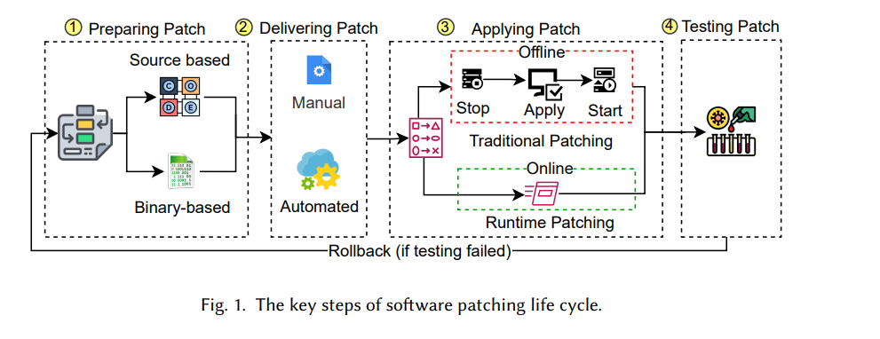
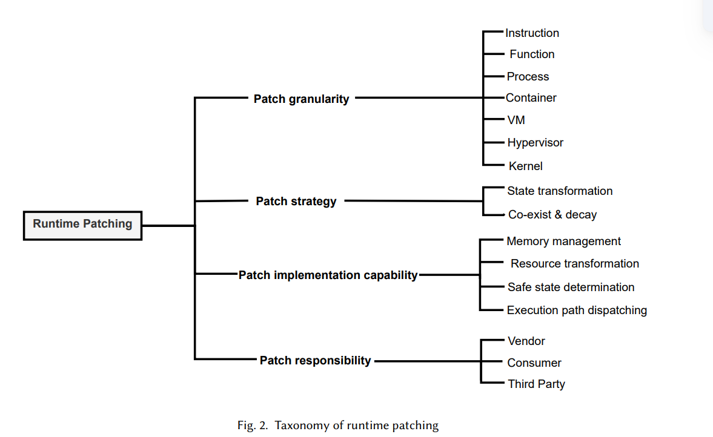
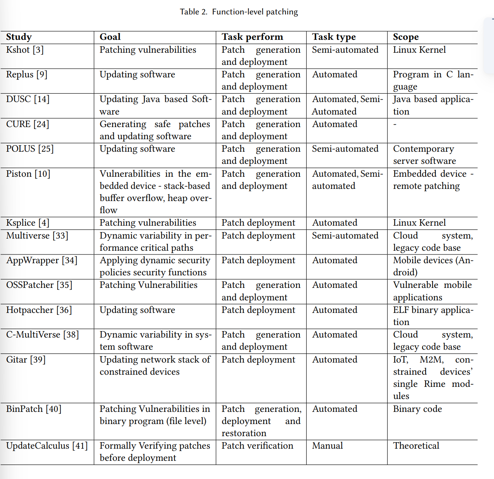
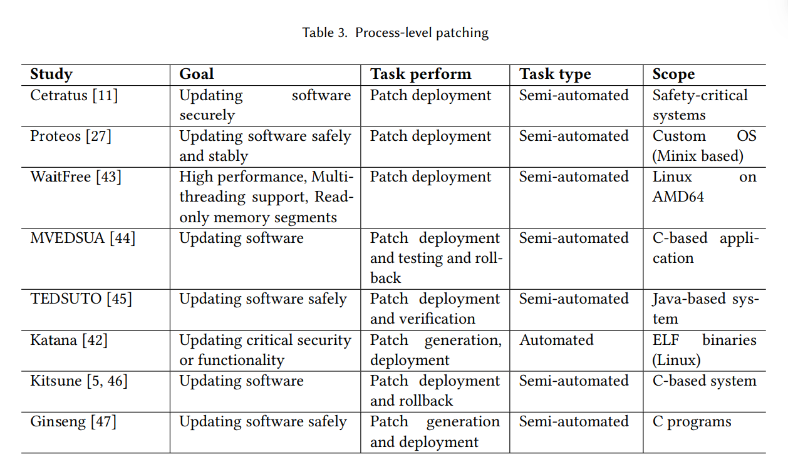
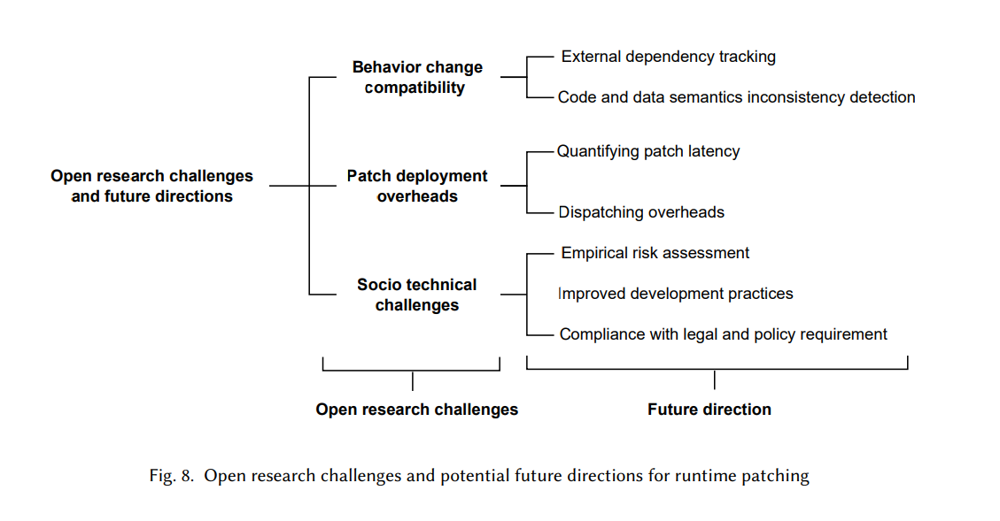

#! https://zhuanlan.zhihu.com/p/613458826
# 运行时软件补丁（热更新/动态更新？）:分类、调查和未来方向

> 本文来自 eunomia-bpf 社区，我们正在探索 eBPF 和 WebAssembly 相互结合的工具链和运行时: <https://github.com/eunomia-bpf/wasm-bpf> 社区关注于简化 eBPF 程序的编写、分发和动态加载流程，以及探索 eBPF 和 Wasm 相结合的工具链、运行时和运用场景等技术。

[https://arxiv.org/pdf/2203.12132.pdf](https://arxiv.org/pdf/2203.12132.pdf)

运行时软件修补:分类、调查和未来方向

运行时软件补丁旨在最小化或消除服务停机时间、用户中断和潜在数据损失，在部署补丁时。由于现代软件系统具有高度的差异性和异构性，没有通用的解决方案可用或提出以在运行时部署和执行补丁。现有的运行时软件补丁解决方案关注特定的情况、场景、编程语言和操作系统。本文旨在识别、调查和综合最先进的运行时软件补丁方法，并概述目前未解决的挑战。它还提供了有关运行时修补方法的多个方面的见解，如修补规模、一般策略和责任。这项研究确定了七个粒度级别、两个关键策略提供了三个责任实体的概念模型，以及四个运行时修补解决方案的能力。通过对现有文献的分析，本研究还揭示了阻碍运行时修补更全面采用的开放问题。最后，它提出了几个需要更多研究人员和实践者关注的重要未来方向。

## 1 INTRODUCTION

现代软件不断发展和适应不断变化的用户需求和要求，这导致需要对现有软件代码应用各种变更。在传统的软件开发生命周期中，软件变更是在代码编译和部署步骤中实现的。这些变更范围从简单的错误修复到全面的软件重构。现代软件的复杂性不断增加，用户需求不断增长，导致频繁的软件修改以更新和补丁的形式提供。这种代码修改通常旨在改进或扩展现有软件功能以满足新的用户需求。改进不一定涉及核心软件系统功能，但可以专注于增强辅助属性，如安全或隐私。
补丁和更新之间的区别没有普遍接受的正式定义。然而，普遍理解是引入新功能的软件变更称为更新（或升级）。相反，修复现有错误或漏洞的小改动被称为补丁。或者，一些版本控制系统松散地将软件兼容性定义为补丁和更新之间的分界线。然而，即使是较小的错误修复补丁也可能破坏与先前版本的兼容性，使得基于兼容性的区分在实践中不足。无论使用的术语是什么，补丁和更新本质上都涉及从简单到相当复杂的代码修改。
在最简单的形式中，用更新版本替换先前运行的软件实例涉及停止旧的软件实例并启动新的实例。这样运行的软件实例可以是单个进程。

Web服务、虚拟机或容器。然而，根据软件变更的程度和类型，更新过程可能会导致长时间的软件服务停机，这可能会对终端用户的体验产生负面影响。从终端用户的角度来看，更新也可能被视为现有使用会话的中断或新会话建立的延迟。这种软件服务中断可能会在高度关键的环境中（如医疗或工业控制领域）造成严重的负面后果。此外，像大型数据中心或股票交易所这样的高负载利润导向环境可能会遭受直接的财务损失，即使是短暂的停机也可能如此。Gartner最近的一份报告表明，仅一小时的停机成本可能高达100万至500万美元。因此，开发了运行时软件修补（简称为运行时修补），也称为热修补、动态修补或在线修补。为了改善传统（也称为离线）修补，运行时软件修补旨在最小化或完全避免任何软件操作中断。运行时修补通常被认为是一种快速漏洞缓解技术。但是，与简单的传统修补（即源代码修补）相比，修补正在运行的软件会带来重大挑战。即必须实现保留现有的终端用户活动（以及与未来活动的兼容性），从人类输入到复杂的基于网络的通信会话，以实现有效的运行时修补。换句话说，软件的未来行为必须受应用程序修补的影响，当前执行的活动和使用的数据也需要相应地进行调整，以保持兼容性。在某些情况下，运行时修补会将代码注入易受攻击的程序以实现临时修复。这些临时修复旨在立即禁用或替换易受攻击的代码，以防止漏洞的利用。同时，开发人员可以实现和测试实际修复错误而不仅仅是禁用当前损坏的功能的适当更新。请注意，与修补批准、测试、签名和分发相关的其他非技术供应链要求可能会在实践中引入更多的显着修补采用延迟。采用运行时修补需要深入了解软件实现细节。例如，将现有的内部函数或对象转换为与更新的软件版本兼容需要深入了解对象格式、结构和位置。

然而，由于底层硬件、编译器、第三方库和操作系统（OS）的技术多样性，没有实现综合运行时修补机制。现有的运行时修补解决方案针对特定的领域或场景，例如物联网设备或数据中心规模的虚拟机和超级虚拟机[9-13]。这些解决方案通常专注于特定平台的挑战，例如资源受限的物联网设备固有的硬件限制。例如，即使在严格的存储限制下，存储软件的修补副本可能也是不可能的。现有的修补研究和评论没有提供定量确定修补规模的正式方法，因此在与修补和更新差异相关的术语方面存在空白。此外，由于现有的特定于平台的修补解决方案数量众多且多样化，缺乏对一般运行时修补策略和所需实现能力（如方法适用性和预期潜在干扰）的全面和正式的理解。此外，运行时修补中涉及的不同方的角色以及他们在各种修补过程步骤中的责任也没有得到明确考虑。

因此，我们从部署方面回顾软件运行时修补的最新文献，以了解现有的运行时修补技术和方法。基于分析，我们提出一个分类法（在第3节中讨论），它提供了运行时修补解决方案的全面视图。

针对补丁粒度（第4节）、补丁方法（第5节）和补丁责任（第6节）的视角，我们还确定了运行时补丁中的挑战和研究空白，并在第8节中强调了进一步改进这一领域的未来研究方向。
本研究的其余部分结构如下。第2节讨论了软件修补的一般情况，接着第3节进一步深入概述了运行时修补。第4节考虑了各种运行时补丁粒度。第5节介绍了现有运行时补丁部署策略、工作流程和功能的全面视图。第6节包含了有关补丁过程中涉及的各方及其相应角色和责任的详细讨论。第8节概述了解决已确定的开放挑战的进一步研究机会，第9节总结了本研究。

## 2 BACKGROUND

图1展示了一个通用的补丁管理流程。无论更改的程度如何，更新软件系统都可以在线或离线进行。如图1所示，补丁准备、提供补丁、应用补丁、测试补丁以及可能删除补丁（如果适用）是关键步骤。补丁准备的技术取决于原始源代码是否可用。源代码补丁本质上是独立的、逻辑上统一的代码编辑，用于改进或修复某些功能、漏洞或漏洞。现代代码版本控制系统通常跟踪这些编辑作为代码提交。完全访问应用程序源代码使得开发全面和灵活的更改成为可能。然而，基于源代码的修补程序的主要缺点是需要重新编译整个应用程序以包括所需的更改。根据软件包的大小，重新编译步骤本身可能需要相当长的时间。

相比之下，缺乏源代码访问权限意味着必须直接修改二进制可执行文件。因此，基于二进制的补丁基本上包含需要在原始二进制可执行文件中更改的字节。与源代码修补相比，二进制修补通常需要更短的时间，因为不需要进行漫长的重新编译步骤。然而，在准备阶段，二进制修补面临一个额外的挑战。即，必须在原始二进制文件中定位要更改的字节的地址。虽然超出了本文的主要范围，但值得注意的是，在生产系统中发生的所有更改都需要进行回滚规划，这是至关重要的。通常假定当新行为与期望的更改不匹配时进行回滚。这种假设可能意味着某些停机时间是不可避免的。因此，在进行回滚时，仍然优先考虑保持运行。因此，从总体上看，回滚操作等同于运行时补丁。相反的方向（新代码返回旧代码）。在两个方向上都必须考虑相同的自洽性问题。关键区别在于，在应用补丁之前可以进行更长时间的准备工作，而不是可能的突然失败。通常，回滚过程高度依赖于应用的补丁类型，涉及的应用程序数据，预期的影响，时间限制和代码量。本次审查旨在仅关注补丁部署步骤、方法和解决方案。

### 2.1 Traditional Software Patching

传统或离线修补意味着停止运行的软件实例，可能转换现有数据并启动一个新实例[9、14]。如图1所示，软件修补的第一步是修补准备。准备好的补丁针对源或二进制级别，具体取决于源代码是否可用。面向源代码的补丁需要进行可能耗时的软件重新编译以生成新的（修补后的）可执行文件，而面向二进制的补丁则修改现有的软件可执行文件。源代码级别的修补允许程序员轻松修改软件的任意方面，例如替换任何函数、指令和数据流。另一方面，二进制补丁在其本质上有些受限，并且主要用于较小规模的修改（主要在安全上下文中）。二进制修补的主要复杂性在于任何代码长度变化都可能导致重要的内存指针失效。此外，在二进制级别的修补中，找到要修改的错误部分的确切位置可能会很复杂[15]。此外，旧的二进制文件仍然可以运行，进一步复杂化了修补过程。此外，由于新修补的二进制文件已准备好执行，运行它可能会因资源共享而导致冲突，因为旧的二进制文件使用相同的资源。

传统补丁的挑战：传统软件补丁方法的主要缺陷是旧软件停止并且新软件未完全启动时会出现的服务中断[1，14]。例如，当补丁软件系统停止时，远程或本地用户会话、网络连接和数据处理会中断或暂停。在交互式用户会话中，短暂的中断可能是可以接受的（尽管不方便），例如网页浏览或文字处理。交互式软件通常被设计成自动保存和恢复用户会话，以在某种程度上减轻这种不便。试图在重新启动之间恢复状态的Web浏览器就是这种缓解的很好的例子。相比之下，对于高度关键的系统，在服务中断可能导致重大经济损失或完全不可接受的情况下，经历服务中断是不可取的。例如，对于生命支持软件和空中交通管制，禁止关闭系统或不被视为选项[14]。因此，系统管理员可能选择延迟补丁部署，以避免可能导致服务中断和应用程序状态丢失的系统重新启动。例如，更新用于高度交互活动（如在线游戏或视频流）的服务器操作系统通常需要安排服务器停机时间。在此期间，玩家必须停止游戏，等待服务器更新和重新启动，然后登录服务器，并可能从头开始游戏，这对玩家来说很麻烦。不幸的是，保持一个容易受攻击的系统未修补一段时间会增加被攻击的风险。为了克服传统修补的这些挑战，运行时修补已经出现并获得了广泛的认可。运行时修补的详细信息和相关优点将在第3节中讨论。

## 2.2 Existing reviews

近年来进行了几项与软件补丁和更新相关的评估[16-22]。Ahmed等人[17]对运行时软件更新解决方案进行了全面的系统映射研究。在分析大量论文时，我们遇到了一些不太结构化的方法分类。例如，最常引用的更新方法包括“Java VM”和“多版本”，它们不一定是互斥的。此外，尽管该研究提供了使用方法的统计数据和概述，但缺乏有关特定方法的好处和挑战以及技术、工具和算法采用之间的相关性的详细信息。 Seifzadeh等人[16]提出了一种更为结构化的运行时软件更新解决方案分类。该研究提供了一套全面的、高层次的运行时更新评估指标，例如范围、更新时间和类型安全。 Miedes等人[18]没有专注于现有实现，而是概述了一般运行时软件更新中使用的概念和技术。此外，还确定和讨论了一组目标和要求，例如服务连续性和普遍性。然而，该研究未提供这些方法的连贯分类或分类，导致一些分类不匹配。例如，尽管在目标方面是正交的，但Java导向的方法和可回滚性与技术挑战并列讨论。此外，一些评论关注特定的技术领域和使用场景。例如，Lopez等人[19]已调查了现有的功能和系统调用挂钩方法。虽然功能挂钩可用于多种目的（包括恶意），但应用挂钩技术可以显着提高功能级补丁的效果。此次调查的主要优点是综合考虑了主要操作系统下的功能和系统调用挂钩。然而，此次评论的范围仅限于功能粒度，未考虑其他补丁级别。 Gregersen等人[21]比较了三种现有的Java应用程序运行时修补实现。除了评估实现的性能外，还分析了低级修补能力。评论的范围仅限于Java特定功能，例如考虑了类修改。最后，Mugarza等人[22]关注了工业物联网领域的运行时软件更新。具体而言，通过核控制系统案例研究评估了安全系统的要求。与现有评论不同，Ilvonen等人[20]采取了一种有趣的视角，通过分析支持运行时或动态软件更新（DSU）在软件工程教育上下文中的情况。特别地，分析了现有的软件工程课程，以确定DSU概念的采用和覆盖范围。该研究的主要发现是，在教育中缺乏对DSU的整体方法，只有某些个体方面得到了关注。

根据审查研究，得出了几点观察结果。首先，在运行时修补领域，甚至在术语层面仍然缺乏共同理解。其次，迄今为止还没有清晰的分类法来协调现有的运行时修补方法。第三，缺乏通用性阻碍了现有的运行时软件修补方法和工具的更广泛采用。第四，评估指标因所需运行时修补领域而异，从通用时间开销到特定语言的类修改。

我们的调查范围：我们的调查重点关注运行时修补方法的多个方面，例如修补规模、通用策略和责任。我们提供了详细的分类法，并伴随着现有解决方案的相应分析。主要关注点在于修补管理生命周期中的应用修补阶段（如图1所示）。与现有调查不同的是，它们通常是狭窄的，主要强调用于修补的方法和工具，我们试图概括不同修补粒度级别固有的问题和方法。值得注意的是，我们的调查不比较不同技术或解决方案的性能，因为观察到的实验设置和执行环境差异巨大。同样，由于评估技术的高度多样性，不同实现侧重于不同的度量标准（例如停机时间、开销和长期修补连续性），因此不同的评估技术不能直接进行比较。自然而然地，旨在实现零停机时间的系统在其评估程序中甚至不会考虑这种度量标准。此外，我们指出现有先进解决方案的共同挑战，并提出一组未来发展方向。

## 3 RUNTIME PATCHING

运行时软件补丁旨在更新给定软件系统，同时保留运行进程和会话。如果不可避免地需要停机，运行时补丁方法侧重于最小化中断时间。周等人[3]将运行时补丁定义为“一种动态更新软件的方法，有效降低了软件升级常常伴随的停机时间和不便”。与传统的补丁方法相比，运行时补丁主要是二进制导向的，因为程序的运行二进制实例是在内存中修改的。代码的二进制表示需要在运行时用新的（即修补的）版本替换[3,23]。除了修补二进制的内存版本外，还必须相应地修补磁盘副本，以便在任何将来的重启中修补的行为保持持久。

运行时补丁必须注意需要转换为与新代码兼容的当前状态[24-26]，其中包括内存中的对象、数据结构和外部操作系统资源。一组现有的方法涉及各种运行状态转换的方面，例如更新点和状态转换器[7,8,27]。在这些方法中，补丁由新代码、安全更新点和必要的状态转换器组成。更新点本质上是适用于应用运行时补丁的时间窗口。特定于数据的状态转换器可以将当前程序状态转换为新版本。具体而言，运行时补丁系统会不断监视程序执行。当程序达到适当的更新点时，系统会加载修补代码，并开始根据指定的状态转换器进行程序状态转换。一旦转换完成，程序执行将继续进行，新版本将处于活动状态[24]。

在严重情况下，通常是对于大型和复杂系统，状态转换可能需要相当长的时间，引起明显的服务中断。例如，将现有虚拟机（VM）转换为与新的超级监视器版本兼容可能涉及到转换虚拟磁盘格式。考虑到现代磁盘的多个GB大小，这个操作可能需要相当长的时间。此外，在转换过程中不停止VM可能会导致磁盘内容在新磁盘映像最终确定之前发生变化。在这种情况下，运行时补丁可以选择分步执行转换，并仅在最后一个数据部分转换期间停止VM。

我们注意到，在考虑需要修补什么时，调查研究所涉及的问题和提出的方法是不同的。因此，我们通过将相关的运行时修补研究按照目标修补的细粒度分组，提取出七个粒度级别。需要注意的是，仅有少数论文被归类为多个子类别的情况，即某些研究提出的方法可以在多个细粒度级别上进行修补。

第二和第三类别侧重于“如何”方面的修补以及采用的一般技术（修补策略）和给定修补系统实现的技术能力（在第5节中讨论）。我们确定了两种主要策略：状态转换和共存与衰减。在某些情况下，当修补所带来的变化不大时，直接进行状态转换是可能的。例如，添加一个对象属性或方法以反映新的（修补后的）功能可能很简单。相反，删除或修改现有函数可能会导致依赖先前行为的其他代码片段发生问题。因此，共存和衰减方法旨在根据会话或事务将旧数据对象和新数据对象分开，如果可能的话。换句话说，在使用中的旧（未修补的）对象不会被修改，而新的代码修补将针对更新的对象。稍后，在预先存在的会话/事务完成时，旧对象将被处理掉。实现能力直接反映了给定解决方案的实际适用性。例如，某些系统可能能够自动安全地检测更新时间窗口，而其他缺乏这种能力的系统必须依靠开发人员的手动协助。同样，能力较弱的系统可能需要额外的外部帮助来管理内存，以将修补后的代码加载或适应到RAM中。

在第四个类别中，我们已经确定了涉及的实体及其职责，这些职责是由修补系统考虑的。具体来说，我们关注的是“谁”负责应用补丁。现有的研究有三种常见的职责目标观点。首先，供应商支持的修补系统意味着原始软件系统的开发人员负责修补过程。其次，软件系统的最终用户需要对正在运行的系统进行修补。最后，独立的第三方修补程序尝试提供设施，以将通用补丁应用于现有的通用软件（在某些限制内）。这些情况在修补程序可用的先前知识量上存在差异。最重要的是，开发人员自然会访问原始软件源代码，而最终用户则不会。同样，原始开发人员会拥有更深刻的应用内部和逻辑知识。研究可以以其他方式进行分类；然而，我们的主要关注点是确定补丁应用的级别以及应用补丁的采用或建议方法。这有助于我们确定从业者忽视的运行时修补方法的问题，并确定未来潜在的有益方向。

## 4 RUNTIME PATCHING GRANULARITIES

本节介绍了运行时补丁中旨在描述要应用的补丁的规模和边界的预期补丁粒度。补丁粒度定义了一个责任边界，在此边界内通常不需要或执行状态变换。我们确定的研究被分类为七个组：指令级别、函数级别、进程级别、容器级别、虚拟机级别、超级监视器级别和内核级别。图3提供了在不同粒度下涉及到的对象或元素的概述。虽然大多数简单的补丁是针对在RAM中更改单个机器指令，但是复杂的补丁则是针对替换易受攻击的VM为固定VM。例如，图3显示，补丁指令需要获取内存指针，而补丁主机操作系统则需要修改物理硬件状态。将研究按补丁粒度分类可以洞察到应用补丁时需要修改的对象和元素。它进一步

帮助理解补丁的影响（即更改/补丁后果的范围）。例如，更改较低层中的对象，例如物理硬件状态，会影响较高层对象，例如文件系统和操作系统对象。补丁准备和部署过程高度依赖于补丁粒度。例如，替换几个CPU指令仅涉及将相应的代码编译成目标CPU架构，而更新VM可能需要重建整个VM镜像。与每个粒度相关的技术问题在下面讨论。除非对整体功能行为产生重大影响，否则修补单个指令只需要考虑指令抽象级别。同样，用修补过的变量替换函数需要关注函数抽象级别，除非整个过程行为的变化在外部可观察。相比之下，转换到新内核需要处理正在使用旧内核资源的所有进程。选择适当的补丁粒度实质上是在内部状态和外部状态之间进行权衡。如图3所示，集合边界以外的连接点（例如网络套接字、外部函数调用和硬件）可能需要调整以匹配补丁代码。

## 4.1 Instruction-level Patching

指令级修补需要修补解决方案将更改的指令写入适当的内存位置。它旨在替换机器级CPU命令或RAM中的单个字节[2、15、31]。我们已经确定了一组已执行指令级修补的研究[2、7-9、15、31]。根据给定软件的源代码可用性，指令级修补的修补准备略有不同。在两种情况下，修补准备输出是要写入某个内存地址的字节序列(可能是动态计算的)。指令级修补比函数级修补更轻量级和更快速[9]。表1总结了提出指令导向运行时修补方法的研究，并确定了每个研究的目标以及与修补相关的任务，例如修补生成、部署、验证和恢复。通过目标，我们考虑研究的重点——例如，解决软件更新、修复错误、漏洞或修补特定攻击(如缓冲区溢出)的解决方案。表1还显示了修补任务是否完全自动化，需要人类手动输入来触发自动化任务(即半自动化)，还是完全依赖于人类。在大多数指令级修补解决方案中，修补部署后会自动进行修补生成[2、7、15、31]。我们进一步确定了修补的范围。由于技术和语言的变化，修补解决方案不是通用的；因此，特定研究的范围显示了所提出的方法是针对Linux、特定语言(如C)还是云系统。从表1中，我们可以看到大多数指令级修补方法都是自动化的，并跨越多个系统和应用领域。

### 4.2 Function-level Patching

功能级补丁相对于指令级补丁更为粗略，因为它的目标是修补整个函数[4，34]。例如，它用一个修补过的函数替换有错误的函数以消除漏洞。一系列研究已经提出了进行功能级补丁[4，9，24，25，33-37]。进行功能级补丁需要考虑跨函数依赖关系。此外，长期存在的函数提出了进一步的挑战，因为必须确定合适的修补时间。与指令级补丁相比，定位修补目标地址的步骤并没有太大的区别。表2总结了与功能级补丁相关的研究。它显示了大多数功能级补丁研究，在修补部署之前执行修补生成。与指令级修补类似，这些研究的范围涵盖不同的领域、操作系统和应用程序。

一些运行时的功能级修补方法是为安全补丁而设计的[4，34，35，40]。例如，段安等人[35]提出了OSSPatcher，自动识别易受攻击的函数，生成二进制补丁并在运行时执行补丁注入。同样，李等人[34]提出了一个Appwrapper工具包，可以在每个方法（即函数）的基础上注入额外的安全代码到不安全的应用程序中，从而实现使用动态策略提高整体应用程序安全性。还可以通过将整个易受攻击的函数链接到内核中的新函数或替换代码来执行功能级修补。这种方法被认为对于被多个用户高度利用的大型服务器环境非常有用[4]。还有研究通过代码传输和函数的二进制重写来修补二进制程序的漏洞[40]。表2显示，大多数功能级修补是自动执行的，不需要用户干预。

## 7 DISCUSSION

高性能和内存开销主要定义了运行时补丁的可行性，而不是传统的离线补丁。这些开销是由于现代复杂软件固有的执行状态的规模和确定安全更新点的困难所导致的。在医疗、军事或救援行动等关键任务领域，维持不间断的服务运营至关重要。资源丰富的高度关键的系统可以容忍运行时补丁系统常见的高性能或内存开销。然而，资源受限的系统如嵌入式物联网设备可能需要更高效的补丁解决方案，具有较低的性能或内存开销。我们对审查的研究的分析提示，供应商提供的补丁具有降低相关开销的更大潜力。对软件内部的深入了解以及软件的协作性质，简化了许多修补步骤。协作性质可以指请求控制的代码执行暂停，而不是突然的代码中断或漫长的等待静止状态。类似地，现有的旧代码可以协作提供正在使用的资源列表，而不需要复杂的手动资源跟踪。

根据我们提出的分类法，我们还得出结论，运行时补丁在开源生态系统中占主导地位，大多数补丁框架设计用于独立第三方使用，而不是软件供应商和消费者直接使用（如表6所示）。这可能解释了软件供应商没有足够关注运行时补丁功能。中间人角色似乎正在形成，专注于服务连续性。云基础设施是一个典型的例子，其中服务连续性不是软件供应商向终端用户提供的单独解决方案，而是由云服务提供商集成到云提供的服务中。访问源代码显著简化了应用程序内部的理解，使得可以开发适用于给定应用程序的高效运行时补丁解决方案。不将补丁解决方案限制在特定的供应商或最终用户也有助于补丁系统的普及度，因为它具有更广泛的适用性。

我们观察到一种常见的商业化趋势，即运行时修补解决方案通常不通过对修补系统本身进行货币化，而是将实际的修补作为付费订阅的一部分提供。例如，现有的商业解决方案，如TuxCare的KernelCare9、Oracle的Ksplice10和Red Hat的kpatch11，提供可以在运行时应用的修补程序。客户基本上支付适应和支持常规源级更改的运行时修补格式。请注意，某些类型的更改，例如语义结构修改或特定系统函数替换，可能会被某些修补解决方案明确不支持12,13。
.
我们进一步观察到，尽管这些专注于Linux内核补丁的商业解决方案取得了成功，但实际上内部使用的粒度不一定是内核级别，而可以在指令或函数级别上实现（表1-4）。值得注意的是，我们将Ksplice归类为函数级别的粒度。因此，根据补丁设计选择，可能需要实现不同的功能，如表5所示。例如，Ksplice选择不实现执行代码路径分派功能，同时支持我们的分类法所识别的其他三种补丁实施能力。

闭源商业运行时修补解决方案主要由相应的软件供应商开发、控制和管理。这是因为只有供应商才能访问软件源代码，这显着简化了补丁的开发和准备工作。因此，这种供应商策划的修补解决方案与软件紧密集成，不会单独提供给更广泛的受众。例如，微软采用了一种运行时修补解决方案，以最小化 Azure SQL 数据库引擎服务在补丁期间的中断14。根据他们的统计数据，超过80%的 SQL 错误可以使用这个修补系统得到纠正。根据我们的分类法，这种方法是一种功能级共存和衰退解决方案。尽管与特定的软件应用程序密切相关，由于补丁加载和函数重定向步骤的普及，类似的编译器辅助方法也可以用于其他基于 Visual C 的应用程序。我们发现的另一个商业解决方案，即 MuleSoft CloudHub 平台15，主要关注维护持续的云服务。由于封闭性，所提供的修补解决方案说明在实现细节上很少；然而，根据我们的分类法，它属于过程级共存和衰退解决方案。

请注意，虽然Python或JavaScript等某些动态编程语言提供了各种动态代码加载机制，但它们并不直接映射到实际的补丁内容。开发人员仍必须准备代码，通过编写将加载并应用的代码片段来进行必要的状态转换。尽管如此，动态代码处理的进一步发展是实现高效运行时修补系统的有希望的道路。

## 8 运行时修补的开放挑战和未来研究方向

根据进行的回顾，可以提出一些关于现有知识和努力中存在的差距的观察。简而言之，我们注意到，尽管进行了大量的研究和开发工作，但运行时补丁仍未得到充分利用。例如，最近一个有趣的Log4J漏洞被提议通过利用漏洞本身来修补。此外，尽管各个软件应用程序使用了各种运行时修补解决方案，但缺乏通用解决方案表明，在这个领域有重要的研究潜力，特别是开发编译器和操作系统内核增强方法。我们确定了许多未解决的问题和潜在的未来方向，这些问题和方向在图8中显示，并在下面的小节中讨论。首先，大多数现有解决方案的适用范围狭窄，且适用性严重受限。例如，运行时修补解决方案可能采用特定的语言或执行平台或操作系统特性，限制了这种解决方案的实用性。或者，只支持特定类型的更改（例如添加类方法），这对于非平凡的修改提出了挑战。

其次，运行时补丁缺乏系统化方法的原因可能是当前实践中补丁开发的临时性质所导致。与已经成熟的众多开发实践相比，传统的软件开发已经被充分建立。补丁开发看起来不那么有条理。这是因为由于相关的安全风险，补丁通常是在紧迫的时间压力下开发的。高调的漏洞可能会导致巨额的经济损失，从而促使尽快部署补丁。这留给开发人员很少或没有时间系统地处理任务，导致补丁很快被补丁（有时超过一次）跟随，以修复最初的补丁被发现有漏洞的情况17,18。
.
最后，与传统的源代码级别修补相比，运行时修补能力往往被视为事后补救。
运行时补丁甚至可能不是独立开发的，而是从开发人员提供的源代码更改自动生成的。
这导致合作修补解决方案短缺，无法通过现有代码库提供各种程度的协助来简化进一步修补。
开发合作更新子系统需要在设计和开发阶段进行额外的努力。因此，在实践中并不常用。
此外，预见所有可能的修补和资源移交场景可能是不可行的，从而使这样的实现在长期内不够灵活。

### 8.1 Behaviour Change Compatibility

为了确保用户体验的连续性，必须维护机上活动与更新代码之间的兼容性。引入显著外部可观测变化的修补程序可能会导致与外部观察者的预期不兼容。因此，运行时修补系统的任务之一是实现代码和数据的兼容性，或者至少在补丁部署之前检测潜在的不兼容性。处理原始代码和补丁代码之间的潜在不兼容性需要确定不兼容性的范围（即补丁效果的可观测范围）和类型（即哪些方面变得不兼容）。例如，如果检测到某些不兼容性，补丁应用可能会被完全停止或推迟。检测最具破坏性的补丁可以帮助减少相关停机时间和服务中断。考虑到行为变化兼容性的上述问题，我们进一步讨论未来的研究方向，这些方向可能有助于解决原始代码和补丁代码之间不同方面的这些问题。

8.1.1 外部依赖跟踪。确定潜在的不兼容性在哪里需要跟踪代码的各个外部依赖项，这些依赖项也需要更新。例如，如果一个函数级别的补丁修改了函数接受的参数，那么调用该函数的所有外部代码片段都需要相应地进行更新。此外，需要递归分析依赖于调用修补函数的代码的进一步代码片段，以必要的方式传播更改。类似地，修补网络服务应用程序可能需要更新远程客户端软件以保留网络级服务兼容性。这个过程类似于常用于跟踪不受信任的用户输入流的递归污染跟踪，以识别和纠正不安全的输入使用[60]。一般来说，旨在安全的补丁试图最小化大幅改变代码行为。然而，可以认为，对于紧密集成的软件，即使是微小的补丁（函数或指令级别），也可能导致严重的副作用。因此，在运行时修补之前，了解补丁影响将可见的地方是关键的初步步骤。因此，研究和开发量化补丁影响评估技术将有助于检测潜在的外部不兼容性。还可以使用进一步的补丁影响评估技术来评估给定补丁的潜在破坏性。这种复杂度度量将使得可以正式验证给定补丁的影响。因此，可以立即应用不影响最终用户的简单补丁，而应用复杂和破坏性补丁则需要计划停机时间。准确地说，将估计外部可观察的软件行为变化，以确定给定补丁的影响。鉴于软件隔离（通过容器化和虚拟化）的趋势增加，需要特别注意可观察到的网络相关补丁副作用，即使在远程网络节点上也是如此。

8.1.2 代码和数据语义不一致性检测。当开发人员创建新的代码片段时，可能会无意中引入某些不一致性。简单的不一致性，如数据类型不匹配，可以通过维护类型安全性的方法自动检测。现有的解决方案通常试图通过跟踪变量数据类型的更改来实现类型安全。相反，语义差异（例如相同类型的变量的含义发生了变化）可能无法仅通过查看更改的代码片段来发现。例如，将整数变量更改为字符串变量可以被检测并相应地纠正[41]。然而，考虑一个不改变变量类型（即整数仍然是整数）但以不同的方式解释变量值的补丁（例如把米转成英尺）。通常，测量单位处理容易出现这种错误，同一距离/角度/重量变量可以用不同的方式解释（例如米与英尺，度与弧度，磅与千克等）。此外，执行从一种测量单位到另一种测量单位的转换的补丁可能会引入更多的错误。

将系统从一个转换到另一个可能不会导致类型不匹配错误（即违反类型安全），但仍可能在执行链的下游引起问题。检测这种语义变化无疑更加复杂，因为必须分析所有依赖于修补程序范围之外的变量的相关代码路径。不幸的是，迄今为止还没有提出可行的解决方案来检测语义不一致。也许类似于 𝜇DSU [61] 的元语言可以被调整以允许概述语义应用层。

### 8.2 Patch Deployment Overheads

除了技术实现问题之外，必须解决运行时修补的开销问题。这些开销主要集中在资源（例如RAM）和时间领域。基于共存的解决方案意味着必须同时在内存中存在多个代码或数据副本。这种共存对于较小的补丁可能不是问题；然而，在较长时间内应用多个补丁可能最终会带来挑战。同样，受资源限制的物联网设备也可能由于缺乏硬件资源而使一些解决方案不可行。例如，一些基于哈佛架构的微芯片可能不允许直接修改代码，导致需要重新刷新主存内容并重新启动执行。请注意，即使在这种受限制的设备中，某些扩展也已实施以帮助自修改，这对于修补目的是有用的19。必须预测架构、设备和资源限制的开销，以确定给定系统实时要求的修补适用性。我们在下面确定并讨论相关的定量度量研究方向。

### 8.3 Socio-technical Challenges

除了与运行时修补相关的纯技术问题外，几个社会技术方面也可能带来额外的复杂性。例如，由于内部政策或立法的实施而导致的延迟可能会显著减缓修补程序。组织可以考虑在设计阶段纳入运行时修补的软件开发实践。然而，根据改进的开发实践重写大型遗留软件包所需的货币和时间成本可能会使软件开发人员望而却步。此外，在某些情况下，供应链参与者（例如移动服务提供商或硬件供应商）可能会为了修补验证或安全分发而引入额外的复杂性。我们确定了一些潜在有益的研究方向，以解决阻碍运行时修补更广泛采用的社会技术挑战。

## 9 CONCLUSION

运行时修补技术和方法需要在安全和关键任务系统采用新兴技术后进行彻底的转型。在运行时应用补丁的关键步骤是最小化开销和停机时间。我们提出了一个分类法，突出了需要考虑的四个关键方面，以进行运行时补丁部署。我们识别和分析了七个补丁粒度级别，以及两种常规的补丁策略（状态转换和共存和衰减）和三个负责实体（供应商、消费者和第三方）。我们进一步定义了一个高层次的工作流程（图5），以支持四个关键实现能力，即（i）内存管理，（ii）资源转换，（iii）安全执行状态确定和（iv）执行路径分派。最后，本文回顾了挑战并提出了潜在的未来前景。我们认为，这个领域主要需要一种系统的方法来开发实用和方便的补丁解决方案，适用于各种基础设施、编程语言和执行环境。该领域还需要定义可量化的指标，以通过语义和依赖跟踪解决方案来确定补丁的影响。我们观察到许多需要供应商、最终用户和第三方考虑的开放机会和问题。

未来的研究方向包括通过实际的现场研究获得与修补相关的实际数据。通过分析这些数据，可以了解各个关键领域中现有修补挑战的统计数据。值得注意的研究问题应该集中在实践中常用的补丁程序、补丁粒度分布、应用的补丁复杂程度、补丁引起的系统停机时间和服务连续性，以及潜在的不兼容问题。总之，深入了解从业者和业务要求的问题和关注点对于弥合运行时修补研究与实际实现/部署之间的差距至关重要。

> 本文来自 eunomia-bpf 社区，我们正在探索 eBPF 和 WebAssembly 相互结合的工具链和运行时: <https://github.com/eunomia-bpf/eunomia-bpf> 社区关注于简化 eBPF 程序的编写、分发和动态加载流程，以及探索 eBPF 和 Wasm 相结合的工具链、运行时和运用场景等技术。
