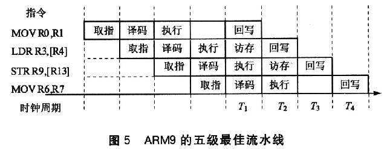
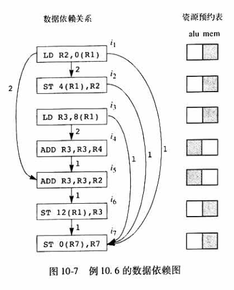
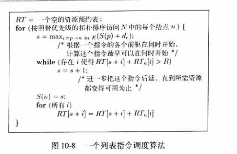
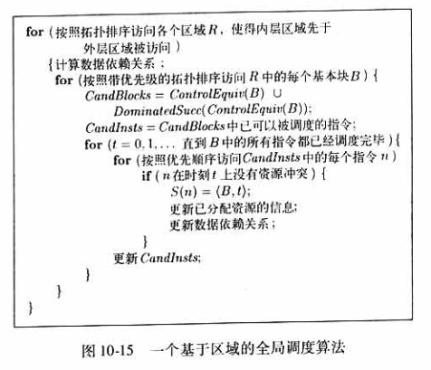
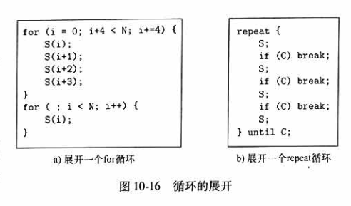
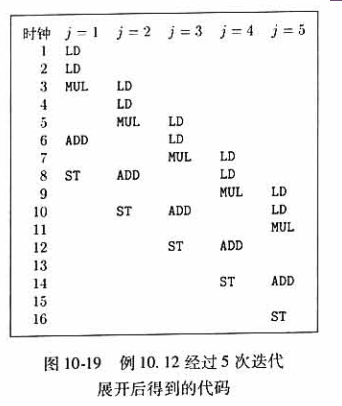
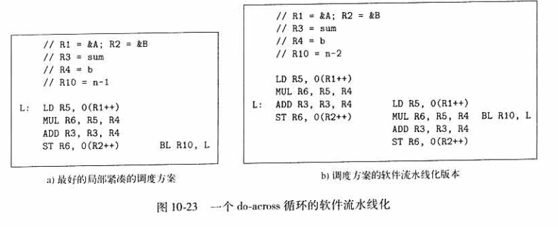
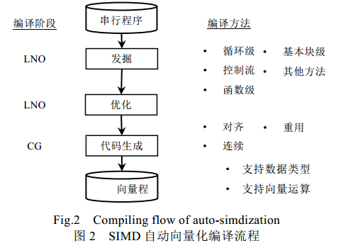

# 编译过程中的并行性优化概述

浙江大学《编译原理》课程报告

目录：

- [编译过程中的并行性优化概述](#编译过程中的并行性优化概述)
  - [前言](#前言)
  - [并行相关的处理器体系结构](#并行相关的处理器体系结构)
  - [代码调度的相关约束](#代码调度的相关约束)
    - [数据依赖](#数据依赖)
    - [内存访问依赖](#内存访问依赖)
    - [寄存器使用与并行性的折衷](#寄存器使用与并行性的折衷)
    - [控制依赖](#控制依赖)
    - [投机执行](#投机执行)
  - [基本块调度算法](#基本块调度算法)
    - [数据依赖图](#数据依赖图)
    - [列表调度算法](#列表调度算法)
  - [全局代码调度](#全局代码调度)
    - [基本代码移动](#基本代码移动)
    - [全局调动算法](#全局调动算法)
    - [动态调度](#动态调度)
  - [软件流水线化](#软件流水线化)
  - [SIMD](#simd)
  - [总结：](#总结)
  - [参考资料](#参考资料)

## 前言

`并行性`是指计算机系统具有可以同时进行运算或操作的特性，在同一时间完成两种或两种以上工作。并行性等级可以分为`作业级或程序级`、`任务级或程序级`、`指令之间级`和`指令内部级`。

指令级并行 (Instruction Level Parallelism, ILP)是指为了实现多个操作的并行执行而在处理器和编译器的设计中采用的一系列技术。指令级并行是现代高性能处理器的重要特征。对于在一个具有指令级并行机制的处理器上程序的并行能力，需要考虑以下因素：

- 程序中潜在的并行性，或者说程序中预算之间的依赖关系；例如具有简单的控制结构和规则的数据访问模式的数值应用中的并行性就相对较多；
- 处理器上可用的并行性，比如可以用以计算的硬件资源的数目；
- 从原来的顺序程序中抽取并行性的能力；
- 在给定的指令调度约束下找到最好的并行调度方案的能力；

并行性抽取和并行执行的调度可以通过软件静态完成，也可以通过硬件动态完成，或二者互相结合。编译中主要涉及的就是软件相关的静态过程，即如何通过在编译的过程中进行`指令抽取`和`指令调度`，来达到更好的并行性和运行速度。传统优化编译器的后端主要包括寄存器分配，求值顺序确定以及指令选择等几部分内容；而对于需要支持指令级并行编译的后端来说，核心的问题是指令
调度。指令调度决定操作执行的相对顺序，各操作的具体执行时间及使用哪些硬件资源等。

本文希望从并行性相关的处理器体系结构实现、基本块调度算法、全局调度算法，以及软件流水线化等方面来介绍编译过程中的并行性问题。

-------

## 并行相关的处理器体系结构

并行性的基础是现代高性能处理器的硬件能够在一个时钟周期能执行多条指令。现流行的并行技术大都可以从三个方面实现：资源重复、资源共享、时间重叠。其中主要应用到的技术如下：

- `流水线技术`：
  
    计算机中的流水线技术是把一个重复的过程分解为若干个子过程，每个子过程与其他子过程并行进行。从本质上讲，流水线技术是一种时间并行技术。通常我们描述的指令级并行性指的是在一个时钟周期内能发射多条指令，但如果使用流水线技术，由于一个指令需要多个时钟周期完成，因此仍然存在指令级并行的情况：每个时钟周期都可以取得一个新指令，而前面的指令还在流水线中执行，例如一个简单的五级流水线，可以分为取址->译码->执行->访存->写回五个阶段进行，其时空图如下：

    

    如果后续指令所需要的结果在此时已经可用，那么流水线就可以流出一条指令。但对于部分存在数据相关或者分支跳转的指令而言，下一条指令所需要的内容依赖于上一条指令的执行结果，此时就需要进行一定的调度或数据传输来避免流水线停顿。

- `多指令发送`：
    
    流水线技术虽然已经利用了一定的并行性来加速程序执行，但如果能通过配置多个可用的功能部件在每个周期发送多条指令，并行性还可继续提升，即多指令发送技术，也称多发射技术。常见的多发送机器有通过软件管理其并发性的 `VLIW`  (Very Long Instruction Word，超长指令字) ，即通过一种非常长的指令组合，把许多条指令连在一起增加运算速度；或通过硬件管理的 `超标量` 机器。

    简单的硬件指令调度器根据指令获取的顺序执行指令，如果其碰到依赖先前指令的指令，需要等待依赖关系的解除（计算结果可用）才能进行下一步的计算。更加复杂的指令调度器可以通过动态地调整指令执行的序列来避免相关性造成的阻塞。

- `多核处理器`：

    近年来，由于摩尔定律的限制，仅仅提高单核芯片的速度会产生过多热量且无法带来相应的性能改善，因此引入了多核芯片来增加并行性。多核处理器是指在一枚处理器中集成两个或多个完整的计算引擎(内核)，此时处理器能支持系统总线上的多个处理器，由总线控制器提供所有总线控制信号和命令信号。多核处理器对应于线程级并行性。本文主要涉及指令级并行，因此不做过多的介绍。

- `SIMD`：

    `SIMD 扩展部件`是又一个现代计算机在硬件方面对并行性的支持技术，它是集成到通用处理器中的加速部件, 旨在发掘多媒体程序和科学计算程序的数据级并行。SIMD 扩展部件能够对多媒体程序中的数据进行并行处理,提升了多媒体程序的运行速度；在特定的微处理器体系结构上，SIMD 扩展指令允许将原来需要多次装载的内存中地址连续的数据一次性装载到向量寄存器中,通过一条 SIMD 扩展指令实现对 SIMD 向量寄存器中所有数据元素的并行处理，如intel的MMX,SSE,AVX等指令集。

-------

## 代码调度的相关约束

在讨论代码调度的相关算法之前，我们首先需要看一下代码调度所需要遵守的一些基本约束条件。约束可以大致分为三种类型：

- `控制依赖约束`：所有在源程序中执行的操作都必须在优化的程序中执行；
- `数据依赖约束`：优化后的程序中的操作必须和源程序中的相应操作生成相同结果；
- `资源约束`：特定机器上的资源是有限的，不能超额使用。

这些约束保证程序的优化可以正常进行，并生成和源程序相同的结果。但由于代码调度改变了指令执行的顺序，有可能优化后的程序在执行某一点上的内存状态与优化前任何一点都不匹配。

我们来看看具体的一些依赖问题。

### 数据依赖

简单来说，如果两个操作访问同一个变量，且这两个操作中有一个为写操作，此时这两个操作之间就存在数据依赖性，并且它们之间的相对执行顺序必须保持不变。在代码调度中可能出现的数据依赖有：

1. `真依赖`：即写之后再读；
2. `反依赖`：读之后再写，如果调度时写操作在读操作前发生，就可能读到错误的值。
3. `输出依赖`：写之后再写，如果顺序调换则会导致被写位置上存放的是错误的值。

其中，后两者被称为`存储相关的依赖`，可以通过在不同的内存位置存放不同的值来消除这些依赖关系。

### 内存访问依赖

如果两个不同的内存访问指向同一个位置，就有可能存在内存访问之间的依赖关系。内存访问依赖关系比较复杂，尤其是对于非类型安全的语言（如C语言），要证明任意一对基于指针的内存访问之间的独立性需要负债的分析过程。主要的分析可以有以下几种：

- `数组的数据依赖分析`：区分数组元素访问中的下标值；
- `指针别名分析`：如果两个指针指向同一个对象，即互为别名；
- `过程间分析`：关于全局变量与参数之间的问题。

### 寄存器使用与并行性的折衷

在并行分析和调度中的机器无关中间表示所使用的无限多个伪寄存器必须被映射到目标机器上的有限寄存器；而把几个伪寄存器映射到同一个物理寄存器会生成一定的存储依赖，导致限制了指令级的并行性。从另一方面来说，并行性也产生了更多的存储需求，从而增大了寄存器分配的压力。因此，尽量降低寄存器使用数量的目标与最大化指令并行性的目标直接冲突。

寄存器分配阶段与代码调度阶段的顺序也会影响到并行性与存储器数量。因此，在某些时候可以采用`层次化`的方式来处理，例如从最内层循环开始进行代码优化，先进行指令调度，再进行寄存器分配，再对代码进行调度；对外层循环依次重复此过程。

### 控制依赖

如果说指令A的结果决定了指令B是否执行，那么就可以说指令B是`控制依赖`于指令A的。一个优化后的程序必须执行源程序中所有的运算，也可以执行更多的指令来增加并行性。

### 投机执行

如果我们知道一条指令可能会执行，并且有空闲的资源来"免费"执行这个指令，就可以先投机地执行这个指令；如果这个投机是正确的，就能加速程序执行。如内存加载指令就能从中获取较大好处，很多现代高性能处理器都有对其的支持功能，如：

- 预取指令
- 毒药位
- 带断言的执行

-------

## 基本块调度算法

基本块是连续三地址状态的最大序列，其中控制流只能在块的第一个语句中输入，并在最后一个语句中停留，而不会停止或分支。

对于一个由机器指令组成的基本块中的指令进行调度以获取最优解，这个时间复杂度是NP完全的。但在实践中，由于基本块之间的高度约束的运算较少，因此用简单的调度算法是可行的。这里介绍一个`列表调度`的算法。

### 数据依赖图

数据依赖图是调度算法中用到的一个重要工具。我们可以把每个由机器指令组成的基本块标识成为一个`数据依赖图`（data-dependence graph), G = (N,E)，其中节点集合N表示基本块中机器指令的运算，而有向边集合E表示运算之间的数据依赖约束。G的节点集合和边及可以按照如下方式构造：

1. 在N中的每个运算n为一个节点，有个资源预约表RTn，其值就是n的运算类型所对应的资源预约表；
2. E中的每条边e有一个表示延时的标号de，表明目标节点必须在源节点发出后至少de个时钟周期之后发出。

数据依赖图的实例如下：

### 列表调度算法

从数据依赖图和资源预约表就能清晰地看到指令之间的依赖关系，因此，我们可以采用简单的方法，即使用`带优先级的拓扑排序`访问数据依赖图的各个节点，就能得到基本块调度的顺序。换句话说，算法根据数据依赖图中每个节点和之前已调度的节点之间的数据依赖约束，计算出能执行该节点的最早时间位置。

- 输入：一个机器资源向量 `R = [ r1, r2 ... ]`, 其中ri是第i种资源的可用单元数目；以及一个数据依赖图 `G = (N,E)`
- 输出：一个调度方案S, 将N中的每个运算映射到时间位置中。

算法伪代码：

列表调度算法不进行回溯，对每个节点只进行一次指令调度，并使用一个启发式的优先级函数函数从已就绪的节点中选择下一个调度的节点。它具有如下性质：

- 在不考虑资源约束的情况下，最短的调度方案根据关键路径给出；
- 如果运算都是独立的，调度方案的长度受到可用资源的约束；
- 可以使用源代码中的顺序决定运算之间难分先后的情况；

--------

## 全局代码调度

为了更好地利用机器资源，我们还可以考虑将一些指令从一个基本块移动到另一个基本块的代码调度，这种策略就称为`全局调度`。全局指令调度与寄存器分配可以说是指令级并行编译中的核心问题。为了正确地进行全局调度，除了数据依赖关系以外，我们也要考虑控制依赖关系。

我们需要保证以下两点才能进行调度：

1. 所有在源程序中执行的指令都会在优化后的程序中运行；
2. 额外投机执行的指令不能产生任何副作用；

### 基本代码移动

局部与全局代码调动的例子：

就像上述调度，在全局代码移动过程中，我们可以沿着一个执行路径上下移动指令。可以根据基本块之间的支配关系考虑指令移动的方式：

- 如果每个从控制流图入口处到达基本块B1的路径都经过一个基本块B2，那么就认为B2`支配`B1；
- 如果从基本块B1到达控制流图出口处的路径都经过B2，那么就认为B2`反向支配`B1；
- 如果B1支配B2且B2反向支配B1，则二者`控制等价`。

在一条路径上的一堆基本块之间可能支配关系和反向支配关系都不具有。

对于可能的全局代码移动方式，可以总结如下：

- 在控制等价的基本块之间移动指令最简单且性价比最高；
- 在沿着控制流路径向上（向下）的代码移动中，如果源基本块不反向支配（支配）目标基本块，可能需要执行额外的运算；
- 在沿着控制流路径向上（向下）的代码移动中，如果目标基本块不支配（反向支配）源基本块，就可能需要补偿一些相应的代码；
- 如果在沿着控制流路径向上（向下）的代码移动中，源和目的基本块之中既不支配，也不反向支配，那么可能既需要需要执行额外的运算又需要补偿一些相应的代码。

同时，代码移动可能也会改变运算之间的数据依赖关系，因此每次代码移动之后都必须更新它。

### 全局调动算法

- 基于区域的调度算法：

    区域是一个控制流图的子集，它只能ton过一个入口基本块到达。对于一个简单的全局调度器，可以采用基于区域的调度算法，它支持吧运算向上移动到控制等价的基本块，或把运算向上移动一个分支，到一个支配前驱中：

    - 输入：一个控制流图和一个机器资源描述
    - 输出：一个调度方案S
    - 伪代码：

    

- 循环展开：

    在代码调度前少量地展开循环可以增加代码移动的可能性，进而增加并行性，如下所示：

    

- 相邻压缩：

    在基于区域的调度后可以再跟一个简单的代码处理过程，在这个过程中检查各对相邻的连续执行的基本块是否有运算可以在他们之间上移或下移，以改进它们的执行时间。

### 动态调度

如果编程语言支持动态调度器，即可以根据运行时刻的情况产生新的调度方案，而不需要在运行之前对于所有的可能调度进行编码，就能获得更好的优化方案。

--------

## 软件流水线化

`软件流水线化`也是一种重要的指令调度技术，就像硬件流水线的指令一样，它通过并行执行来自不同循环体的指令来加快循环程序的执行速度, 在前一个循环体未结束前启动下一个新的循环体，来达成循环体时间上的并行性。相比于简单的展开循环（在提高性能的同时会导致代码的膨胀），软件流水线提供了一个方便的优化方法，能够在优化资源使用的同时保持代码的简洁。

对于循环之间没有数据依赖的 `do-all` 循环，我们可以用一个简单的对比来说明软件流水线同简单循环展开的不同，下图为简单的循环展开：

软件流水线化通过将循环展开调度后中重复的部分进行循环，完成流水线。下图为软件流水线化的结果：

在开始阶段（1-6行）用来填充流水线的指令序列被称为`序言`；在稳定循环的部分（7-8行）被称为`稳定状态`；用来排空流水线的指令序列（9-14行）称为`尾声`。

在软件流水中，相邻循环体的启动时间间隔称为启动间距。在软件流水中再次应用循环展开，使同一时刻可以运行多个循环，可以使软件流水实现分数值的启动间距，同时基于展开的优化技术可以降低程序的资源需求和关键路径的长度。但是，循环展开也会引起代码量增长和寄存器需求增大，代码量的增长会导致缓存的性能变差，寄存器需求的增大则有可能使软件流水失败。因此，软件流水的核心问题之一就是展开因子的确定。

对于各个迭代之间的存在数据依赖关系的循环，也称 `do-access` 循环，软件流水线化也可以起到一定的效果：

--------

## SIMD

`SIMD 扩展指令`允许将原来需要多次装载的内存中地址连续的数据一次性装载到向量寄存器中,通过一条 SIMD 扩展指令实现对 SIMD 向量寄存器中所有数据元素的并行处理；这种执行方式非常适合于处理计算密集、数据相关性少的音视频解码等多媒体程序。

为了高效利用SIMD扩展部件的特性，需要让编译器分析串行程序中控制流和数据流的特征，识别程序中可以向量执行的部分，将标量语句自动转换为相应的SIMD 向量语句。SIMD 自动向量化编译流程大致可分为3部分,分别是发掘、优化和代码生成：

- `发掘`：识别生成出 SIMD 指令，同时解决控制依赖对发掘的影响。SIMD 扩展部件可在不同的粒度进行识别向量化，包括面向基本块内向量化、面向最内层循环或者循环嵌套的向量化以及面向函数级别的向量化。
- `优化`：首先减小辅助指令的开销，同时考虑数据局部性、寄存器重用等工作。由于部分体系结构的 SIMD 指令只能从内存中存取连续对齐的数据，因此当程序中存在不对齐或不连续内存引用时需要通过移位或者重组等辅助指令才能组成向量。减少辅助指令的数量和提高辅助指令的效率，是增加程序 SIMD 向量化收益的关键问题。
- `代码生成`：考虑平台支持哪些数据类型和向量运算。直接面向特定平台的 SIMD 向量化代码生成存在许多不足，通常分阶段并行编译优化和虚拟向量是解决面向多平台向量化的两个方法。

当前 SIMD 编译优化对数据对齐和重组研究很深入，面向循环和基本块的向量化方法也很成熟。目前,针对SIMD 扩展部件编译优化的主要关注热点是生成高性能低功耗的代码。

--------

## 总结：

- 体系结构相关问题
- 数据依赖的定义与消除
- 基本块的数据依赖图
- 带优先级的拓扑排序
- 列表调度
- 基本块之间的代码移动
- 软件流水线化
- SIMD技术

--------

## 参考资料

- 《编译原理》第二版，第十章、第十一章
- 李文龙等，软件流水中的循环展开优化，北京航空航天大学学报
- 魏海涛等，一种面向数据流程序的软件流水并行化方法，计算机学报
- 高伟等，SIMD 自动向量化编译优化概述，软件学报
- 吴承勇等，协作式全局指令调度与寄存器分配，计算机学报